# 支付系统收敛方案（仅 Stripe / Check / StoreCredit）

> 需求来源：运营原话 ——「支付厂商只保留 stripe，其它一概不留，代码已经实现的我也要移除，现在结构越来越复杂了」。
> 设计原则：**一条记录 = 一个收款渠道**。取消「厂商 vs 入口」双层结构与「多家厂商竞争一个支付方式」的全部求值；把入口从「需要被求值的对象」降级为「Stripe 账户事实 + 一个开关」。
> 关联 PRD：`PRD-20260915-admin-管理后台支付配置选项化…`（本页既有 PRD，收敛后需回写）、`PRD-20260920-checkout-支付核心统一…`（拟作废的抽象来源）
> 文档状态：**待评审**（未开工；第 11 节 3 项待确认）

---

## 0. 一页总览

```
┌───────────────── 收敛前（为「多厂商竞争」设计）─────────────────┐
│  厂商 provider（capability 声明）                                │
│    └─ 入口 option（rule_set 四维 + 熔断 + 3DS 能力）             │
│         └─ 收窄：能力 ∩ 账户 ∩ 市场                              │
│              └─ 路由 P3：这个方式由「哪家厂商」承接               │
│                   └─ Availability::Resolver（唯一求值点）        │
└──────────────────────────────────────────────────────────────────┘
                              ↓ 收敛
┌───────────────── 收敛后（三条渠道各司其职）─────────────────────┐
│  Stripe（在线收款：卡 / 钱包 / 本地支付方式）                    │
│      └─ 方式列表 = Stripe 账户启用 ∩ 本店开关   ← 只剩「事实+开关」│
│  Check（线下支票，人工确认）                                     │
│  StoreCredit（店铺余额抵扣）                                     │
│         ↓ 三者都不竞争；前台只按「一行一种方式」展示              │
│  Availability::Resolver（保留：环境隔离 + 3DS + 入口启用过滤）    │
└──────────────────────────────────────────────────────────────────┘
```

**四个删除动作**：① 厂商层抽象（P0-A/P0-B）② 方式级路由（P3）③ 适用范围四维（D8）④ 熔断（D11）—— 其中 ①③④ 有生产消费点，②**零生产消费点**（最干净）。

---

## 1. 现状病灶（为什么要收敛）

| 病灶 | 具体表现 | 根因 |
|---|---|---|
| **概念双层** | 「厂商」与「入口」两层，后台要运营**手填**「我账户开通了哪些方式」（`metadata['account']`） | 为「能力 ∩ 账户 ∩ 市场」收窄而建；单渠道下无对比对象 |
| **隐形门控** | `optionized`：不勾任何入口 → 前台回落默认入口；勾了任一 → 0 入口即 0 前台 | 状态迁移靠勾选框隐式触发，运营无从理解 |
| **恒等式路由** | P3「这个支付方式由哪家厂商承接」——只有一家时结果恒为它自己 | 为多厂商抢单而建 |
| **无人竞争的规则** | D8 四维 `rule_set`（市场/国家/Zone/币种）逐入口配置 | 为「不同渠道在不同市场」而建 |
| **页面堆叠** | Stripe 编辑页曾同时挂：诊断卡 + 账户手填表单 + 路由预览 + 范围四维 + 熔断卡 + 凭据卡 + Webhook | 逐切片叠加，缺少一次总体规划 |
| **名字混淆** | 后台列表里「Credit Card」实为 `Gateway::Bogus`（假网关），与「Credit Card (Stripe)」只差括号 | 种子/测试数据直接进了运营视图 |

---

## 2. 目标架构

### 2.1 三条渠道的分工与边界

| 渠道 | 类型 | 有外部 API？ | 有 key？ | 有 webhook？ | 前台形态 |
|---|---|---|---|---|---|
| **Stripe** | 第三方网关（`PallasTradeStripe::Gateway`） | ✅ | ✅ | ✅ | 卡表单 / 钱包按钮 / 重定向（按方式） |
| **Check** | 框架内置结算方式（`PaymentMethod::Check`） | ❌ | ❌ | ❌ | 「线下支票」选项，下单后待人工确认 |
| **StoreCredit** | 框架内置结算方式（`PaymentMethod::StoreCredit`） | ❌ | ❌ | ❌ | 「用余额抵扣」 |

> **关键认知**：Check / StoreCredit **不是「支付厂商」**，是 core 自带的「结算方式」。它们与 Stripe **不竞争**——一笔订单可以「余额抵扣 + 差额 Stripe」。

### 2.2 概念归位表

| 概念 | 收敛前 | 收敛后 | 动作 |
|---|---|---|---|
| 厂商能力声明 | `provider_capability`（provider 类方法 + 推导） | — | 🗑️ 删 |
| 账户配置 | `metadata['account']` + `Providers::Account.write!`（手填/同步） | — | 🗑️ 删（Stripe 的「账户事实」直接体现在方式列表） |
| 收窄 | `provider_effective_scope`（能力∩账户） | — | 🗑️ 删 |
| 三态 | `provider_state`（enabled/disabled/suspended，停用粘性） | 原生 `active` 布尔 | 🔄 改 |
| 诊断 | `provider_diagnostics` + 诊断卡 | — | 🗑️ 删 |
| 方式级路由 | `Routing::{Decide,Policy,Summary}` | — | 🗑️ 删 |
| 适用范围 | `rule_set`（market/country/zone/currency）+ 后台四维编辑 | — | 🗑️ 删（**契约变更**） |
| 熔断 | `CircuitBreaker` + `Health::Metrics` + 24h 指标卡 | — | 🗑️ 删 |
| 入口（option） | `metadata['options']`，需被 Resolver 求值 | `metadata['options']`，**只承载「开关 + 显示名 + 排序」** | 🔄 降级 |
| 隐形门控 | `optionized` | 显式：**入口可见 = `active` 为真** | 🔄 改 |
| 环境隔离 | `environment = test` 不进前台 | 不变 | ✅ 保留 |
| 3DS 认证 | `D15c`（策略 + `force_3ds` + 下发） | 不变 | ✅ 保留 |
| 前台密钥下发 | `D10`（`client_config` 只给 publishable） | 不变 | ✅ 保留 |
| 入口展示 | `D16`（每行前台显示名） | 不变 | ✅ 保留 |
| 凭据健康 + Webhook | `D9`（轮换/到期/reveal + 签名密钥） | 不变 | ✅ 保留 |

### 2.3 数据落点

| 数据 | 落点 | 变化 |
|---|---|---|
| 本店开关 / 显示名 / 排序 | `payment_methods.private_metadata['options']`（`[{kind, active, display_name, position, frontend_kind}]`） | ✅ 沿用（去掉 `rule_set`） |
| Stripe 账户已启用方式 | **不落库**（每次进页面/点同步时从 Stripe 读，只读缓存于请求内） | 🔄 从「手填 metadata」改为「实时读 Stripe」 |
| 最近一次连接检查 | `metadata['last_test_connection']` | ✅ 沿用 |
| 环境 | `payment_methods.environment`（原生列） | ✅ 沿用 |
| 停用 | `payment_methods.active`（原生列） | 🔄 从 `State.disable!` 改回原生 |
| ~~`metadata['account']`~~ | — | 🗑️ 删除后旧值保留但不再读 |
| ~~`options[].rule_set`~~ | — | 🗑️ 删除后旧值保留但不再读（**不迁移**） |

---

## 3. 正向履约（Forward Fulfillment）

### 3.0 下单编排总则：Place Order → Payment（一次点击，两段）

**现状（重要）**：**两段语义今天已经实现**，不是待建能力 —— 出处 PRD-20260915-checkout-单页两段语义 FR-003。

| 段 | 端点 | 代码位置 | 今天做什么 |
|---|---|---|---|
| **第一段** | `POST /api/checkout/prepare` | `UnifiedCheckout.tsx` 的 `prepareOrder()` | `carts.update`（保存）+ `carts.submit`（**建单**）→ 返回 Order 权威报价 |
| **第二段** | `POST /api/checkout/start` | 同文件 `handlePayNow()` | 携 `order_id` **只启交易**（`orders.transactions.create`），**不再 update/submit** |

顺序也**已经在代码里强制**：

```ts
const prepared = await prepareOrder();
if (!prepared) return;   // 建单失败直接 return —— 永远走不到付款
```

**真实缺口（本次要补的四件事）**：

| # | 缺口 | 现状 | 目标 |
|---|---|---|---|
| 1 | **正名** | 这一段叫 `prepare`（“准备”），但它在做的是**下单** | 改名 `place-order`，名副其实 |
| 2 | **边界** | `prepare` 一肩挑「保存表单」+「建单」 | 端点内**明示两步**；契约把**建单结果**放在显眼位（`order_id` + `quote`） |
| 3 | **可读性** | `prepareOrder()` 这个名字让读者以为是“预检” | 改名 `placeOrder()`，返回值即**下单结果** |
| 4 | **文档** | PRD / skill / 注释散落 `prepare` 语义 | 术语统一到 **Place Order**，与「支付」明确分段 |

> 换句话说：**本次是给一段已存在、且顺序已正确的编排「正名 + 显式化」，不是新造流程。** 顾客可见行为**零变化**。

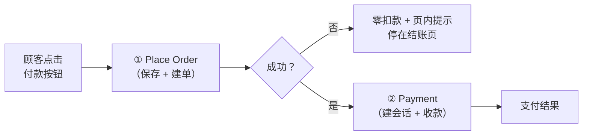

#### 3.0.1 Place Order 是什么

**Place Order = `PallasTrade::Carts::Submit`**
（`backend/pallastrade_gems/pallastrade_core/app/services/pallastrade/carts/submit.rb`）

它是**已存在**的服务 —— 本方案**不新造**下单逻辑，只给它一个**显式的编排位置**与**端点名**。

它做的事（按顺序）：

| 步 | 动作 | 说明 |
|---|---|---|
| 1 | 校验 | 购物车 active / ≥1 勾选项 / 变体有价 / 有货 / 游客必须有 email |
| 2 | 快照 | 行项目 + 地址 + 配送，全部**冻结**成 Order 字段 |
| 3 | 权威算价 | 走 Order 管道（Pricing + TaxRate + OrderUpdater）重算 —— **顾客被扣款的唯一金额来源** |
| 4 | 建单 | `cart.convert!` → Order `state=pending`、`submitted_at` 落时间 |
| 5 | 发事件 | `order.submitted`（**提交后**发布，订阅者不可阻断结算） |
| 6 | 后继车 | 建一张新空购物车（`successor_cart`） |

**它不做的事**（边界，很重要）：

| 不做 | 说明 |
|---|---|
| ❌ 不建 `PaymentSession` | 支付会话是第 ② 段的事 |
| ❌ 不启 `PaymentTransaction` | 同上 |
| ❌ 不锁库存 | 除非 `stock_reservation_strategy = 'order'`；**当前默认就是 `'order'`**（`backend/config/initializers/pallastrade.rb:44`），所以本地会在下单瞬间锁 |
| ❌ 不扣款 | **零资金副作用** |

#### 3.0.2 为什么必须先 Place Order 再 Payment（顺序不可倒）

> **顾客确认的金额，必须是被扣款的金额。**

- **先支付再建单** → 钱已划走订单才生成；一旦建单失败（缺货 / 无价 / 地址非法），钱已在 Stripe 手里，只能走退款 → 顾客体验 + 资金成本双输，且违反 **P1-2 硬约束**「未见到 Order 权威金额之前不得扣款」。
- **建单成功但支付失败** → 订单已在（`pending` + `submitted_at`），这正是正常的「未支付订单」态 —— 有明确出口（重试 / 补付 §3.6 / 取消 §4.2），**不是故障**。

结论：**Place Order 先行是安全方向**。

| 结果 | 订单 | 资金 | 可恢复性 |
|---|---|---|---|
| 建单失败 | **不存在**（零痕迹） | 零 | 顾客改数据重试即可 |
| 建单成功 + 支付失败 | 存在（`pending`） | 零 | 补付 / 取消，出口明确 |
| 建单成功 + 支付成功 | 存在（`paid`） | 已收 | 正常履约 |

#### 3.0.3 幂等性（三道保障）

`Carts::Submit` 天然幂等：

| 保障 | 机制 |
|---|---|
| 行锁 | 对 cart 行加锁，并发提交只有一个赢 |
| converted replay | 已转换的购物车再提交 → **返回同一张 Order**（不重复建单） |
| 金额守卫 | 第 ② 段复用第 ① 段返回的 Order，不重建 |

因此「顾客狂点按钮 / 网络重试 / 双标签页」都**不会**产生两张订单。

#### 3.0.4 契约变化（只在 BFF 层）

| 端点 | 方法 | 职责 | 变化 |
|---|---|---|---|
| `/api/checkout/preview` | POST | 只读预览报价（dry_run，零副作用） | 不变 |
| `/api/checkout/place-order` | POST | **① 建单**：`carts.update`（保存）+ `carts.submit` → Order 权威金额 + `order_id` | **由 `prepare` 更名**（行为等价，语义正名） |
| `/api/checkout/start` | POST | **② 起支付**：`orders.transactions.create` → `client_secret` | **不变**（已支持 `order_id` 形态） |
| `/api/checkout/prepare` | POST | 旧名（兼容） | **保留为薄别名**（转发到 `place-order`），给未升级客户端一个过渡期，见 §11-6 |
| `/api/checkout/start`（形态 2） | POST | 兼容：`cart_` 一次请求完成 update + submit + Pay | **不变**（钱包入口专用，见下方说明） |

> **Store API 层零改动** —— `POST /api/v3/store/carts/:id/submit` 今天就在，语义、幂等、错误码都不用动。本次只动 **BFF 端点名 + 前台函数名 + 文档**。

**形态 2 为什么保留**：钱包（Apple Pay / Google Pay）面板**自身即金额确认界面**，其 express 流程必须先有会话才能拉起面板，因此保留「一次请求合并」语义。这与 P1-2 硬约束不冲突 —— 约束是「未见到 Order 权威金额不得扣款」，而钱包面板展示的**就是**该 Order 的金额。

#### 3.0.5 前台按钮语义：顾客仍只点一次

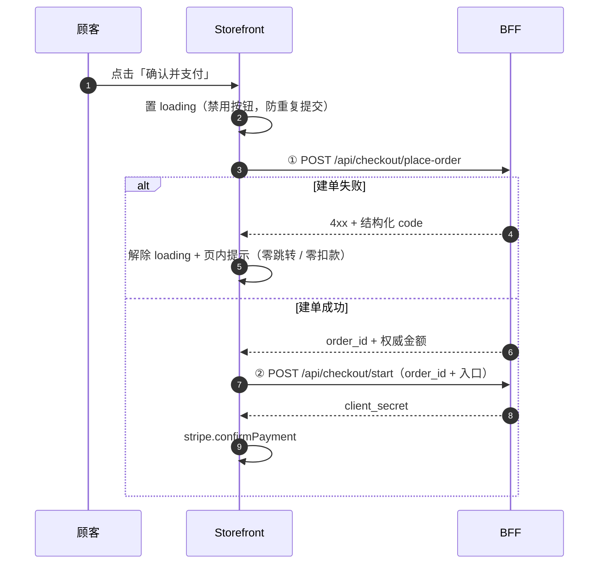

**按钮文案不变**（仍是「确认并支付」/「Pay Now」）—— 顾客感知**仍是一次操作**；两段编排是**实现细节**，不暴露给顾客。

**这已经是今天的真实行为**（`UnifiedCheckout.tsx`）：`handlePayNow` 内部先 `await prepareOrder()`，拿到 Order 才继续 `POST /api/checkout/start`；`prepareOrder` 返回 `null`（建单失败）时**同一次点击内直接 return**，不进支付。本次只改**名字**与**文档**，不改这段控制流。

---

### 3.1 全景流程图

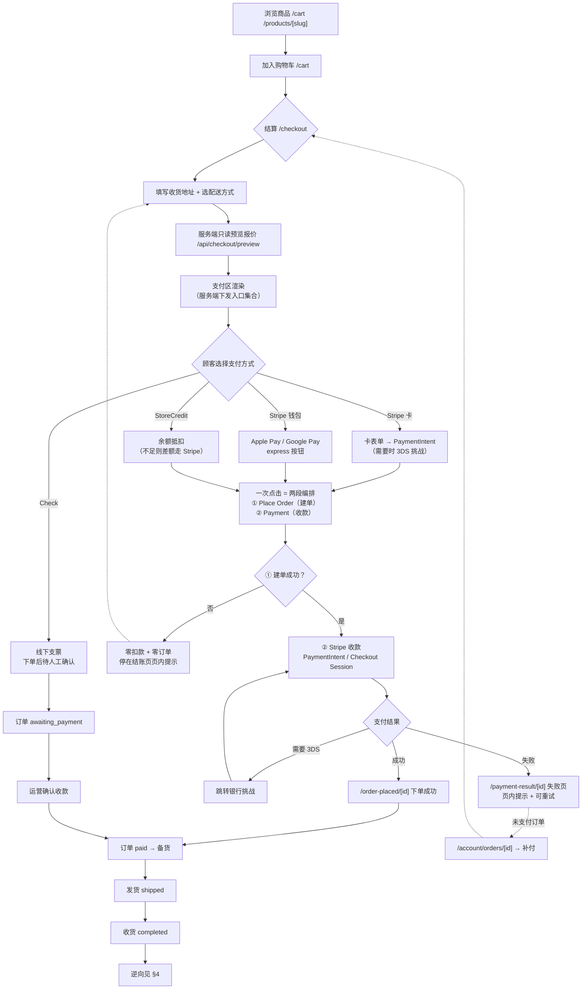

### 3.2 时序图 A：纯 Stripe 在线支付（含 3DS）

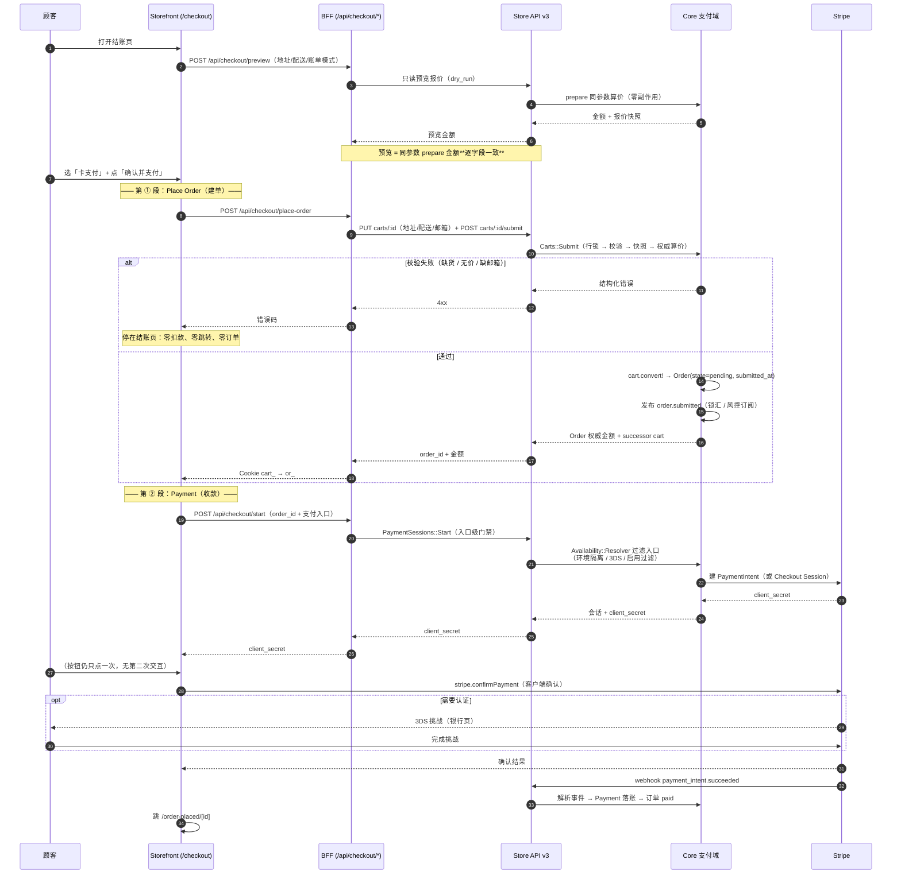

### 3.3 时序图 B：余额抵扣 + Stripe 差额（组合支付）

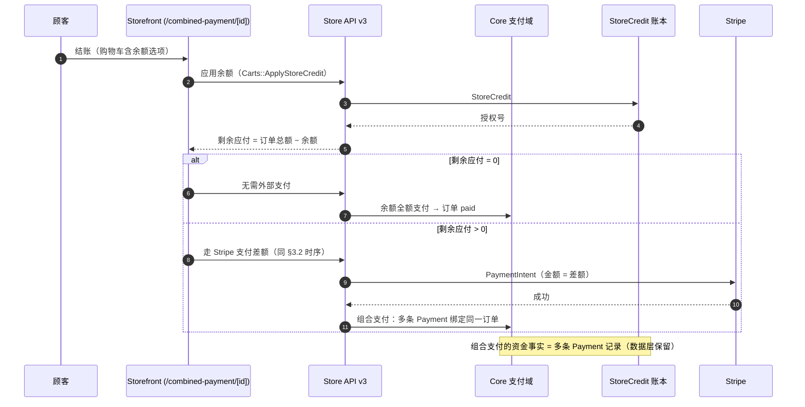

### 3.4 时序图 C：线下支票 Check

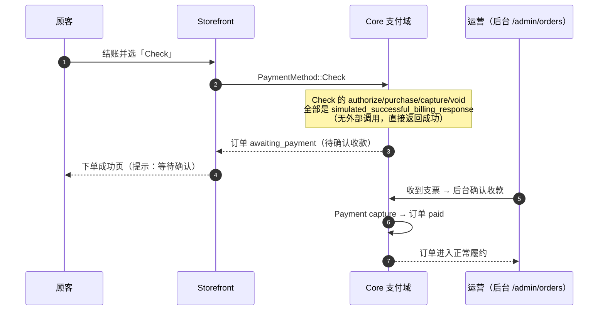

### 3.5 时序图 D：钱包快捷支付（Apple Pay / Google Pay）

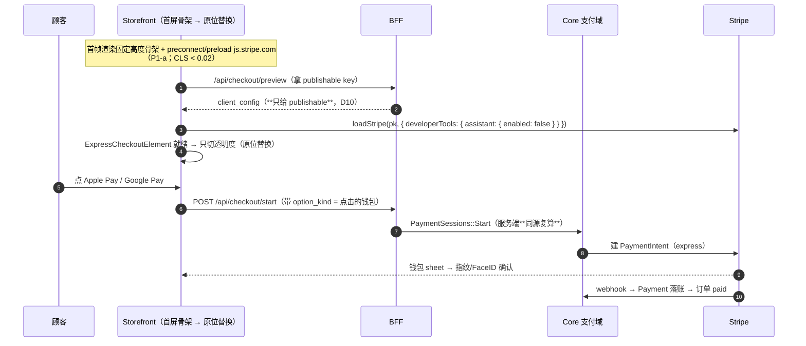

### 3.6 时序图 E：未支付订单补付

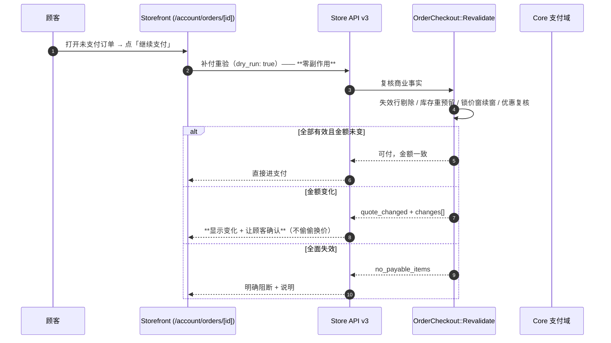

### 3.7 正向的退出点与异常分支

| 分支 | 触发 | 行为 |
|---|---|---|
| **① 建单失败** | 缺货 / 变体无价 / 游客缺邮箱 / 地址非法 | **停在结账页页内提示**：零扣款、零跳转、**订单不存在**；修正后可重试 |
| **① 建单成功但 ② 起会话失败** | 入口被关 / 环境不匹配 / Stripe 拒绝 | 订单**已在**（`pending`）→ 页内提示 + 可重试；`availability` 类错误回落到入口刷新 |
| 金额变化 | 预览与 place-order 不一致 | 显示「旧 → 新」变化块，要求顾客确认（不自动扣款）。**此时订单已存在**（建单成功），只是**暂缓付款**；顾客再点不重新提交购物车（复用 `preparedOrder`） |
| 3DS 挑战 | 风控要求认证 | 跳银行页；失败 → 支付结果页失败态 |
| 支付失败 | 卡被拒 / 网络 | **零跳转、零 PATCH**，页内提示 + 可重试 |
| 支付超时 | 会话过期 | 订单仍 awaiting_payment → 可补付（§3.6） |
| 订单失效 | 库存/优惠失效 | 补付重验阻断；订单可取消（§4.2） |
| 入口被后台关闭 | 运营改开关 | 前台即时不出现；**已建会话不受影响** |

---

## 4. 逆向履约（Reverse Fulfillment）

### 4.1 全景流程图

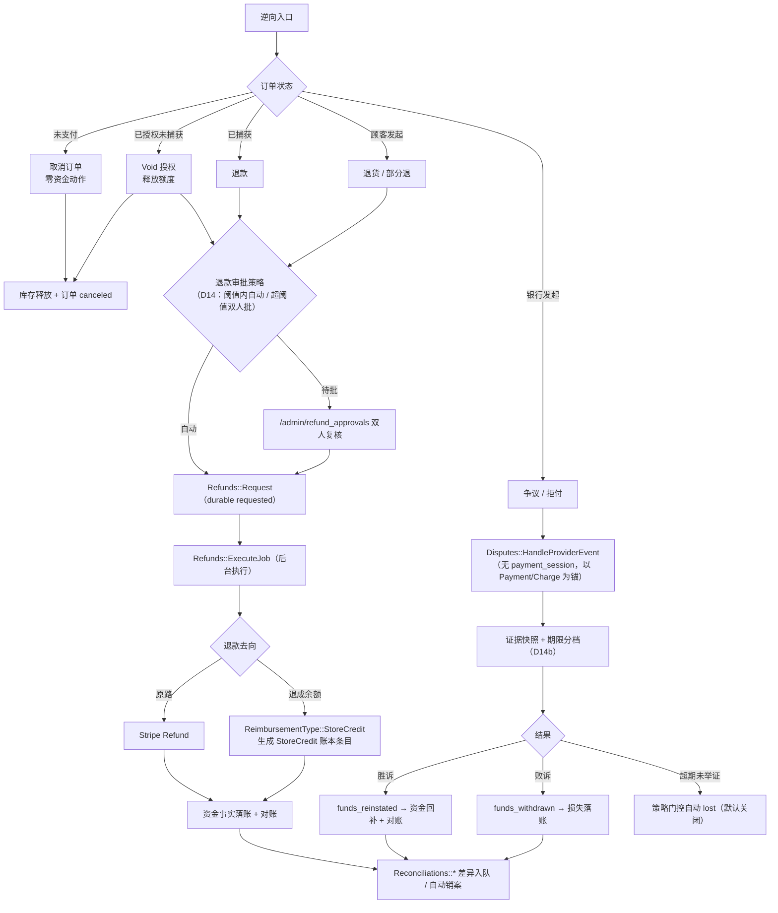

### 4.2 时序图 F：未支付取消

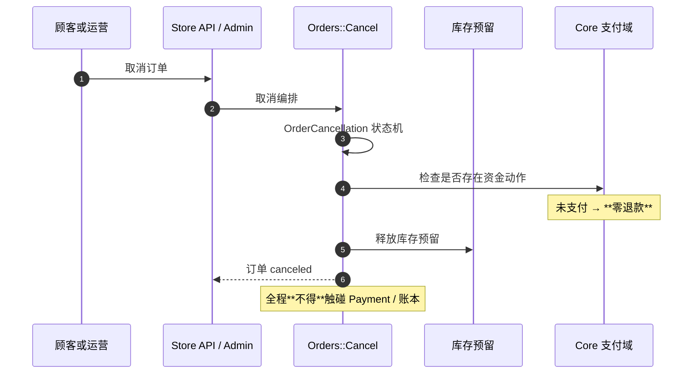

### 4.3 时序图 G：已授权未捕获取消（Void）

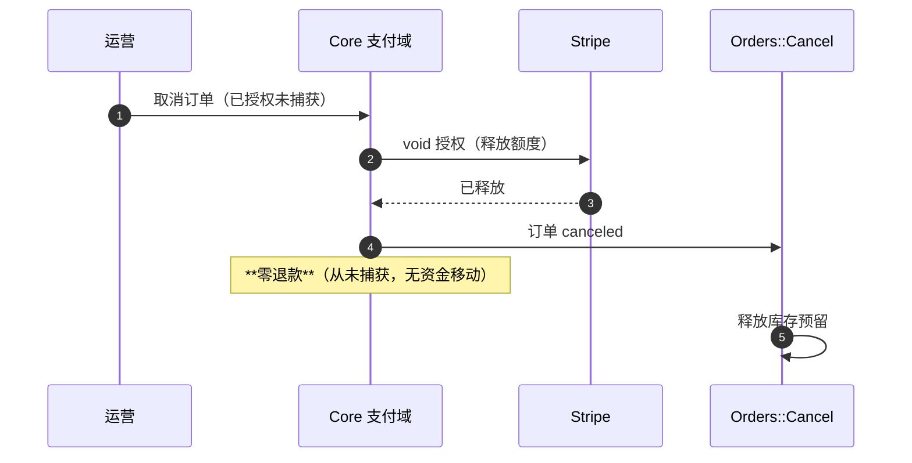

### 4.4 时序图 H：已捕获退款（全额 / 部分）

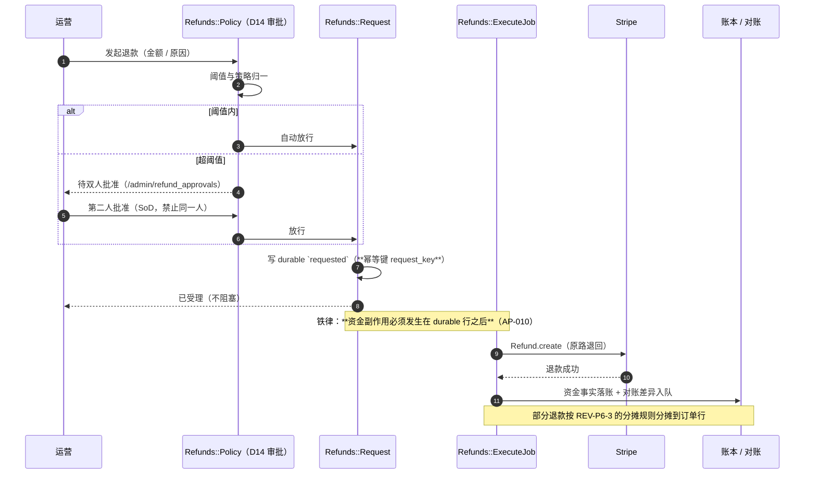

### 4.5 时序图 I：退款退成 StoreCredit

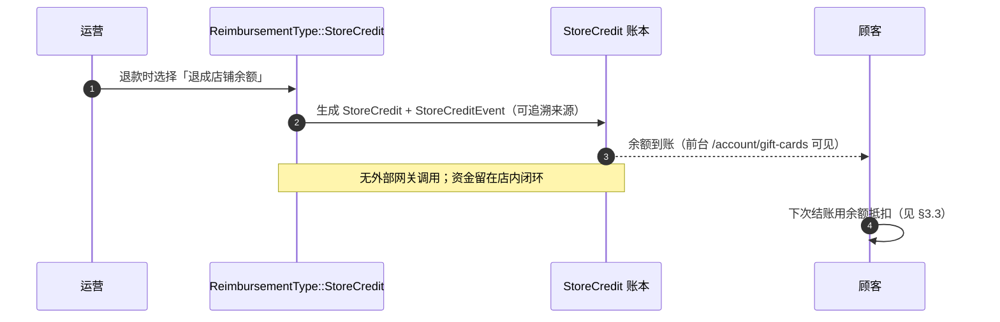

### 4.6 时序图 J：争议 / 拒付（Chargeback）

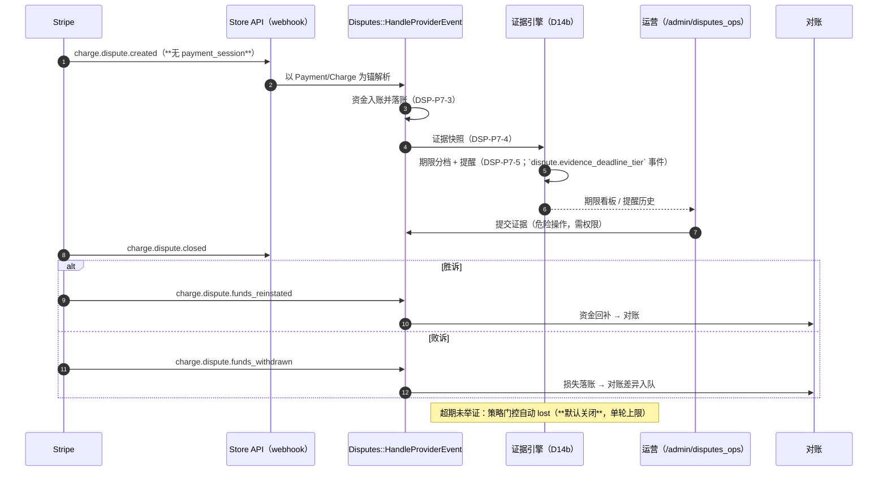

### 4.7 逆向的资金 / 库存 / 台账一致性（三条铁律）

| 铁律 | 内容 | 现状 |
|---|---|---|
| **① durable 先行** | 退款一律 `Refunds::Request`（durable `requested`）→ `ExecuteJob` 后台执行；**禁止**在业务事务内同步调用网关（AP-010） | ✅ 已实现 |
| **② 库存与资金独立收敛** | 取消/退货先释放预留或做 Restock 决策；**资金动作与库存动作各自幂等**，不互相阻塞 | ✅ 已实现（`StockReservations::Release` / REV-P6-5） |
| **③ 对账是最终裁判** | 所有逆向的资金事实都要能被 `Reconciliations::*` 对到；差异入队可运营 | ✅ 已实现（D13 系列） |

---

## 5. 前台页面架构

### 5.1 路由与页面清单

| 路由 | 组 | 作用 | 支付相关组成 |
|---|---|---|---|
| `/cart` | storefront | 购物车 | 商品行 / 小计 / 「去结算」；顶部快捷支付（`TopExpressPay`）常显 |
| **`/checkout`** | (checkout) | **结账页（主）** | 地址 / 配送 / **支付区** / 合计明细（常显） |
| `/checkout/[id]` | (checkout) | 转换后购物车恢复路由 | 同上（`cart_` → `or_…` 恢复） |
| **`/combined-payment/[id]`** | (checkout) | **组合支付页** | 余额抵扣 + 多笔支付编排 |
| `/order-placed/[id]` | (checkout) | 下单成功 | 订单摘要 / 下一步 |
| **`/payment-result/[id]`** | (checkout) | **支付结果** | 成功 / 失败态（失败**页内提示，不跳转**） |
| `/account/orders` | storefront | 订单列表 | 状态 + 未支付订单的补付入口 |
| `/account/orders/[id]` | storefront | 订单详情 | 支付状态 / **补付**（走 §3.6 重验）/ 退款进度 |
| `/account/credit-cards` | storefront | 已存卡 | Stripe 客户档 |
| `/account/gift-cards` | storefront | 礼品卡 / 余额 | StoreCredit 余额展示 |

**BFF**：`/api/checkout/{prepare,preview,start,coupon,preflight,newsletter}` + `/api/webhooks/pallastrade`

### 5.2 结账页组成（组件树）

```
/checkout  page.tsx
├─ StripeResourceHints            （preconnect/dns-prefetch/preload js.stripe.com，仅当有 Stripe 且首屏有 publishable）
├─ OrderSummaryPanel（**常显**：合计 + 明细）
├─ AddressForm / ShippingSelector
├─ BillingModeSelector（Stripe 已收集 > 独立账单 > 同收货）
├─ **PaymentSection**             ← 支付区主体
│   ├─ WalletButtonSkeleton       （首帧固定高度骨架 h-12，列数 = maxColumns）
│   ├─ ExpressCheckoutElement     （常挂载，就绪只切透明度 = 原位替换）
│   │   └─ 钱包按钮（Apple Pay / Google Pay …… 服务端下发哪些就有哪些）
│   ├─ 「or」分隔线                （位置恒定，不因加载态跳变）
│   └─ CardPaymentForm            （卡表单）
│       └─ [Pay Now / 确认并支付]  （**一次点击 = 两段编排**：① place-order → ② start → confirm）
├─ QuoteChangeBlock               （**仅当金额确实变化**：旧 → 新 + 确认块）
└─ PaymentResultInline            （失败态：页内提示，零跳转）
```

### 5.3 支付区的前台口径（硬约束）

| 约束 | 内容 | 来源 |
|---|---|---|
| 入口集合**服务端定** | 客户端**不得**按 `kind`/`frontend_kind` 自行筛选（否则「看得到、付不了」） | D8 §66.5 同源硬约束 |
| 顺序 | 按后台 `position` | D1 |
| 显示名 | `display_name ?? name` | D16 |
| 密钥 | 只收服务端下发的 publishable；**无 env 回落** | D10 |
| 金额变化 | 只在**确实变化**时让顾客确认；无基准不阻断 | P1-a |
| 失败 | 确认失败 → 零 PATCH / 零跳转，页内提示 | 结账失败体验 |
| **下单顺序** | **必须先 place-order 再 start**：未建单不得建支付会话；未拿到 Order 权威金额不得扣款 | P1-2 / §3.0.2 |
| **按钮交互** | 顾客**只点一次**；两段编排对顾客不可见；点击后立即禁用按钮防重复提交 | §3.0.5 |

### 5.4 收敛对前台的净影响

| 变化 | 前台影响 |
|---|---|
| 删范围 `rule_set` | **无**（你已明确不做；旧数据保留但不生效） |
| 删熔断 | 去掉「入口被自动置灰」这一态 —— 运营需手动关 |
| 删能力∩账户收窄 | **无**（改由「Stripe 账户事实 ∩ 本店开关」直接决定） |
| 删 `optionized` | **行为更可预期**：入口可见 = 开关为真，不再有隐形回落 |
| 删路由 / 厂商层 | **无**（前台从不显示厂商名） |

---

## 6. 后台页面架构

### 6.1 导航与页面清单（收敛后）

**设置 → 支付方式（`/admin/payment_methods`）** —— 本方案的主战场

**Fund（资金域，`/admin/fund`）** —— 收敛**不影响**下列页面（它们消费的是资金事实，不是厂商抽象）：

| 页面 | 路由 | 与收敛的关系 |
|---|---|---|
| 交易排障台 | `/admin/transactions` | 无关（含 D2 人工裁决） |
| Payment Ops | `/admin/payments` | 无关 |
| 组合支付 | `/admin/payment_combinations` | 无关（数据层保留） |
| 退款 Ops / 退款审批 | `/admin/refunds` `/admin/refund_approvals` | 无关（D14） |
| 争议控制台 / 期限看板 / 拒付率 | `/admin/disputes_ops` `/admin/dispute_rates` | 无关（D14b/c） |
| 对账差异 / 结算台账 | `/admin/reconciliation_cases` `/admin/payouts` | 无关（D13） |
| 支付成本 / 费率策略 | `/admin/payment_costs` `/admin/payment_fee_policies` | 无关（D13c） |
| 风控 / 名单 / 规则 | `/admin/payment_risk` `/admin/risk_lists` `/admin/risk_rules` | 无关（D15） |

> **要点**：收敛**只动「支付方式的配置面」**，资金域的运营页一概不动。

### 6.2 `/admin/payment_methods` 列表页

```
┌─ 支付方式 ──────────────────────────────────────────────┐
│  ⠿  [图标] Store Credit   [可见性▾]  [启用●]   [编辑]   │
│  ⠿  [图标] Check          [可见性▾]  [启用●]   [编辑]   │
│  ⠿  [图标] Stripe         [可见性▾]  [启用●]   [编辑]   │
└─────────────────────────────────────────────────────────┘
┌─ 可用的支付方式 ────────────────────────────────────────┐
│  （空 —— 收件后仅 Stripe 系，且已装）                    │
└─────────────────────────────────────────────────────────┘
```

**变化**：删除 Adyen / PayPal / Bogus 后，列表**只剩 3 条**；「可用」区为空。

### 6.3 Stripe 详情页（最终形态）

```
/admin/payment_methods/pm_xxx/edit      ← 专用版面（provider_page_partial_name）
┌─ ① Stripe 连接 ─────────────────────────────────────────┐
│  Publishable Key  ••••••••••16 OOI8   [编辑]            │
│  Secret Key       ••••••••••16 JUnl   [编辑]            │
│  （Apple Pay 域名等 provider 自有字段）                  │
│  环境              [Live (production) ▾]                │
│  [测试连接]  最近检查：✅ Yes · credentials_present · …  │
│  [从 Stripe 同步]  上次同步：2026-09-21 10:12           │
└─────────────────────────────────────────────────────────┘
┌─ ② 支付方式 ───────────────────────────────────────────┐
│  方式           Stripe 账户   本店开关   前台显示名      │
│  Card           ✅ 已启用      [●—]      Card           │
│  Apple Pay      ✅ 已启用      [●—]      Apple Pay      │
│  Google Pay     ✅ 已启用      [—●]      —              │
│  Klarna         ✅ 已启用      🔒         当前版本不支持  │
│  Link           ✅ 已启用      🔒         当前版本不支持  │
│  Amazon Pay     ✅ 已启用      🔒         当前版本不支持  │
│  Affirm         ❌ 未启用      🔒         [去 Stripe 开启]│
└─────────────────────────────────────────────────────────┘
┌─ ③ 显示设置 ───────────────────────────────────────────┐
│  名称 / 可见性 / 自动捕获 / 启用                          │
└─────────────────────────────────────────────────────────┘
┌─ ④ 凭据健康 + Webhook ─────────────────────────────────┐
│  凭据分级 / 轮换 / 到期 / [查看明文(审计)]               │
│  Webhook 地址（可复制）+ 签名密钥（只读掩码）             │
└─────────────────────────────────────────────────────────┘
```

**② 的四象限口径**（`Stripe 账户事实 × 本地实现能力`）：

| 本地实现 | Stripe 账户 | 行状态 | 开关 |
|---|---|---|---|
| ✅ | ✅ | 可开 | **可切换** → 直接决定前台 |
| ✅ | ❌ | 置灰 | 🔒 + 「去 Stripe 后台开启」 |
| ❌ | ✅ | 置灰 | 🔒 + 「当前版本不支持该方式」 |
| ❌ | ❌ | 折叠区 | 🔒 |

> 你 Stripe 账户实际开着 8 种（`amazon_pay / apple_pay / card / cashapp / google_pay / kakao_pay / klarna / samsung_pay`），本地能渲染 3 种 → **5 种可见但开不了**（而不是现在的完全看不见）。

**页面删除项**：诊断卡、账户配置手填表单、路由预览（S1 已删）、熔断卡、适用范围四维、3DS 能力列。

### 6.4 Check / StoreCredit 详情页

| 卡片 | Check | StoreCredit |
|---|---|---|
| 显示设置（名称/可见性/启用） | ✅ | ✅ |
| **支付方式**（入口列表） | ❌ 无入口 | ❌ 无入口 |
| 连接 / 凭据 / Webhook | ❌ | ❌ |

> 这两个是「开关型结算方式」，页面极简。

### 6.5 订单页的支付区块（`/admin/orders/:id`）

| 区块 | 收敛后 |
|---|---|
| 支付记录（多条 `Payment`） | 保留 |
| 退款 / 争议入口 | 保留 |
| 成交快照（促销分摊） | 保留 |
| ~~厂商诊断/收窄依据~~ | 🗑️ 删 |

### 6.6 页面架构总图

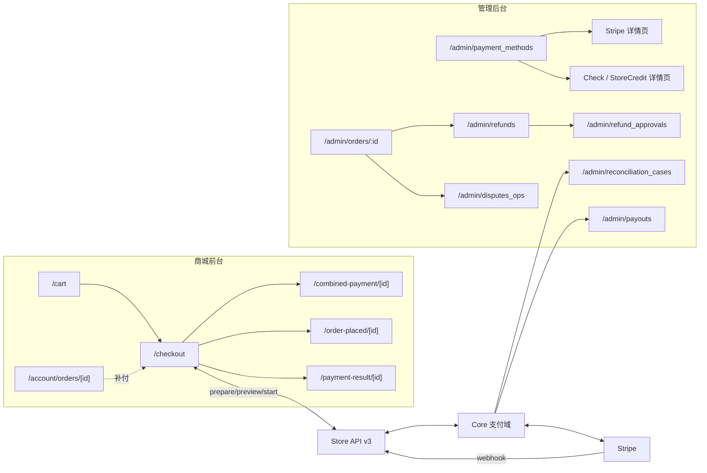

---

## 7. 删除清单（逐文件）

### A. 第三方厂商连根拔

| 目标 | 动作 |
|---|---|
| `backend/pallastrade_gems/pallastrade_adyen/` | 整目录删 |
| `backend/pallastrade_gems/pallastrade_paypal_checkout/` | 整目录删 |
| `platform/payments/pallastrade_{adyen,paypal_checkout}/` | 两份镜像删 |
| `backend/Gemfile` | 删 2 行（`pallastrade_adyen` / `pallastrade_paypal_checkout`） |
| `PallasTrade::Gateway::Bogus` | **出注册表**（后台不可选/不可新建）；**类保留**（大量测试造数依赖） |
| dev 库 `Credit Card`（Bogus）+ `chk` | 清记录 |

### B. 厂商层抽象（Q2-①）

| 目标 | 位置 |
|---|---|
| 服务 | `core/app/services/pallastrade/payments/providers/{config,state,validate,account}.rb` |
| 模型方法 | `payment_method.rb`：`provider_capability_declaration` / `provider_capability` / `provider_account_config` / `provider_effective_scope` / `provider_state` / `provider_diagnostics` |
| 网关声明 | `pallastrade_stripe/gateway.rb`：`self.provider_capability` |
| 后台 | `_provider_diagnostics.html.erb`；`payments_helper.rb` 的 `provider_diagnostics*` 系列 + `provider_account_form` |
| 动作/路由 | `payment_methods_controller#update_provider_account` / `#sync_provider_account`；`routes.rb` 两行 |
| i18n | `admin.payment_methods.provider_diagnostics.*`（en + zh-CN） |
| 测试 | `providers/{config,validate,state,account}_spec.rb`、`payment_provider_diagnostics_spec.rb`、`payment_provider_account_spec.rb` |
| 验证器 | `payment-providers-rspec` + `AGENTS.md §6` 对应行 |
| 消费点修正 | `disputes/build_evidence_snapshot.rb` 的 `provider_capability?` → 改为直接判断 `is_a?(PallasTradeStripe::Gateway)` |
| **停用改法** | `active` 原生布尔（去掉 `State.disable!` 的粘性三态） |

### C. 方式级路由（Q2-②，零生产消费点）

`core/app/services/pallastrade/payments/routing/{decide,policy,summary}.rb`、`spec/services/.../routing/{decide,policy_write}_spec.rb`、验证器 `payment-routing-rspec`、skill 段落、`AGENTS.md §6` 该行、`store.private_metadata['payment_routing']` 旧值（保留不读）。

### D. 适用范围 `rule_set`（Q2-③，**契约变更**）

| 目标 | 位置 |
|---|---|
| 引擎 | `payments/availability/{rule_set,evaluator}.rb` |
| 模型 | `payment_option_rule_set` / `payment_option_scope_summary` |
| 求值 | `Availability::Resolver` 的范围分支 |
| 后台 | `_options.html.erb` 的 `scope` 列；`payments_helper.rb` 的 `payment_option_scope_*` 4 个 helper；控制器 `merged_payment_option_rule_set` |
| 契约 | admin `payment_method_serializer` 的 `rule_set`/`scope_summary`；**OpenAPI（`backend/public/api-docs/admin.yaml`）+ `platform/docs/api-reference/`**；SDK 类型（`platform/packages/sdk/src/types`，含 `rule_set` 字段） |
| 前端类型 | `backend/app/javascript/types/serializers/PallasTradeApiV3AdminPaymentMethod.ts` |
| 测试 | d8 相关用例、resolver 的范围分支用例 |
| 验证器 | `d8-availability-rspec` + `AGENTS.md §6` 该行 |

### E. 熔断（Q3）

`payments/circuit_breaker/**`、`payments/health/metrics.rb`、`payment_method.rb` 的 `breaker_state` / `soft_disabled?` / `soft_disable!` / `soft_enable!`、`_breaker.html.erb`、`soft_disable`/`soft_enable` 动作与路由、`D11CircuitBreakerSweepJob`、5 个 spec、验证器 `d11-circuit-breaker-rspec` + `AGENTS.md §6` 该行、`Availability::Resolver` 的熔断分支。

### F. 顺带

- **丢弃 S3 未提交 WIP**（载体 `Providers::Account` 属删除面）
- `harness.config.mjs` 删 4 个验证器
- 各 skill 中对应小节改「已废弃」或删除
- `scenarios.json`：为「收敛」新增 1 个 GS 场景

---

## 8. 保留清单（不能碰）

| 保留 | 理由 |
|---|---|
| `PaymentSessions::Start`（含入口级门禁 422 `payment_option_not_available`） | 建会话唯一入口 |
| `Availability::{Resolver,Context}`（**去掉范围/熔断分支**） | 前台与建会话的**同一求值点**；且承载 D9 环境隔离 + D15c 3DS |
| D9 环境隔离 | test 不进前台 |
| D15c 3DS 策略与下发 | 未要求删 |
| D10 前台密钥下发 | 只给 publishable |
| D16 入口展示元数据 | 你要的「一行一种方式」 |
| D7 入口级支付区 | 前台支付区 |
| 凭据健康 + Webhook 卡 | Q3 确认保留 |
| 退款/争议/对账/账本全套 | 资金事实，与厂商层无关 |
| 组合支付数据层（多条 `Payment`） | 业务线 |
| `platform/payments/pallastrade_stripe/` 镜像 | Stripe 本身保留（镜像同步属治理决策，另行处理） |

---

## 9. 实施切片（每步跑绿再进下一步）

| # | 切片 | 内容 | 验证器 |
|---|---|---|---|
| **0** | 清算 | 丢弃 S3 WIP、关 gate | — |
| **1** | 删路由 | P3 全套（零消费点） | 下线 `payment-routing-rspec` |
| **2** | 删熔断 | D11 全套 | 下线 `d11-circuit-breaker-rspec` |
| **3** | 删厂商层 | Providers::* + 诊断卡 + 账户表单；停用改 `active` | 下线 `payment-providers-rspec` |
| **4** | 删范围 | `rule_set` + 后台 scope + **契约同步** | 下线 `d8-availability-rspec`；`generated:check` |
| **5** | 删第三方厂商 | Adyen/PayPal + 镜像 + Gemfile + Bogus 出注册表 | 全量 check |
| **6** | 后台收敛 | Stripe 页最终形态；列表只剩 3 条；Check/StoreCredit 极简页 | `admin-payment-methods-rspec`、`admin-theme-rspec`、`admin-i18n-rspec` |
| **7** | 知识同步 | AGENTS.md / skills / scenarios / PRD 回写 | `doc-impact`、`sync-check` |
| **8** | **Place Order 正名与显式化**（**可独立先行，不依赖切片 1–6**） | BFF `prepare` → `place-order`（旧名留薄别名）；`prepareOrder` → `placeOrder`；契约把「建单结果」放显眼位；术语统一 | `storefront-test`；`checkout-preview-quote-rspec` 回归 |

> 切片 8 是**纯前向增强**（不删任何东西），因此**可以最先做或最后做**，与 1–7 的删除工作互不阻塞。

---

## 10. 风险与代价

| 风险 | 说明 | 缓解 |
|---|---|---|
| **契约变更** | 删 `rule_set`/`scope_summary` 影响 OpenAPI + SDK 类型 + 前台类型 | 切片 4 单独做，跑 `generated:check` |
| **数据残留** | `metadata['account']`、`options[].rule_set`、`payment_routing` 旧值保留但不读 | 显式声明**不迁移**；如需可加一次性清理任务 |
| **测试面大** | D8/D11/P0/P3 的 spec 共约 15 个文件 | 按切片逐个下线；每步跑全量确认 |
| **AGENTS.md/验证器同步** | 删验证器要同步 §6 与 `harness.config.mjs` | 每切片一并提交 |
| **回滚** | 删除量大 | 每切片独立提交 → `git revert` 单切片即可回退 |
| **`Availability::Resolver` 误删** | 整体删会塌「选得上、付不了」防线 | **只删两个分支**，本体与同源约束不动 |

---

## 11. 待确认项（开工前必须定）

| # | 问题 | 我的建议 |
|---|---|---|
| **1** | `Availability::Resolver` **只删范围/熔断两个分支，不删本体** —— 同意吗？ | ✅ 同意即可（删本体将同时失去「环境隔离」与「3DS 闸门」） |
| **2** | `optionized` 隐式门控**一并删掉**，改为显式「入口可见 = `active` 为真」 —— 同意吗？ | ✅ 同意（消除隐形状态迁移） |
| **3** | `rule_set` 是**契约变更**（动 OpenAPI + SDK + 前台类型）—— 接受这个代价吗？ | ✅ 接受则切片 4 单独提交 |
| **4** | `Gateway::Bogus`：**类保留、出注册表**（后台不再可选）—— 还是**连类一起删**（会牵动大量测试造数）？ | 建议前者 |
| **5** | dev 库里 `Credit Card`（Bogus）与 `chk` 两条**记录**清掉 —— 同意吗？ | ✅ 同意（名字最易混淆） |
| **6** | Place Order 正名：**BFF `prepare` → `place-order`**，`prepare` 保留为薄别名，前台函数 `prepareOrder` → `placeOrder`—— 同意吗？ | ✅ 同意（**Store API 与支付链零改动**；两段语义今天已实现，本次是**正名 + 显式化**） |
| **7** | 顾客视角仍是**一次点击**（按钮文案与交互不变）—— 同意吗？ | ✅ 同意（两段编排是**实现细节**，不暴露给顾客） |
| **8** | 建单失败 → **停在结账页页内提示**（零跳转、零扣款、订单不存在）—— 同意吗？ | ✅ 同意（与「支付失败零跳转」口径一致） |
| **9** | 是否给「建单成功」**新增 `order.placed` 事件**？ | ❌ **建议不加** —— `order.submitted` 已是同一时刻的语义等价事件，再加 = 重复事实源 |

> 确认 1–9 后，从切片 0 + 1 开始（切片 8 可任意插队）。

---

## 12. 切片 8 展开：Place Order 的交付与验收

### 12.1 交付清单（逐文件）

| 文件 | 动作 | 内容 |
|---|---|---|
| `storefront/src/app/api/checkout/place-order/route.ts` | **新增** | 由 `prepare/route.ts` 内容搬移；头注释改为「第一段：Place Order」；响应把 `order_id` + `quote` 放在显眼位 |
| `storefront/src/app/api/checkout/prepare/route.ts` | **改薄** | 保留为别名，转发到 `place-order` 的处理函数（或 re-export），做过渡期兼容 |
| `storefront/src/components/checkout/UnifiedCheckout.tsx` | **改名** | `prepareOrder` → `placeOrder`；端点引用 → `place-order`；注释术语统一 |
| `storefront/src/lib/checkout/server.ts` | **改名** | `CheckoutPrepareBody` → `CheckoutPlaceOrderBody`（保留旧名 type alias） |
| `docs/design/payment-convergence-stripe-only.md` | 已改 | §3.0（本文件） |
| `docs/prd/**` | **回写** | PRD-20260915 术语对齐（`prepare` → `place-order`） |
| `ai/skills/pallastrade-checkout/SKILL.md` | **更新** | 记录两段语义的正式命名与边界 |
| `harness/scenarios/scenarios.json` | 更新 | 若新增 eval 场景则登记 |

### 12.2 不改的东西（明确边界）

| 不改 | 理由 |
|---|---|
| `backend/**` 任何文件 | Store API `carts/:id/submit` 已满足全部需求 |
| `platform/packages/**` | SDK 类型无变化（BFF 是内部契约） |
| 数据库 / migration | **零 schema 变化** |
| 支付链（`PaymentSessions::Start` / Stripe / webhook） | 第 ② 段完全不动 |
| 顾客可见 UI 文案与交互 | 一次性点击不变 |

### 12.3 验收清单

| # | 验收点 | 验证方式 |
|---|---|---|
| 1 | 建单失败 → **零扣款、零订单、零跳转** | E2E：制造缺货商品 → 点击付款 → 断言页内提示 + DB 无新 Order + 无 Stripe 请求 |
| 2 | 建单成功 + 支付失败 → 订单存在（`pending`）、可补付 | E2E：用测试卡触发拒绝 → 断言订单在 + `/account/orders/[id]` 可补付 |
| 3 | 金额未变 → **一次点击走完两段** | E2E：点一次 → 断言先 `place-order` 再 `start`，无第二次交互 |
| 4 | 金额变化 → 停在确认块，且**订单已建、不重复提交** | E2E：改库存触发变价 → 确认块出现 → 再点 → 断言只有 1 张 Order |
| 5 | 幂等：并发 / 重试不产生第二张订单 | 集成：同一 cart 连续两次 `place-order` → 同一 `order_id` |
| 6 | 钱包形态 2 不回归 | E2E：Apple Pay 面板仍可拉起 |
| 7 | 旧端点 `prepare` 仍可用 | 契约：直接调 `prepare` 返回与 `place-order` 等价 |

### 12.4 风险

| 风险 | 缓解 |
|---|---|
| 改名导致漏改引用（BFF 路径是字符串字面量） | 全仓 `rg "checkout/prepare"` 一次清；保留薄别名兜底 |
| 别名长期残留 | 设定明确删除时点（切片 7 知识同步时），并在 §8 保留清单登记 |
