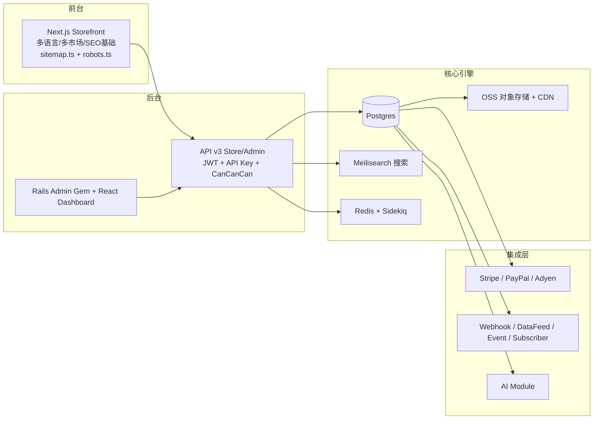
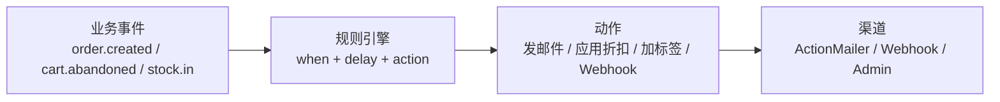

# PallasTrade 对标 Shopify 调研分析与升级路线方案

> **文档类型**：Research / 能力盘点与升级路线
> **日期**：2026-08-14
> **状态**：Draft（待评审确认）
> **对标基准**：Shopify（独立站 SaaS 标杆）、Solidus/Spree 生态（同源框架演进方向）
> **适用范围**：PallasTrade 全栈（backend / storefront / platform）

---

## 1. 背景与目标

### 1.1 背景

PallasTrade 是一套自托管（self-hosted）电商平台，技术栈为 **Ruby on Rails 8.1（分层 Gem 架构）+ Next.js Headless Storefront + TypeScript SDK/CLI**，当前已部署于阿里云（dev/prod 单栈策略），面向**海外 DTC 独立站**场景。

从能力盘点看，PallasTrade 的**核心交易引擎**（商品/购物车/订单/履约/支付/促销/多租户）已相当完整，与 Shopify 的核心交易能力基本对齐。但对照 Shopify 的**增长层能力**（营销、内容、SEO、客户生命周期、生态），存在明显差距——这些正是独立站能否获客、转化、复购的分水岭。

### 1.2 目标

1. 系统盘点 PallasTrade 现有能力（功能 / 业务 / 架构三维）；
2. 对标 Shopify 等独立站标杆，识别差距与机会点；
3. 为每个差距项给出**细致的升级思路**（目标、实现路径、涉及层、工作量、风险、验收）；
4. 输出**分阶段优先级路线图**，供后续 PRD 立项。

### 1.3 读者

- 工程负责人：用于排期与立项；
- 后端/前台/平台开发者：用于理解升级项的技术路径；
- 产品/运营：用于理解业务场景差距。

---

## 2. PallasTrade 现状全景

### 2.1 架构总览



### 2.2 功能能力清单（现状）

| 领域 | 已有能力 | 备注 |
|---|---|---|
| 商品 | 产品/变体/选项(OptionType)/原型(Prototype)/分类(Taxon/Taxonomy)/品牌/价格表(PriceList)/数字商品(Digital)/媒体(Image/Media) | 完整 |
| 交易 | 购物车、结账(Checkout)、订单(Order)、促销(Promotion)/优惠码(CouponCode)/价格规则(PriceRule)、礼品卡(GiftCard)、店铺信用(StoreCredit) | 完整 |
| 履约 | 多仓库(StockLocation)、库存(StockItem/Movement/Transfer)、发货(Shipment)、退货/退款/换货/报销(Return/Refund/Reimbursement/Exchange) | 完整 |
| 支付 | Stripe / PayPal Checkout / Adyen 三网关、支付会话、退款、信用卡(含 wallet 字段：apple_pay/google_pay 基础) | 网关抽象良好 |
| 客户 | 账户、地址、信用卡、礼品卡、愿望清单(Wishlist)、newsletter、客户分组(CustomerGroup)、store credit | 完整 |
| 多租户 | Store / Market / Country / Zone / Currency / Locale / Channel + 翻译(Translations) | 完整，跨境基础扎实 |
| 数据/集成 | metafield、custom field、导入导出(Import/Export)、报表(Report)、DataFeed、Webhook(Endpoint/Delivery)、事件(Event)+Subscriber、API Key+Scope | 完整 |
| 前台 | 产品列表/详情、分类、购物车、账户中心(订单/地址/信用卡/礼品卡/资料/注册/找回密码)、政策页、多语言多市场、sitemap/robots | 交易功能完整 |
| 后台 | Rails Admin Gem + React Dashboard：商品/订单/客户/促销/库存/翻译/Webhook/导入导出/API Key 全量 CRUD | 完整 |
| 安全 | Turnstile 真人验证、CORS 白名单、角色/权限(CanCanCan)、API Key 分级 | 良好 |
| 搜索 | Meilisearch（faceted 过滤基础、search_indexable concern） | 有基础，可加深 |
| AI | pallastrade_ai gem（AI 工具页、provider 管理） | 初期 |

### 2.3 关键缺失（盘点确认）

通过模型层/控制器层/前台路由全量盘点，确认以下**不存在**：

- ❌ 博客/文章/CMS 内容管理（无 Blog/Post/Page 模型）
- ❌ 产品评论/评分（无 Review 模型）
- ❌ 订阅制电商（无 Subscription 模型，`Subscriber` 仅为事件订阅者）
- ❌ 弃单恢复 / 营销自动化序列（无 AbandonedCart / Automation）
- ❌ 社交登录（无 OmniAuth / OAuth 第三方登录）
- ❌ 商品/页面级 SEO 元数据管理（仅全局 sitemap/robots）
- ❌ 图片 URL 动态变换（无 resize/format/webp 服务）
- ❌ 自动税务 / 关税 / HS Code
- ❌ 承运商实时运费（仅有静态 shipping_method/calculator）
- ❌ 忠诚度积分 / 动态客户细分（有 customer group 但为静态）
- ❌ 补货通知（Back-in-stock）
- ❌ 第三方 App OAuth 授权生态（有 API Key，但无第三方应用授权流）
- ❌ 可观测性（无 Sentry/APM/告警）
- ❌ A/B 测试 / 实验平台

---

## 3. 对标差距分析（三维）

### 3.1 功能差距（按价值/成本排序）

| 优先级 | # | 能力 | 现状 | Shopify 参考 | 核心价值 |
|---|---|---|---|---|---|
| **P0** | 1 | SEO 深度增强 | 仅全局 sitemap/robots | 商品/集合级 meta、JSON-LD、301 重定向 | 免费流量 |
| **P0** | 2 | 内容管理 CMS（博客） | 仅 policies 静态页 | 博客/文章/页面 | 内容营销+SEO 主引擎 |
| **P0** | 3 | 邮件营销自动化 | 事务邮件模板+newsletter+事件 | 弃单恢复/欢迎序列/广播 | 复购与挽回 |
| **P0** | 4 | 产品评论/评分 | 无 | Product Reviews | 转化率+信任 |
| **P0** | 5 | 图片 CDN 变换 | OSS+静态 cache-control | URL 参数 resize/format/webp | 性能+体验 |
| **P1** | 6 | 社交登录+快速结账 | 仅邮箱注册 | Apple/Google Sign-in、Shop Pay | 降低门槛、转化 |
| **P1** | 7 | 订阅制电商 | 无 | Shopify Subscriptions | 订阅客单 |
| **P1** | 8 | 自动税务 | tax_category/rate/zone 静态 | 自动 VAT/GST | 跨境合规 |
| **P1** | 9 | 承运商实时运费 | 静态运费 | UPS/FedEx 实时报价 | 转化+成本 |
| **P1** | 10 | 忠诚度/积分+动态细分 | 静态 customer group | 积分/等级/动态规则 | 复购 |
| **P1** | 11 | 补货通知 | 无 | Back-in-stock | 挽回缺货转化 |
| **P2** | 12 | 第三方 App OAuth 生态 | API Key+Scope | Shopify App Model | 平台化 |
| **P2** | 13 | 可观测性 | 日志手工排查 | Sentry/APM/告警 | 稳定性 |
| **P2** | 14 | 搜索增强 | Meilisearch 基础 | autocomplete/同义词/个性化 | 搜索转化 |
| **P2** | 15 | 事件可靠性深化 | webhook+事件 | outbox/死信/重试可视化 | 数据一致性 |
| **P2** | 16 | A/B 测试 | 无 | 实验平台 | 转化优化 |

### 3.2 业务场景差距

| 业务场景 | 现状 | 差距 | 补齐后价值 |
|---|---|---|---|
| **引流** | 依赖外部投放，站内无内容资产 | 无博客/SEO 页面/内容站内沉淀 | 免费自然流量、长尾 SEO |
| **转化** | 标准结账流 | 无评论背书、无社交登录、无快速结账 | 提升 CVR |
| **复购/挽回** | 无主动触达 | 无弃单恢复、无营销序列、无忠诚度 | 提升 LTV |
| **跨境合规** | 多市场有、税/关空白 | 自动税务、发票、禁运 | 合规出海 |
| **B2B 批发** | price_list 基础 | 无公司账户/审批流/最低起订 | 可选，看客户结构 |

### 3.3 架构差距

| 架构维度 | 现状 | 差距 | 建议方向 |
|---|---|---|---|
| **营销自动化** | 事件/订阅基础完备（Event+Subscriber+Webhook+Sidekiq） | 无规则/序列编排层 | 增加 Automation 编排层（规则+画布+定时任务），复用现有事件总线 |
| **可观测性** | 无监控/告警，2C 服务器+手动运维 | 故障定位靠日志（本次磁盘满即暴露） | 引入 Sentry + 资源告警 + 健康检查 + Sidekiq UI |
| **生态开放** | API Key+Scope+Webhook | 无第三方 OAuth 授权流 | 增加 OAuth2 授权码 + 应用清单，向平台化演进 |
| **性能/边缘** | OSS+CDN 静态资源 | 图片动态变换、边缘缓存策略 | 图片服务 + 更细的缓存分层 |
| **多租户隔离** | Store 数据按 current_store 作用域 | 备份/隔离策略单一 | 租户级备份、数据导出（已有 export，可深化） |
| **事件可靠性** | Sidekiq+WebhookDelivery | 无 outbox/死信可视化 | outbox 模式 + 重试/重放管理 |

---

## 4. 升级方案详述（含升级思路）

> 每个升级项给出：目标 / 升级思路 / 实施步骤 / 涉及层 / 工作量 / 风险 / 验收。

### 4.1 P0-1 SEO 深度增强 ⭐ 建议最先做

**目标**：商品、分类、CMS 页面具备独立 SEO 元数据与结构化数据，支持 301 重定向，形成完整的站内 SEO 能力。

**升级思路**：
1. **元数据层（低成本先行）**：利用现有 **metafield/custom field** 能力先落地商品级 `meta_title` / `meta_description` / `og_image`，无需新表；后续若使用频繁再抽为专用列（`Product#meta_title` 等）。
2. **序列化与 API**：Store API serializer 暴露 `seo` 对象；Admin API 支持读写（`expand=seo`）。
3. **前台渲染**：Next.js 商品/分类页读取 `seo` 数据 → 动态 `<title>`/`<meta name="description">`/`<meta property="og:*">` + **JSON-LD 结构化数据**（`Product`、`BreadcrumbList`、`Organization`），用 `generateMetadata` 实现。
4. **301 重定向管理**：新增 `Redirect` 模型（`from_path` / `to_path` / `status` / `store`），Admin CRUD，API 暴露；Next.js 中间件或 `next.config` redirects 消费。用于商品下架/改 URL 后的 SEO 权重保留。
5. **规范化 URL 与分页**：`rel=canonical`、分页 `prev/next`、多语言 `hreflang`（已有 country/locale，可自动生成）。
6. **集合/落地页 SEO**：Taxon 增加 SEO 字段（同理走 metafield 先行）。

**涉及层**：Core（可选列/模型）、API（serializer+controller）、Admin（表单）、Storefront（meta 渲染+middleware）。
**工作量**：中（3-5 人日）；**风险**：低；**依赖**：无。
**验收**：商品页有独立 title/description + Product JSON-LD；301 重定向可配置生效；`curl` 验证 meta 标签。

### 4.2 P0-2 内容管理 CMS（博客/页面）

**目标**：支持博客文章与自定义页面，形成内容营销与 SEO 资产。

**升级思路**：
1. **模型**：Core 新增 `Blog` / `Post` / `Page`（或统一 `Content` 多态），字段含 `title`、`slug`、`body`（Rich Text / Markdown）、`excerpt`、`cover_image`、`author`、`published_at`、`seo` 字段、**多语言**（复用 `translations` 机制）、`store` 作用域。
2. **API**：Store API 只读（`/api/v3/store/posts`、`/posts/:slug`）；Admin API 全量 CRUD（草稿/发布/定时发布）。
3. **前台**：`/blog`、`/blog/[slug]` 路由；列表分页；文章页渲染 + SEO meta + JSON-LD `Article`；接入 sitemap。
4. **后台**：Rails Admin Gem 增加 Blog/Post 管理页（或 dashboard 扩展）；Markdown 编辑器。
5. **关联**：商品/分类可关联文章（内容引流到商品）。

**涉及层**：Core（模型+迁移）、API（store/admin）、Admin（UI）、Storefront（路由/渲染）。
**工作量**：中（4-6 人日）；**风险**：低；**依赖**：无（可在 P0-1 之后复用其 SEO 渲染管线）。
**验收**：可发布双语文章；`/blog` 列表与详情正常；文章进 sitemap；SEO meta 生效。

### 4.3 P0-3 邮件营销自动化（弃单恢复/序列）

**目标**：基于现有事件系统实现**弃单恢复**与**营销序列**，无需引入外部 ESP。

**升级思路**：
1. **现状复用**：已有事务邮件模板（`storefront/src/app/dev/emails`）、`newsletter_subscriber`、`Event+Subscriber`、Sidekiq。
2. **弃单检测**：`AbandonedCart` 模型（记录 cart 状态/时间/金额/联系方式），由 Sidekiq 定时任务扫描"加入购物车/进入结账但未下单"的会话（如 1h/24h 未下单），触发邮件模板（含恢复链接）。
3. **自动化规则引擎**：`Automation` / `AutomationStep` 模型（触发条件=事件类型 + 延迟 + 动作=发邮件/加标签/应用折扣码），Klaviyo 式"when X → wait → send Y"。
4. **邮件发送**：Rails 内置 ActionMailer + SMTP（或接 SendGrid/Mailgun/SES）；`dev/emails` 预览机制已存在可直接复用。
5. **效果度量**：`email_event` 记录发送/打开/点击（可选埋点），与订单归因。

**涉及层**：Core（模型+任务）、API（admin CRUD 规则）、Storefront（邮件模板/恢复链接）、后台（规则配置 UI）。
**工作量**：中（4-6 人日，先弃单恢复再规则引擎）；**风险**：低-中（发送量与反垃圾）；**依赖**：P0-2 无直接依赖。
**验收**：弃单 1h/24h 自动发邮件；恢复链接回购物车；后台可配置规则。

### 4.4 P0-4 产品评论/评分

**目标**：商品评论与评分，提升转化与 SEO（Review JSON-LD）。

**升级思路**：
1. **模型**：`Review`（`product`、`customer`、`rating(1-5)`、`title`、`body`、`status[pending/approved/rejected]`、`verified_purchase`、`store`），唯一约束（product, customer）。
2. **API**：Store 只读（按商品聚合 `average_rating`/`count`，Serializer 暴露）；写（下单后或注册后可评）；Admin 审核 CRUD + 批量审核。
3. **前台**：商品详情页评分摘要+评论列表+评论表单（登录客户）；展示"已购验证"徽标。
4. **SEO**：商品页 JSON-LD `AggregateRating` + `Review`（仅 approved）。
5. **防滥用**：限制每商品每客户一条；结合订单判定 verified。

**涉及层**：Core（模型+迁移）、API（store/admin）、Admin（审核 UI）、Storefront（详情页组件）。
**工作量**：中（3-5 人日）；**风险**：低；**依赖**：无。
**验收**：可提交/审核/展示评论；聚合评分进商品页与 JSON-LD。

### 4.5 P0-5 图片 CDN 动态变换

**目标**：URL 参数化图片处理（resize / format=webp / 质量 / 裁剪），提升性能与体验。

**升级思路**：
1. **方案选型**：OSS 图片处理服务（阿里云 OSS ImageStyle/`x-oss-process`）或自建 **imgproxy**（容器化，轻量）；两者都支持 URL 变换。
2. **URL 约定**：`/media/:id?w=200&h=200&fm=webp&q=80`，由图片服务处理并 CDN 缓存（带 `cache-control` 与版本化 key）。
3. **Storefront**：Next.js `next/image` 配置 **loader** 指向图片服务，产出响应式 srcset（多尺寸、webp/avif）。
4. **兼容**：无参数时回退原图，保证老 URL 不破；仅对受信任尺寸白名单开放（防滥用）。

**涉及层**：Storefront（loader/组件）、平台（图片服务部署）、OSS/CDN（缓存策略）。
**工作量**：小-中（2-3 人日）；**风险**：低；**依赖**：OSS（已有）。
**验收**：商品图支持 `?w=&fm=webp`；页面 LCP 明显改善；老图 URL 兼容。

### 4.6 P1-1 社交登录 + 快速结账

**目标**：降低注册门槛，支持 Apple/Google 登录与钱包快速支付。

**升级思路**：
1. **社交登录**：引入 **OmniAuth**（google_oauth2 / apple / facebook），`UserIdentity` 模型已存在（可复用）→ 增加 provider/uid；登录/注册页加社交按钮；回调完成账户关联（邮箱匹配则绑定）。
2. **钱包支付**：`credit_card` 已有 `wallet` 字段（apple_pay/google_pay 基础）→ 前端集成 **Apple Pay / Google Pay**（Stripe Payment Request Button，现有 Stripe 网关即可承接）；结账页"快速支付"按钮。
3. **安全**：社交登录仅需邮箱+身份，仍走 Turnstile/风控；钱包支付走 3DS/生物识别由支付方处理。

**涉及层**：Core（UserIdentity 扩展）、API（auth 扩展）、Storefront（登录/结账 UI）、支付（Stripe 钱包）。
**工作量**：中（4-6 人日）；**风险**：中（Apple 开发者账号/域名校验、OAuth 客户端配置）；**依赖**：无。
**验收**：Google/Apple 登录可注册并关联；结账页可唤起钱包支付。

### 4.7 P1-2 订阅制电商

**目标**：支持定期购（订阅商品、周期、跳过/暂停/取消）。

**升级思路**：
1. **模型**：`Subscription`（customer、address、status）、`SubscriptionItem`（variant、qty、interval[week/month/quarter]）、`SubscriptionLineItem`（每期生成的 order line）。
2. **支付**：复用 Stripe 网关的 **Stripe Subscriptions API**（payment_method + schedule），或自研定时扣款（PaymentSession + Sidekiq 调度 + 重试）。
3. **下单**：按周期自动生成 Order（复用 checkout 引擎）；首期立即下单，后续由调度任务（Sidekiq Cron）创建。
4. **管理**：客户账户中心订阅管理（跳过/暂停/取消/改地址/改周期）；Admin 订阅 CRUD。
5. **电商联动**：库存、促销（订阅折扣价）、税务与普通单一致。

**涉及层**：Core（模型+调度）、API（store/admin）、Storefront（订阅页+账户中心）、支付（Stripe 订阅）。
**工作量**：大（8-12 人日）；**风险**：中-高（续费扣款失败/退款策略）；**依赖**：P1-1 钱包非必需。
**验收**：可创建订阅；周期触发生成订单并扣款；客户可自助管理订阅。

### 4.8 P1-3 自动税务

**目标**：按市场自动计算 VAT / GST / 销售税。

**升级思路**：
1. **现有基础**：`TaxCategory` / `TaxRate` / `Zone` 已存在（静态税率）。
2. **升级路径**：① 内置税率表（按 Country/State + 生效日期维护，Admin 可编辑）→ ② 对接第三方税务服务（**TaxJar / Avalara**，地址校验+自动税率，跨境合规更稳）。
3. **结账集成**：checkout 的 `OrderUpdater` 在地址确定后按市场/发货地查税率 → 生成 tax adjustments（现有 adjustment 机制）。
4. **发票**（可选联动）：生成 EU 合规 VAT invoice（订单完成时）。

**涉及层**：Core（税率解析）、API（store 结账）、Admin（税率维护）、可选外部服务。
**工作量**：中（3-5 人日内置 / +对接服务）；**风险**：中（税率准确性/合规）；**依赖**：无。
**验收**：不同市场结账自动带正确税率；税目在订单/发票中体现。

### 4.9 P1-4 承运商实时运费

**目标**：支持实时运费报价与更细的运费规则。

**升级思路**：
1. **现有基础**：`ShippingMethod` / `ShippingCategory` / `ShippingRate` / `ShippingCalculator` / `Zone` 已有。
2. **实时报价**：新增承运商适配器（UPS / FedEx / DHL / 17TRACK 等），按订单重量/体积/地址调报价 API → 生成 `ShippingRate`（标记 carrier_quote）。
3. **运费规则深化**：Shipping Profile（按商品/地区/重量/价格分段定价）、免费门槛、叠加规则。
4. **前台**：结账页展示多承运商选项（价格/时效）；预估时效展示。
5. **降级**：承运商不可达时回退静态运费（与本项目 Turnstile 降级思路一致）。

**涉及层**：Core（适配器+规则）、API（checkout 报价）、Storefront（结账展示）、后台（规则配置）。
**工作量**：中-大（5-8 人日）；**风险**：中（承运商账号/时区/接口稳定性）；**依赖**：无。
**验收**：结账可选实时报价；不可达时自动回退静态运费。

### 4.10 P1-5 忠诚度/积分 + 动态客户细分

**目标**：积分体系与动态客户分组，驱动复购。

**升级思路**：
1. **积分模型**：`LoyaltyPoint`（customer、amount、reason[order/review/referral]、expiry、balance 汇总）；`LoyaltyProgram` 规则配置（每消费 1 元积 X 分、评论加分、推荐加分）。
2. **兑换**：积分可抵现（挂到 `Adjustment`/`StoreCredit` 通道）或兑换礼品卡。
3. **动态细分**：`CustomerGroup` 扩展为动态规则（RFM：最近购买/频次/金额、标签、生命周期），Sidekiq 定时物化成员；用于促销定向/邮件分群。
4. **展示**：账户中心积分余额/明细；订单页显示积分获得。

**涉及层**：Core（模型+规则）、API（store/admin）、Storefront（账户中心）、Admin（规则配置）。
**工作量**：中（5-7 人日）；**风险**：低-中（规则复杂度）；**依赖**：无。
**验收**：下单/评论产生积分；积分可抵现；动态分组可用于促销。

### 4.11 P1-6 补货通知（Back-in-stock）

**目标**：缺货商品到货时通知订阅客户，挽回流失转化。

**升级思路**：
1. **模型**：`BackInStockSubscription`（variant、email/customer、status[active/notified]），唯一约束防重复。
2. **前台**：商品缺货时显示"到货通知我"输入框/按钮（登录客户自动带邮箱）。
3. **触发**：库存入账事件（StockMovement in）→ 扫描订阅 → 发邮件 + 标记 notified + 可选附带折扣码。
4. **API**：Store 创建/取消订阅；Admin 查看订阅与导出。

**涉及层**：Core（模型+事件订阅）、API（store）、Storefront（商品页组件）、邮件（模板）。
**工作量**：小-中（2-3 人日）；**风险**：低；**依赖**：无。
**验收**：缺货商品可订阅；到货自动发通知邮件。

### 4.12 P2-1 第三方 App OAuth 生态

**目标**：从"API Key 直连"演进为第三方应用授权模型，平台化。

**升级思路**：
1. **OAuth2 授权码流**：`OAuthApplication`（client_id/secret/redirect_uri/scope）、授权端点、token 端点（复用 `refresh_token`/`api_key` 基础设施）。
2. **Scope 细化**：现有 API Key scope 体系可直接映射到 OAuth scope。
3. **应用清单**：Admin 注册第三方应用 + 安装流程（仿 Shopify App Install）。
4. **Webhook 订阅**：已有 webhook_endpoint/subscriptions，应用可通过 OAuth token 自助管理订阅。
5. **沙箱/测试**：提供测试 store 数据与重放工具。

**涉及层**：Core（OAuth 模型）、API（授权/token 端点）、Admin（应用管理）、SDK（OAuth 客户端支持）。
**工作量**：大（8-12 人日）；**风险**：中（安全审计）；**依赖**：无。
**验收**：第三方应用可 OAuth 安装并调用受限 API + 订阅 webhook。

### 4.13 P2-2 可观测性

**目标**：监控、告警、可排查，降低 2C 服务器运维风险。

**升级思路**：
1. **错误追踪**：Sentry（Rails + Next.js）接入，错误聚合 + 版本关联。
2. **性能**：APM（如 Sentry Performance / OpenTelemetry）追踪慢请求/SQL。
3. **队列监控**：Sidekiq UI（内网保护）+ 队列深度/失败率告警。
4. **资源告警**：磁盘/内存/CPU 阈值告警（服务器端脚本或云监控）——**本次磁盘满事件为直接动机**。
5. **健康检查**：`/up` 已存在 → 加外部 uptime 监控（UptimeRobot 等）。

**涉及层**：全栈（埋点+部署）、运维（告警配置）。
**工作量**：中（3-5 人日）；**风险**：低；**依赖**：Sentry 账号。
**验收**：错误自动上报；磁盘/CPU 告警生效；Sidekiq 面板可查。

### 4.14 P2-3 搜索增强

**目标**：联想、同义词、个性化排序，提升搜索转化。

**升级思路**：
1. **autocomplete**：Meilisearch search-as-you-type → 前台搜索框联想（商品名/分类/品牌）。
2. **同义词/停用词**：Meilisearch synonyms 配置，Admin 可维护。
3. **个性化排序**：登录客户按历史浏览/购买加权（轻量规则排序），不引入重型推荐系统。
4. **搜索建议**：记录搜索词 → 管理后台"搜索词报表"（提升关键词策略）。

**涉及层**：Storefront（搜索组件）、Core（Meilisearch 配置）、Admin（同义词/报表）。
**工作量**：中（3-5 人日）；**风险**：低；**依赖**：Meilisearch（已有）。
**验收**：搜索框实时联想；同义词生效；搜索词报表可用。

### 4.15 P2-4 事件可靠性深化

**目标**：事件不丢失、可重试、可审计。

**升级思路**：
1. **Outbox 模式**：写库事务内写入 outbox 表 → 后台投递到事件总线（避免业务提交成功但事件丢失）。
2. **死信管理**：Sidekiq 失败任务转死信队列 → Admin 面板查看/重试/丢弃。
3. **Webhook 重放**：webhook_delivery 增加"重放"能力与签名验证（HMAC，仿 Shopify X-Shopify-Hmac-SHA256）。
4. **监控**：事件延迟/失败率指标（与 P2-2 联动）。

**涉及层**：Core（outbox+投递）、API（webhook 重放端点）、Admin（死信 UI）、平台（SDK 验签）。
**工作量**：中（4-6 人日）；**风险**：中（事务与并发）；**依赖**：无。
**验收**：模拟失败可重试；webhook 带签名可验证；死信可管理。

### 4.16 P2-5 A/B 测试

**目标**：首页/商品页变体实验，数据驱动转化优化。

**升级思路**：
1. **方案**：Next.js middleware 按实验 ID + 用户分组（cookie/随机）路由变体；或引入轻量 SDK（如 PostHog / GrowthBook）。
2. **实验管理**：Admin 配置实验（名称/变体/流量比例/目标指标）。
3. **指标回传**：订单/点击事件带 experiment 标签 → 报表。
4. **范围**：先做首页 Hero/商品页 CTA 等低成本实验。

**涉及层**：Storefront（middleware+变体组件）、Admin（实验配置）、分析（回传）。
**工作量**：中（3-5 人日）；**风险**：低；**依赖**：无。
**验收**：可创建实验并分流；报表可见转化差异。

---

## 5. 优先级路线图（分阶段）

```mermaid
flowchart LR
    subgraph 阶段一（立即，1-2 周）
        A1[P0-1 SEO 增强]
        A2[P0-5 图片 CDN 变换]
    end
    subgraph 阶段二（1 个月）
        B1[P0-2 CMS 博客]
        B2[P0-3 邮件自动化-弃单]
        B3[P0-4 产品评论]
        B4[P1-6 补货通知]
    end
    subgraph 阶段三（2-3 个月）
        C1[P1-1 社交登录+钱包]
        C2[P1-3 自动税务]
        C3[P1-4 实时运费]
        C4[P2-2 可观测性]
    end
    subgraph 阶段四（长期）
        D1[P1-2 订阅制]
        D2[P1-5 忠诚度]
        D3[P2-1 OAuth 生态]
        D4[P2-3 搜索增强]
        D5[P2-4 事件可靠性]
        D6[P2-5 A/B 测试]
    end
    A1 --> A2 --> B1 --> B2 --> B3 --> B4
    B2 --> C1 --> C2 --> C3 --> C4
    C4 --> D1 --> D2 --> D3 --> D4 --> D5 --> D6
```

### 阶段划分理由

| 阶段 | 内容 | 理由 |
|---|---|---|
| **一：立即可做** | SEO 增强 + 图片 CDN | 成本低（2-3 人日）、零依赖、直接提升免费流量与性能 |
| **二：营销三件套** | CMS 博客 + 弃单恢复 + 评论 + 补货通知 | 独立站增长主引擎；复用现有事件/邮件/多语言基础设施；每项 2-6 人日 |
| **三：转化与合规** | 社交登录/钱包 + 自动税务 + 实时运费 + 可观测性 | 提升 CVR 与合规，同时补齐运维短板（磁盘满教训） |
| **四：平台化与长期** | 订阅 + 忠诚度 + OAuth 生态 + 搜索/事件/A-B | 高投入高回报，按业务增长节奏推进 |

---

## 6. 架构演进建议（横切）

### 6.1 营销自动化编排层（支撑 P0-3 与未来增长）

现状事件总线（`Event` + `Subscriber` + Webhook + Sidekiq）已具备良好基础。建议沉淀一个**规则编排抽象**：



设计要点：规则可配置（Admin UI）、可回放（事件落库）、可度量（归因）。这一层是 P0-3 的直接实现，也为未来营销自动化（推荐、旅程）打地基。

### 6.2 可观测性补齐（强烈建议近期）

- 服务器 2C/40G、手动运维、无监控——本次磁盘满导致部署失败、排查靠手工，已暴露风险。
- 建议至少先做：**磁盘/CPU/内存阈值告警**（云监控或脚本）+ Sentry 错误上报。

### 6.3 第三方生态入口（平台化）

从"框架/产品"走向"平台"，OAuth + 应用清单是必经之路；与现有 API Key/Webhook 能力天然衔接，投入可控、收益（生态与扩展性）长期。

### 6.4 其他横切建议

- **多语言内容**：CMS 文章、SEO 元数据、评论等多语言化应复用现有 `translations` 机制，避免各模块自造轮子。
- **一致性原则**：新模型一律走 `current_store` 作用域（防跨店泄漏）、API 一律 v3 前缀 + prefixed ID（遵守既有约定）、外部服务不可达一律降级（参考 Turnstile 降级模式）。
- **性能**：图片变换 + 边缘缓存落地后再评估是否需要更细的缓存分层（如 CDN 上的商品页 ISR）。

---

## 7. 风险与依赖

| 风险/依赖 | 说明 | 缓解 |
|---|---|---|
| **服务器资源** | 2C/40G，多栈镜像+频繁重建已接近上限 | 阶段一先做 P2-2 可观测性；定期清理（已记录 memory）；必要时升配 |
| **海外网络** | challenges.cloudflare.com / ghcr 跨境被干扰 | 第三方集成一律设计降级路径（已验证模式）；镜像走本地构建/代理 |
| **合规** | 自动税务、GDPR/CCPA、邮件反垃圾 | 税务先内置表后对接服务；邮件提供退订；cookie 同意已具备 |
| **支付依赖** | 订阅/钱包依赖 Stripe 能力 | 先验证 Stripe 订阅与 Payment Request 在当前网关的可用性 |
| **人力投入** | 16 项升级，全做约 60-90 人日 | 分阶段推进，优先 P0；每项独立 PRD 立项 |

---

## 8. 附录

### 8.1 本文档依据的现状盘点

- 后端模型层：`backend/pallastrade_gems/pallastrade_core/app/models/pallastrade/`（约 170+ 模型）
- API v3 端点：Store（20+）/ Admin（50+）控制器
- Storefront 页面：`storefront/src/app/[country]/[locale]/(storefront)/`（商品/分类/购物车/账户/政策）
- 支付网关：`platform/payments/`（Stripe / PayPal Checkout / Adyen）
- 搜索：Meilisearch（`search_provider/meilisearch.rb`）
- 历史 PRD：`docs/prd/`（infra / catalog / storefront / admin / api）

### 8.2 相关既有 PRD（可复用基建）

| PRD | 关联升级项 |
|---|---|
| `PRD-20260809-infra-oss-storage.md` / `oss-cache-control.md` | P0-5 图片 CDN |
| `PRD-20260812-storefront-商城前台新增cookie功能.md` | 合规（邮件/分析埋点） |
| `PRD-20260812-storefront-商城前台注册面板接入-turnstile-真人验证.md` | 安全基线（后续模块沿用） |
| `PRD-20260810-storefront-对商城前台进行重新规划.md` | 前台信息架构（CMS/SEO 接入点） |
| `PRD-20260813-admin-移除管理后台-integrations-菜单及相关逻辑.md` | Admin 侧集成管理入口 |

---

*本文档为调研/路线建议，不构成代码变更。各升级项需单独 PRD 立项并经 gate 流程实施。*
