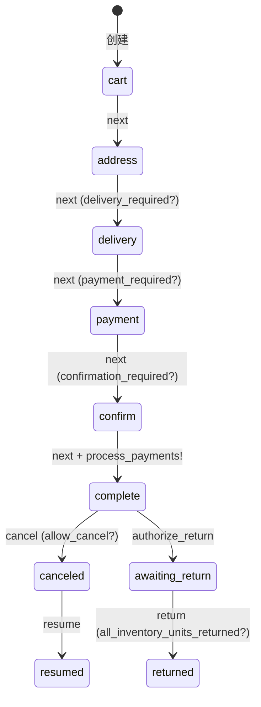
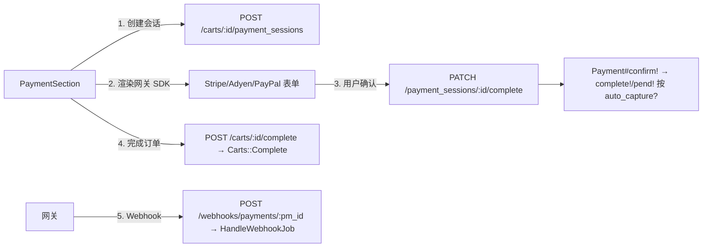
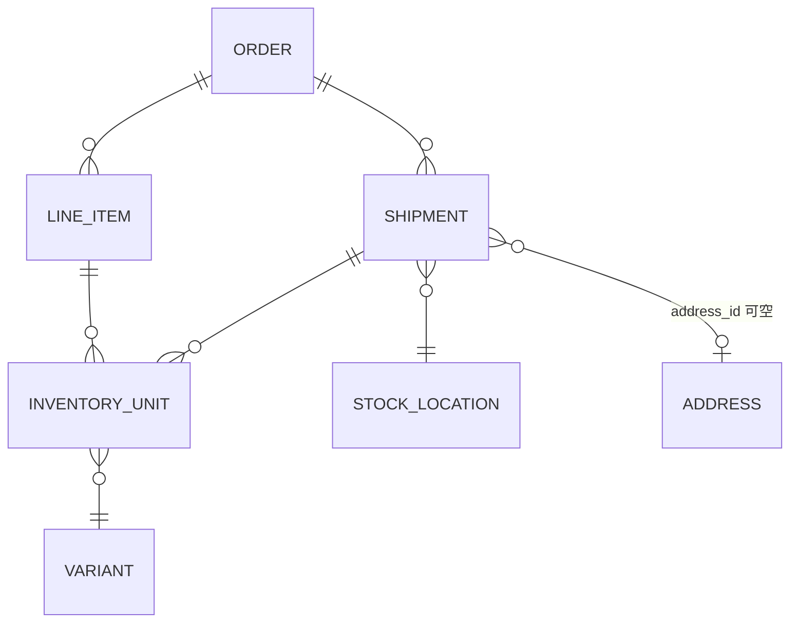
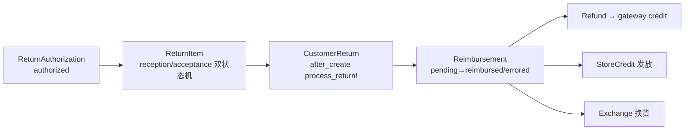

# PallasTrade 订单链路现状审查报告（商品 / 订单 / 支付 / 发货 / 售后）

> **文档类型**：Research / 链路现状盘点与拆单升级准备
> **日期**：2026-08-26
> **状态**：Draft（待评审确认）
> **审查范围**：商品 / 订单 / 支付 / 发货 / 售后 全链路，6 层跨层扫描（`backend/app`、`pallastrade_core`、`pallastrade_api`、`pallastrade_admin`、`storefront`、`platform`）+ 数据库 schema + 6.0 规划文档
> **升级目标**：父子订单结构、合并支付、自动拆单、手动拆单

---

## 1. 背景与目标

### 1.1 背景

PallasTrade 是一套自托管（self-hosted）电商平台，技术栈为 Ruby on Rails（分层 Gem 架构）+ Next.js Headless Storefront + TypeScript SDK。当前订单/购物车为单一 `PallasTrade::Order` 模型，支付硬绑定单订单，发货拆分为 shipment 级。为支撑"父子订单、合并支付、自动拆单、手动拆单"升级，需先全面盘点现状。

### 1.2 目标

1. 系统盘点商品 / 订单 / 支付 / 发货 / 售后五条链路的现状（业务 + 技术）；
2. 识别与"父子订单 / 合并支付 / 自动拆单 / 手动拆单"的差距；
3. 结合仓库既有 6.0 规划蓝图，输出升级准备要点与风险清单。

### 1.3 读者

- 工程负责人：用于排期与立项；
- 后端 / 前台 / 平台开发者：用于理解升级项的技术路径。

---

## 2. 核心结论（先看这里）

| 升级目标 | 当前现状 | 差距 |
|---|---|---|
| **父子订单** | ❌ 订单是**扁平结构**。`pallastrade_orders` 表无 `parent_id` / `order_group_id` / `vendor_id`；全仓库 grep 无 `parent_order` / `child_order` / `OrderSplit` 概念 | 需全新建模（仓库已有蓝图：`OrderGroup`） |
| **合并支付** | ⚠️ 一个订单可有**多条支付**（store credit 混合支付、分批捕获），但 `Payment` 硬绑定单 `order_id`，无支付聚合/层级 | 需引入父支付/支付拆分记录 |
| **自动拆单** | ⚠️ 已有**拆 shipment（发货单）**能力：路由自动按仓库/分类/缺货/数字商品拆多个发货单；但**无拆 order** | 需在 checkout 完成服务中插入拆单 |
| **手动拆单** | ✅ 已有：Admin `split/transfer`（页面 + API v3）、`FulfilmentChanger`、`Fulfillments::Create` | 但**无 SDK 封装**，且是拆 shipment 不是拆 order |

**最重要的发现**：仓库 `platform/docs/plans/` 下已有 **`6.0-cart-order-split.md`**（Cart/Order 分离，Design finalized）和 **`6.0-multi-vendor-marketplace.md`**（Draft，包含 `OrderGroup` + `PaymentSplit` + 按 `vendor_id` 分区拆单的完整设计）——升级方向与 6.0 规划高度吻合，**强烈建议先读这两份文档再动手**。

---

## 3. 总体架构分层

```mermaid
flowchart LR
    subgraph "框架 gem（所有业务逻辑）"
        CORE[palastrade_core<br/>模型/状态机/服务/计算器]
        API[palastrade_api<br/>API v3 端点/序列化器]
        ADMIN[palastrade_admin<br/>HTML 后台]
        GW[palastrade_stripe / adyen / paypal<br/>网关 gem]
    end
    subgraph "Host App（几乎零自定义）"
        HOST[backend/app<br/>仅 admin_user.rb + user.rb + ai_controller.rb]
    end
    subgraph "前端"
        SF[storefront Next.js]
        SDK[@pallastrade/sdk]
    end
    SF --> API --> CORE --> GW
    ADMIN --> CORE
    SDK --> API
```

- **Host App 层几乎无业务代码**：`backend/app/models/pallastrade/` 只有 `admin_user.rb` 和 `user.rb`；`backend/app/controllers/pallastrade/admin/` 只有一个 `ai_controller.rb`。**所有订单/支付/发货/售后逻辑都在框架 gem 中**，升级拆单主要改 `pallastrade_core` + `pallastrade_api` + `pallastrade_admin` + `storefront`。
- **平台包现状（重要修正）**：`platform/packages/` 下**只有** `cli`、`create-pallastrade-app`、`docs`、`sdk`、`sdk-core`。AGENTS.md 提到的 `admin-sdk`、`dashboard`、`dashboard-ui`、`dashboard-core` **当前仓库不存在**。

---

## 4. 商品链路现状

### 4.1 模型结构（全部在 `pallastrade_core`）

| 模型 | 前缀 | 职责 |
|---|---|---|
| `Product` | `prod_` | 商品主模型，master-variant 模式，`has_one :master` + `has_many :variants`，状态机 `draft/active/archived` |
| `Variant` | `variant_` | 可售单元，`is_master` 标志，持有 SKU/价格/库存/重量 |
| `Taxon` / `Category` | `ctg_` | 分类节点（`acts_as_nested_set`）；`Category < Taxon`（STI 别名） |
| `Taxonomy` | `txnmy_` | 分类容器，每 store 默认 Categories/Brands/Collections 三棵 |
| `OptionType` / `OptionValue` | `opt_` / `optval_` | 规格（Color/Size） |
| `Price` | `price_` | 变体价格 + 价格表 + 历史追踪 |
| `StockItem` | `si_` | 库存：`count_on_hand` / `backorderable` / `allocated_count` |
| `Digital` | `dig_` | 数字商品，`has_one_attached` |

**关键发现**：
- **`brand.rb` 不存在**——品牌是 "Brands" taxonomy 下的 taxon（`product.brand_taxon` / `brand_name`）。
- **商品无任何 vendor/seller/merchant 字段**。`VendorConcern` 在 product/order/shipment 等被条件 include，但**全仓库无 `PallasTrade::Vendor` 模型定义**——这是给付费 Enterprise 预留的 no-op 扩展点（`by_vendor_ids` 是空操作直接返回）。
- **无 bundle/套装/捆绑概念**，拆单不会与之冲突。
- 商品归属单 store（`Product#store_id` + Channel publication），API 统一 `current_store` 作用域。

### 4.2 对拆单的意义

- 现有 `Stock::Splitter` 链（`ShippingCategory` / `Backordered` / `Digital` / `Weight`）已经是"**按变体属性分组 package**"的成熟机制——自动拆单可按此模式扩展"按供应商/按仓库分组"。
- 数字商品判定挂在 `shipping_category`（`Digital` 分类）上，`variant.digital?` 可用于拆单分组。
- **若按卖家拆单，需要新增 vendor 维度**（6.0 规划方案：`product.vendor_id` → 加购时冗余到 `line_item.vendor_id`）。

---

## 5. 订单链路现状

### 5.1 模型与状态机

- **`PallasTrade::Order`**（`or_` 前缀，编号 `R-` 开头）是**唯一的订单+购物车模型**——API 层叫 cart，实际就是 Order（5.x 未拆分；6.0 计划拆成 `Cart` + `Order` 两个模型）。
- 订单状态机在 `order.rb` 的 `checkout_flow`（Spree 风格，非 AASM）：



- **注意**：`state` 列（cart/address/.../complete）与 `status` 列（draft/placed/canceled）是两套；另有派生列 `payment_state`、`shipment_state`。
- 关键方法：`finalize!`（完成时收尾）、`create_proposed_shipments`（到货时生成发货单）、`outstanding_balance`、`amount_due`。

### 5.2 金额计算链路（合并支付改造的核心单点）

```ruby
# order_updater.rb
payment_total = payments.completed.includes(:refunds)
  .inject(0) { |sum, p| sum + p.amount - p.refunds.sum(:amount) }
# 仅 completed 支付计入；refunds 从 payment_total 扣减

# order.rb
outstanding_balance = total - (payment_total + reimbursement_paid_total)  # 取消时 = -payment_total
amount_due = [outstanding_balance - total_applied_store_credit, 0].max
```

`payment_state`：`paid` / `balance_due` / `credit_owed` / `failed` / `void`。

### 5.3 数据库表结构要点

- `pallastrade_orders`：无 `parent_id` / `order_group_id` / `vendor_id`，扁平结构；`state` + `status` 双列；`number` 唯一索引。
- `pallastrade_line_items`：`belongs_to :order`（`order_id` 非空），**非多态 owner**（6.0 计划改为 polymorphic `owner`）。
- `pallastrade_inventory_units`：`line_item_id` + `shipment_id` + `order_id` + `variant_id` + `quantity` + `state`，是拆单/部分发货的原子数据基础。

---

## 6. 支付链路现状

### 6.1 模型与状态机

- **`Payment`**（`py_`）：`belongs_to :order`（**硬绑定单订单**），状态机 `checkout → pending(authorize) → completed(capture/purchase)`，另有 `processing / failed / void / invalid`。
- **`PaymentSession`**（`ps_`）：网关会话，`pending → processing → completed/failed/canceled/expired`，`find_or_create_payment!` 按 `response_code` 建 Payment。
- **支付方式**：Stripe（PaymentIntent）/ Adyen（Drop-in）/ PayPal Checkout（Orders API）/ Bogus（测试）/ Check（线下）/ StoreCredit（余额）/ 自定义源。

### 6.2 支付流程（Storefront → API）



### 6.3 关键事实（对"合并支付"）

- **多支付天然存在**：store credit 混合支付（每张 credit 一条 payment）+ 分批捕获（`split_uncaptured_amount` 新建平级 payment）都会产生多条 payment。`process_payments_with` 已支持遍历多个 `unprocessed_payments`。
- **确认/捕获分离已就位**：`confirm!` + `auto_capture?` + `capture!(amount=nil 支持部分)` + Admin `capture/void` 端点。
- **但没有**"多支付聚合/分期/支付层级"概念——`payment_total` 只是 completed 求和，无父支付聚合子支付的机制。
- **Store 端无 authorize/capture/void/refund 端点**（这些只对 Admin 开放）；Store 端"确认"= `payment_sessions/:id/complete`。
- 网关抽象清晰：每个网关实现 `create/update/complete_payment_session` + `parse_webhook_event` 四接口——合并支付的网关行为主要落在这几个 gem 的 `complete_payment_session` 与 `Payment#confirm!`。

### 6.4 支付 API 端点

| 层 | 端点 |
|---|---|
| **Store** | `POST /carts/:id/payments`（直接支付）、`POST/GET/PATCH /carts/:id/payment_sessions`、`PATCH .../complete`、`POST /carts/:id/complete`、`POST /webhooks/payments/:pm_id` |
| **Admin** | `GET/POST /orders/:id/payments`、`PATCH .../payments/:id/capture`（部分金额）、`PATCH .../void`、`GET/POST /orders/:id/refunds`、CRUD `/payment_methods` |

---

## 7. 发货/履约链路现状

### 7.1 核心结构



- **一个订单可有多个 shipment**（`alias fulfillments`）；shipment 通过 `InventoryUnit`（含 `shipment_id` + `line_item_id` + `variant_id` + `quantity`）关联 line_item。
- **两级状态**：`Shipment#state` = `pending/ready/shipped/canceled`（**无 partial**）；`Order#shipment_state` = `backorder/canceled/partial/pending/ready/shipped`（**partial 是订单级派生状态**——部分 shipment 已 shipped）。

### 7.2 发货拆分逻辑（"拆单"的现状语义 = 拆 shipment）

- **自动拆分**：checkout 进入 `delivery` 时 `create_proposed_shipments` → `OrderRouting::Strategy::Rules` 路由 → `Stock::Packer` + `Splitter` 链（按 shipping_category / backorder / digital / weight）→ 多 location 产生多 shipment。已有 `minimize_splits` 规则（偏好减少拆分）。
- **手动拆分**（✅ 已存在）：
  - `PallasTrade::FulfilmentChanger`：`transfer_to_location` / `transfer_to_shipment`（跨仓/跨发货单转移库存单位）
  - `PallasTrade::Fulfillments::Create`：在已完成订单上手动创建新 shipment（3PL 场景）
  - Admin：`split` / `transfer` 页面 + API `PATCH /fulfillments/:id/split`
- **库存扣减时机 = 发货时**（`after_ship` → `manifest_unstock`），取消/恢复回补；**不是下单时扣**。`StockReservation` 模型已存在但预留机制未激活（5.5 恒为 0）。
- **多发货地址：不支持**。订单只有一个 `ship_address`，所有 shipment 共享（结构上每个 shipment 有独立 `address_id` 但无分配流程）。

### 7.3 发货 API

- **Admin**：`GET/POST /orders/:id/fulfillments`、`PATCH .../fulfill`、`.../cancel`、`.../resume`、`.../split`、`...`（update tracking）
- **Store**：仅 `PATCH /carts/:id/fulfillments/:id`（选配送费率）
- **SDK**：仅 `client.carts.fulfillments.update`（checkout 选费率），**无 admin 拆单 SDK 封装**

---

## 8. 售后链路现状

### 8.1 模型链（6 层嵌套，6.0 规划要重构）



### 8.2 关键事实

- **全流程仅 Admin HTML 后台可用**：RMA → 收货 → 验收 → 报销 → 退款。Storefront **无任何售后申请功能**（只有营销文案）；API v3 只有 `refunds` / `store_credits` / `gift_cards` 的 admin 端点，**无 RMA/CR/reimbursement 端点**（序列化器存在但无路由）。
- **退款**：`Refund#after_create :perform!` → 调网关 `credit()`（原路退回）；支持部分退款（`amount ≤ credit_allowed`）。退款金额计算含订单级调整分摊 + 税额分摊。
- **换货**：`ReimbursementType::Exchange` → `Exchange#perform!` → 走正常发货分拣，新 InventoryUnit 保留**原 line_item** 计价。
- **Store Credit**：支付时 `AddStoreCredit` 服务建 `source: StoreCredit` 的 payment；退款时 `ReimbursementType::StoreCredit` 原路回充 + `Reimbursement::Credit` 发新余额。
- **6.0 规划**（`6.0-returns-exchanges-claims.md`）：要把 6 模型嵌套重构为 `Return` / `Exchange` / `Claim` 三个一级实体。

### 8.3 对拆单的**关键障碍**（升级必须处理）

售后链**全部假设单订单**，遍布 `order_id` 硬引用：

| # | 位置 | 假设 |
|---|---|---|
| K1-K3 | `CustomerReturn#order` / 校验 | 所有 return items 属于**同一订单**（取第一条 + 校验） |
| K4 | `Reimbursement` | `belongs_to :order` 硬绑定 + 校验同订单 |
| K5 | `Refund#update_order` | 退款只影响一个订单 |
| K6 | `ReimbursementType::OriginalPayment` | 遍历 `reimbursement.order.payments.completed`（不支持跨订单支付） |
| K7 | `DefaultRefundAmount` | line_item 与 inventory_unit 一对一 |
| K8 | `process_return!` | 订单级"全部退回"判定 `order.all_inventory_units_returned?` |
| K12 | `Payment` | 硬绑定单订单 |

---

## 9. Checkout 下单流程现状

三个完成服务（**拆单逻辑将来应插入 `Carts::Complete`**）：

1. **`PallasTrade::Carts::Complete`**（`services/pallastrade/carts/complete.rb`）—— Storefront 主入口：加锁 → `process_payments!`（payment_total < total 且存在 unprocessed 才处理）→ `advance_to_complete!`（`cart.next until complete?`）→ 释放库存预留。**当前 cart 就是 Order**。
2. `Checkout::Complete` —— 通用推进到 complete。
3. `Orders::Complete` —— Admin 下单（支持 `payment_pending` 发票流、`notify_customer`）。

Storefront 结算页面：`(checkout)/checkout/[id]/`（`CheckoutPageContent.tsx` 主流程 + `PaymentSection` + `DeliveryMethodSection` 多 fulfillment 选配送）、`confirm-payment/[id]/`（离站回调）、`order-placed/[id]/`（成功页，遍历 fulfillments 展示）。

---

## 10. 与升级目标的差距分析 & 6.0 既有蓝图

### 10.1 仓库已存在的设计蓝图（强烈建议先读）

| 文档 | 状态 | 与升级目标的关系 |
|---|---|---|
| **`6.0-cart-order-split.md`** | Design finalized | Cart/Order 分离、`LineItem` 多态 `owner`、`cart.complete!` 复制行项目——拆单的地基 |
| **`6.0-multi-vendor-marketplace.md`** | Draft（2026-07） | **直接命中需求**：`OrderGroup`（父子订单容器）+ `PaymentSplit`（合并支付拆分）+ 按 `line_item.vendor_id` 分区拆单 |
| `6.0-order-routing.md` | Phase 1 已发货 | 订单路由（`for_allocation/for_sale/for_release/for_cancellation`） |
| `6.0-fulfillment-and-delivery.md` | Draft | Shipment→Fulfillment 重命名 + FulfillmentProvider |
| `6.0-returns-exchanges-claims.md` | Draft | 售后重构为 Return/Exchange/Claim |
| `6.0-remove-master-variant.md` | Design finalized | 移除 master variant，与拆单协调 |
| `6.0-stock-reservations.md` / `6.0-typed-stock-movements.md` | — | 库存预留/类型化流水 |

### 10.2 `6.0-multi-vendor-marketplace.md` 的拆单设计（关键决策摘要）

- **容器是独立的 `PallasTrade::OrderGroup`**（不是 `Order#parent_id`），是**领域中立原语**——"N 个订单一起作为一次客户交易"，多商户只是第一个消费者；后续可复用于按仓库拆分、按可用性拆分、B2B。
- **拆单时机**：`cart.complete!`（`Carts::Complete` 服务内）按 `line_item.vendor_id` 快照分区，跨分区时扇出 N 个子 `Order` 挂在 `OrderGroup` 下；单分区 = 裸订单无 group。
- **合并支付**：客户**只付一笔**（网关只 charge 一次），`Payment` 增加可空 `order_group_id`（grouped 时 `order_id` 为 nil）；每子订单一条 **`PaymentSplit`** 记录（`authorized_amount / captured_amount / refunded_amount`）——部分退款只更新该子订单的 split。
- **各子订单独立计算总额**（税费/折扣/运费随行项目走，不按比例摊分；唯一例外是单笔支付捕获和 store credit 分配）。

### 10.3 升级前需要决策的关键点

1. **是否先做 Cart/Order 分离**？拆单蓝图建立在 `Cart` + `Order` 分离之上，但当前两者是同一模型。若不先分离，可在 `Carts::Complete` 服务内直接对现有 Order 做"复制拆分"（把 line_item 迁到新 order）。
2. **拆分维度**：按卖家（需要新增 vendor 字段）？按仓库/库存可用性？按配送方式？当前数据模型只有"按发货单拆分"（shipment 级），没有"按订单拆分"（order 级）。
3. **手动拆单 vs 自动拆单**：手动拆 shipment 已有；手动拆 order（把一个已下单拆成多个）需要新逻辑 + Admin UI + SDK。
4. **售后链的单订单假设**（§8.3 K1-K12）是最大改造面——父子订单后 `CustomerReturn` / `Reimbursement` / `Refund` 都要能跨子订单工作。

---

## 11. 附：各层"无"项汇总（避免重复开发）

| 层 | 缺失项 |
|---|---|
| `backend/app` | 无任何订单/支付/发货/售后自定义代码 |
| `pallastrade_api` | 无售后 RMA/CR/reimbursement 端点；无 store 端支付管理端点 |
| `storefront` | 无售后申请功能；无拆单/订单合并 UI |
| `platform` | 无 `admin-sdk` / `dashboard` 包；SDK 无 admin 拆单/退款方法 |
| 数据模型 | 无 `OrderGroup` / `Vendor` / `PaymentSplit` / `parent_id` / `vendor_id` |

---

## 12. 附录：关键文件索引

### 模型（`backend/pallastrade_gems/pallastrade_core/app/models/pallastrade/`）

- `order.rb`（含 `checkout_flow` 状态机）+ `order/checkout.rb`（状态机定义）+ `order/payments.rb`（`process_payments!`）
- `payment.rb` + `payment/processing.rb` + `payment_session.rb`
- `shipment.rb` + `shipment_handler.rb` + `fulfilment_changer.rb` + `inventory_unit.rb`
- `customer_return.rb` / `return_authorization.rb` / `return_item.rb` / `reimbursement.rb` / `refund.rb` / `exchange.rb` / `store_credit.rb`
- `product.rb` / `variant.rb` / `taxon.rb` / `category.rb` / `taxonomy.rb`

### 服务（`backend/pallastrade_gems/pallastrade_core/app/services/pallastrade/`）

- `carts/complete.rb`（下单完成主入口，拆单插入点）
- `checkout/complete.rb`、`orders/complete.rb`
- `fulfillments/create.rb`、`shipments/update.rb`

### API（`backend/pallastrade_gems/pallastrade_api/`）

- `config/routes.rb`（完整端点清单）
- `controllers/pallastrade/api/v3/store/carts/*`、`admin/orders/*`

### 规划文档（`platform/docs/plans/`）

- `6.0-cart-order-split.md`、`6.0-multi-vendor-marketplace.md`、`6.0-order-routing.md`、`6.0-fulfillment-and-delivery.md`、`6.0-returns-exchanges-claims.md`、`6.0-remove-master-variant.md`
