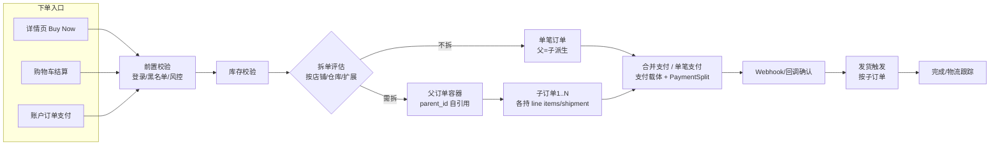
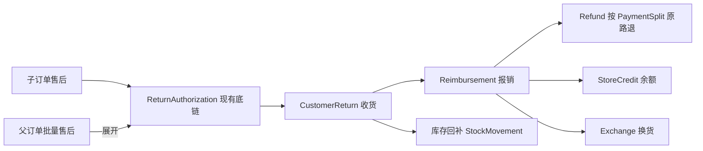

# PallasTrade 订单生命周期升级实施方案（父子单 / 拆单 / 合并支付 / 正向+逆向闭环）

> **文档类型**：Research / 升级实施方案
> **日期**：2026-08-26
> **状态**：Draft（待评审确认）
> **前置文档**：`docs/research/RESEARCH-20260826-order-chain-split-upgrade.md`（链路现状审查报告）
> **适用范围**：backend（core/api/admin）/ storefront / platform sdk / docs
> **参考**：`platform/docs/plans/6.0-cart-order-split.md`、`6.0-multi-vendor-marketplace.md`、`6.0-order-routing.md`、`6.0-stock-reservations.md`

---

## 1. 执行摘要

本方案基于 2026-08-26 完成的链路现状审查（见前置文档），为"**父子单结构、自动拆单、手动拆单、合并支付、Buy Now、完整正向+逆向订单链路闭环**"制定**分阶段、低风险、可回滚**的升级实施路线。

**关键前提**：本项目在 **2026-08-23 ~ 08-25 曾实施过同一需求的完整方案**（PRD-20260823 多订单拆分与合并支付 + PRD-20260824 order-lifecycle 13 阶段），**最终整体回滚**（`git reset` 移除，非 revert；数据库 schema 已完全还原，无 `parent_id`、无 `payment_groups` 表，`payment_sessions.order_id` 仍为 NOT NULL）。**本次方案的第一要务是避免重蹈覆辙。**

**核心原则（吸取上次教训）**：

| # | 原则 | 上次违反点 |
|---|---|---|
| 1 | **小步提交，一阶段一 PR，绝不"大爆炸"** | `52c0402` 单个 commit 同时含模型+迁移+服务+API+Storefront+Admin+SDK+文档+测试；08-24 又叠加 13 阶段 |
| 2 | **每个阶段 feature flag 默认关闭，行为零变化，可独立发布/回滚** | 上次拆单/合并支付直接接入主流程，无开关 |
| 3 | **先数据模型 → 再引擎能力 → 再流程接入 → 最后 UI** | 上次模型/流程/UI 一次到位 |
| 4 | **不破坏现有 `PaymentSession ↔ Payment` 1:1 契约** | 上次一个 session 对应多个订单的多个 payment，绕过唯一索引语义 |
| 5 | **合并支付载体与父子结构解耦**（支付单只管"收了多少钱、覆盖哪些单"） | 上次 PaymentGroup 与订单结构/状态机耦合，failed/expired 裸 422 |
| 6 | **支付与订单完成的一致性要有明确兜底**（网关已扣款 ≠ 订单必然完成） | 上次 `PaymentGroups::Complete` 事务内多订单完成，部分失败整体回滚 → 钱扣了单没完成 |
| 7 | **售后链保持现有 RA/CR/Reimb/Refund 底链，只加"父子维度"** | 上次售后父子单化大改底链 |
| 8 | **每阶段：迁移可 down + 数据备份 + 回滚演练 + 全量验证** | 上次无回滚预案 |

---

## 2. 上次升级失败复盘（2026-08-23/25，已回滚）

### 2.1 上次实施了什么（git 孤立提交中保留的代码事实）

| 提交 | 内容 |
|---|---|
| `52c0402` | 多订单拆分与合并支付：`PaymentGroup` 模型（`pg_`，状态机 pending→processing→completed/failed/canceled/expired）、迁移（orders/sessions 可空外键 + `split_from_id`）、`Orders::Splitter`、`Checkout::SplitOrders`、`PaymentGroups::Create/Complete`、Stripe `create_payment_session` 支持 group + `CompletePaymentGroup`、Store/Admin API、Storefront combined-payment 页、Admin 拆分表单、SDK、文档、测试 |
| `1b5e14b` ~ `4b71b22` | order-lifecycle 13 阶段：`Order#parent_id` 自引用 + `parent/children` 关联 + 语义方法、Buy Now、公用确认页/收银台、库存校验+锁库存双模式、合并支付后自动拆单引擎、手动拆单跨店铺、发货触发、售后父子单化、取消联动、数量风控 |

### 2.2 失败根因分析（基于对回滚前代码的逐文件审读）

1. **大爆炸式实施，无法定点回滚**：一次提交横跨 6 层 40+ 文件，任何一环出错整体不可用，只能整段 reset。
2. **`PaymentSession ↔ Payment` 1:1 契约被打破**：现有契约是 `PaymentSession has_one :payment`（`foreign_key: :response_code, primary_key: :external_id`）。上次合并支付用 `payment_session.find_or_create_payment_for_order!(order)` 为**组内每个订单各建一条 payment**，一个 session 对应 N 条 payment，绕过唯一索引语义与 `Payment#set_amount`（默认 `order.total - order.payment_total`）的既有逻辑，幂等与金额归属极易错乱。
3. **支付与订单完成的一致性没有兜底**：`PaymentGroups::Complete` 在**单个事务**内遍历完成所有成员订单（`payment.confirm!` + `carts_complete_service`）。若任一订单因库存/状态机/校验失败 → **整个事务回滚，但 Stripe 已扣款成功** → 出现"钱扣了、订单没完成"的资金不一致。代码虽有 `rescue Rails.error.report`，但只记日志不回补。
4. **拆单时机与 checkout 状态机交织**：`Checkout::SplitOrders` 在 **cart 状态**拆单，子订单各自从 cart 重新走 checkout 状态机（address/delivery/payment），同时又已进入 PaymentGroup——两组状态机并行推进，事务与锁复杂，异常路径（部分子订单校验失败）没有定义。
5. **父订单语义未定义清楚**：`parent_id` 自引用下，父订单是否保留 line items？拆完为空时订单金额/支付状态/发货/售后如何派生？上次仅"父订单保留（可继续发货/售后）"一句带过，未落地为明确公式 → 序列化输出 `parent_id/children_ids/is_parent/is_child/is_single` 但金额仍是自身 line items 求和，父订单在拆单后金额/支付状态语义失真。
6. **状态机裸错误**：PaymentGroup 对 `failed/expired` 等非法迁移直接抛状态机异常（前端 422 裸错误），NFR 明确要求"非法迁移返回业务错误"，但实现未达标。
7. **webhook 幂等复杂**：一个成功 webhook 要完成组内全部订单，重复 webhook / job 重试下的幂等（session 已 complete、订单已完成等）在多个完成路径（API complete / webhook complete）间没有统一收敛。
8. **售后父子单化（阶段8）与现有售后链的单订单假设冲突**：`CustomerReturn#order`（取第一条+校验同订单）、`Reimbursement#validate_return_items_belong_to_same_order`、`DefaultRefundAmount`（订单级调整分摊）等全部假设单订单，父子化是大改，与 2/3/4 叠加后不可控。

### 2.3 本次必须规避的清单（对应上文 8 条）

- 单次提交文件数 > 15 或跨 > 3 层 → 拆成多次提交。
- 任何改动默认开启 → 一律 `PallasTrade::Config` + store 级开关，默认 false。
- 一个 session 对应多 payment → **禁止**，保持 1:1，用支付载体 + 分摊记录。
- 事务内"扣款成功但订单失败"整体回滚 → 采用"补偿 + 明确状态"策略。
- cart 状态中途拆单 + 多子订单并行走 checkout → 拆单统一收敛到 `Carts::Complete` 完成时一次性执行。
- 父订单金额/支付/发货派生规则不定义 → 本方案 §6 给出明确公式。

---

## 3. 目标架构总览（正向 + 逆向闭环）

### 3.1 正向链路（下单 → 支付 → 拆单 → 发货 → 完成）



### 3.2 逆向链路（售后 → 收货 → 退款/换货 → 库存回补）



### 3.3 核心概念定义（本次方案固定语义）

| 概念 | 定义 |
|---|---|
| **父订单（Parent）** | `orders.parent_id = nil` 且存在 `children` 的订单。是"一次客户交易的容器"：持有客户/地址/支付/售后汇总；**可持有未被拆出的 line items，也可为空**；`total = 自身 line items 金额 + Σ(children.total)`。未拆单时订单**没有** parent_id（派生态：`parent_order? && child_order?` 均为 true）。 |
| **子订单（Child）** | `orders.parent_id` 指向父订单的真实履约单，持有自己的 line items / shipments / 金额 / 发货 / 售后。 |
| **拆单（Split）** | 把一笔订单的行项目按策略分组，迁移到子订单，挂到同一父订单下。三种触发：checkout 完成时自动拆、支付成功后自动拆、后台手动拆。 |
| **合并支付（Combined Payment）** | 多笔未支付订单（可同父、可跨父）组成一次**支付组合（PaymentCombination）**，一次网关扣款；与父子结构**解耦**。 |
| **支付组合（PaymentCombination）** | 新模型：一次合并支付的载体。只管"收了多少钱、覆盖哪些订单"，状态机 `pending → processing → succeeded / failed / canceled / expired`，非法迁移返回**业务错误**。 |
| **支付分摊（PaymentSplit）** | 新模型：每成员订单一条，记录 `authorized/captured/refunded_amount`。子订单的已付/可退金额以 split 为准。 |

---

## 4. 数据模型设计

### 4.1 `orders` 表新增（全部可空，迁移可 down）

| 列 | 类型 | 说明 |
|---|---|---|
| `parent_id` | bigint, null, FK→orders.id, index | 父订单自引用 |
| `split_from_id` | bigint, null, FK→orders.id, index | 拆单来源订单（展示用，保留血缘） |
| `payment_combination_id` | bigint, null, FK→payment_combinations.id, index | 合并支付归属（可跨父订单） |

### 4.2 新表 `pallastrade_payment_combinations`

```ruby
create_table :pallastrade_payment_combinations do |t|
  t.bigint   :store_id, null: false
  t.bigint   :customer_id, null: false        # 合并支付仅登录用户
  t.string   :currency, null: false
  t.decimal  :amount, precision: 10, scale: 2, null: false, default: 0
  t.string   :status, null: false, default: 'pending'
  # pending → processing → succeeded | failed | canceled | expired
  t.datetime :expires_at
  t.datetime :completed_at
  t.jsonb    :public_metadata, default: {}
  t.jsonb    :private_metadata, default: {}
  t.timestamps
end
```

- `PaymentCombination has_many :payment_splits; has_many :orders, through: :payment_splits`（orders 不直接挂组合，经 split 关联，保持"订单可属于多组合历史"的审计语义）。
- 状态机：`pending → processing`（发起）、`pending|processing → succeeded`（支付成功）、`pending|processing → failed/canceled/expired`。**非法迁移在服务层转为业务错误**（`code + message`），绝不让状态机裸异常冒泡。

### 4.3 新表 `pallastrade_payment_splits`

```ruby
create_table :pallastrade_payment_splits do |t|
  t.bigint   :payment_combination_id, null: false
  t.bigint   :order_id, null: false
  t.bigint   :payment_id, null: false          # 组合下的唯一 payment（挂 primary order）
  t.string   :currency, null: false
  t.decimal  :authorized_amount, precision: 10, scale: 2, default: 0
  t.decimal  :captured_amount,   precision: 10, scale: 2, default: 0
  t.decimal  :refunded_amount,   precision: 10, scale: 2, default: 0
  t.timestamps
end
add_index :pallastrade_payment_splits, [:payment_combination_id, :order_id], unique: true
```

### 4.4 既有表改动

| 表 | 改动 | 说明 |
|---|---|---|
| `orders` | +`parent_id` / `split_from_id` / `payment_combination_id`（可空） | 均 nullable，迁移 down 只 drop 列 |
| `payments` | +`payment_combination_id`（可空，index）；`order_id` 保持可空 | **合并支付时 payment 挂在组合上（order_id=nil）**，单笔支付完全不变 |
| `payment_sessions` | +`payment_combination_id`（可空，index）；`order_id` **保持 NOT NULL**（挂 primary order） | 维持 `session ↔ payment` 1:1 契约 |

### 4.5 `Order` 模型新增语义（纯增量）

```ruby
belongs_to :parent, class_name: 'PallasTrade::Order', optional: true, inverse_of: :children
has_many :children, class_name: 'PallasTrade::Order', foreign_key: :parent_id,
         dependent: :nullify, inverse_of: :parent
belongs_to :split_from, class_name: 'PallasTrade::Order', optional: true, inverse_of: :split_orders
has_many :split_orders, class_name: 'PallasTrade::Order', foreign_key: :split_from_id,
         dependent: :nullify, inverse_of: :split_from
has_many :payment_splits, class_name: 'PallasTrade::PaymentSplit', inverse_of: :order

def parent_order? = children.exists?
def child_order?   = parent_id.present?
def single_order?  = !parent_order? && !child_order?
def sibling_orders = parent ? parent.children.where.not(id: id) : none
def root_order     = parent ? parent.root_order : self     # 防环
```

---

## 5. 分阶段实施路线图（每阶段可独立发布/回滚）

> 阶段顺序 = 依赖顺序。**P1~P4 为后端能力（默认关闭，零行为变化），P5~P8 为流程/UI（feature flag 控制，逐 store 灰度）**。每阶段完成即合并、即部署 dev、即验证；**任何阶段异常 → 关闭 flag 或 `git revert` 该阶段即可回滚**。

### P0 基线加固（前置，1 天）—— ✅ 已完成（2026-08-26，详见 `docs/research/RESEARCH-20260826-order-lifecycle-p0-baseline.md`）

- [x] 数据库备份脚本：`scripts/ops/db_backup.{sh,ps1}`（服务器 `pallastrade-dev-postgres-1` / 本地 `pallastrade-postgres-1`，trust auth，gzip + 保留 N 份）。
- [x] 回滚演练脚本：`scripts/ops/rollback_prepare.{sh,ps1}`（schema.rb 快照 + 最新迁移版本记录 + 触发备份）。
- [x] 测试基线：`harness check --profile quick` 本地通过；**核心链路（order/payment/shipment/return）当前无自动化 spec**（`pallastrade_core/spec/` 仅 fixtures），Rails 测试基线以 CI 全绿为准；建议 P1 起补最小冒烟测试（详见基线文档 §4.3）。
- [x] `PallasTrade::Config` store 级覆盖机制确认可用：`Store include Preferable`，已有 `guest_checkout` / `stock_reservation_ttl_minutes` / `order_routing_strategy` 等 store 级先例；新增开关用 `store.preferred_xxx.presence || PallasTrade::Config[:xxx]` 模式。
- **验证**：`harness check --profile quick` 通过 + 脚本语法校验（ps1 解析 OK）+ 备份目录 `/backups/` 已 gitignore。
- **回滚**：P0 不涉及业务代码；脚本删除即回退。

### P1 数据模型 + 语义方法（2-3 天，纯增量）—— ✅ 已完成（2026-08-26）

- 迁移：`orders.parent_id` / `split_from_id` / `payment_combination_id`（可空）+ index；`payments.payment_combination_id`；`payment_sessions.payment_combination_id`；新表 `payment_combinations`、`payment_splits`。
- `Order` 关联 + 语义方法（§4.5）；`PaymentCombination` / `PaymentSplit` 模型 + 状态机（非法迁移在模型层 `rescue` 转业务错误）。
- `OrderSerializer` 增加 `parent_id` / `children_ids` / `is_parent` / `is_child` / `is_single`（Store + Admin）。
- **验证**：21 个新 spec + 5 个回归 spec 全绿；`harness check --profile quick` 通过；迁移回滚演练（`rollback STEP=4` + `migrate` 重放）成功。
- **回滚**：`rake db:rollback` + 移除模型/序列化字段即可；无任何流程引用，线上零影响。
- 关联：PRD-20260826-payments、REQ-20260826-order-lifecycle-p1、gate GATE-2026-08-26T14-10-25。

### P2 统一拆单引擎（3-4 天，能力层，默认关闭）—— ✅ 已完成（2026-08-26）

- 重构 `PallasTrade::Orders::Splitter`：统一入口 `split(order:, groups:, options:)`，支持：
  - 策略分组（按店铺 / 按商品仓库地址 / 扩展点注册）；目标店铺 / 仓库（手动拆单用）；
  - 设置 `parent_id` / `split_from_id`；
  - **行项目迁移 + 调整项（promo/tax/shipping 按行项目金额比例分摊）+ 金额重算**（`OrderUpdater`）；
  - 已付金额分摊（`PaymentSplit`）；幂等（重复调用不重复拆，`split_from_id` + 状态判断）；
  - 发布 `order.splitted` 事件（父/子）。
- 拆单前置校验：源订单可拆（未发货部分、库存、目标店铺商品可用/税率/配送可用）。
- **验证**：`splitter_spec` + `split_strategies_spec`（13 spec）+ P1/回归 26 spec 全绿；`harness check --profile quick` 通过；迁移回滚演练成功。
- **回滚**：服务未接入任何流程，删除/回退服务文件即可。
- 关联：PRD-20260826-checkout、REQ-20260826-order-lifecycle-p2、gate GATE-2026-08-26T15-31-01。
- 注意：新增迁移 `payment_splits.payment_combination_id` 改为**可空**（P2 拆单记账分摊先不归入组合，P4 合并支付归入）；`Adjustment` 分摊记录须**强制 closed 冻结**（防 `AdjustmentsUpdater` 重算覆盖）；OrderUpdater 前须 `line_items.reload`（缓存旧关联坑）。

### P3 父子单金额与支付状态派生（2 天，默认关闭）—— ✅ 已完成（2026-08-27）

> 实际实现（提交 `需求：P3 父子单金额与支付状态派生`）：**不覆写核心方法**，新增只读聚合方法（无 children 回退原值，零行为变化）：

- `Order#combined_total`（own item+shipment+adjustment + Σ children.combined_total 递归）、`combined_payment_total`、`combined_outstanding_balance`（取消 → `-payment`；否则 `total - (payment + reimbursement)`，基于聚合值）、`combined_amount_due`（`[outstanding - store_credit, 0].max`）。已注册 `money_methods`（`display_combined_*` 可用）。
- `Order#combined_shipment_state`：聚合 own+children，套 `OrderUpdater#update_shipment_state` 规则（backorder/partial/pending/ready）。
- `Order#combined_payment_state`：基于 `combined_outstanding_balance`（>0 balance_due / <0 credit_owed / =0 paid / 取消且 0 void）。
- `Order#effective_payment_total`：有 `PaymentSplit` 用 `captured - refunded`，否则 `payment_total`。
- Store/Admin `OrderSerializer` 父订单时输出聚合值（`total`/`display_total`/`amount_due`/`payment_total`/`payment_status`/`fulfillment_status`）。
- **验证**：`order_parent_child_spec` 17 例 + `order_serializer_parent_child_spec` 5 例全绿；P1 支付回归 9 例全绿；`harness check --profile quick` 通过。
- **回滚**：无 children 时聚合 == 原值；如异常 `git revert` 本提交（无迁移，零 DB 影响）。

### P4 合并支付载体 + Webhook（3-4 天，默认关闭）—— ✅ 已完成（2026-08-27）

- `PaymentCombinations::Create`：服务端计算金额（仅未支付订单计入），同 store/同用户/同币种校验；`PaymentCombinations::Complete`：幂等完成。
- **关键设计（避免上次失败）**：
  - 一个组合 → **一个 `PaymentSession`**（挂 primary order）+ **一个 `Payment`**（挂组合，`order_id=nil`，金额=组合合计），维持 `session ↔ payment` 1:1；
  - 每成员订单一条 `PaymentSplit`（`payment_id` 改可空——支付前建 split，Complete 回填）；
  - Webhook 成功 → `PaymentCombinations::Complete`：**先完成支付记账（payment + splits + 各订单 payment_state）**，再逐个订单完成（`checkout_complete_service`）；
  - **一致性兜底**：某订单完成失败时**不回滚已入账支付**，将该订单标记 `balance_due` + 入异常队列（`PallasTrade::Payments::CombinationSettleJob` 重试/人工介入），资金始终 >= 订单状态。
- Stripe 网关：`CompleteOrder` / `CompleteOrderFromSessionJob` 在 session 挂组合时走 `PaymentCombinations::Complete`（收敛同一完成服务）。
- **配套模型**：`Payment#order` optional（组合支付 order_id=nil + nil 守卫）；`PaymentCombination#payments` 关联；`OrderUpdater#update_payment_total` 有 split 时取 `captured - refunded`；checkout 状态机在订单有已捕获 split 时放行（无需本地 payment）。
- **验证**：15 新 spec（Create 5 + Complete 5 + SettleJob 3 + Webhook 2）全绿；回归 39 全绿；quick check 通过；迁移 `20260827000001` 应用成功。
- **回滚**：flag 关闭即不暴露新端点；旧支付链路零改动；`git revert` P4 commit（无破坏性迁移）。

### P5 Checkout 集成（自动拆单 + 合并支付收银台，4-5 天，flag 灰度）

- **自动拆单**：在 `Carts::Complete` 完成时（支付确认后）执行拆单评估（`Config[:auto_split_orders]` = 策略列表，默认 `[]`）。拆出子订单挂父订单，资金经 `PaymentSplit` 分摊；**不在 cart 状态中途拆**。
- **合并支付收银台**：Storefront `PaymentSection` 支持组合支付（账户订单模块多选待支付 → 组合 → 走 Stripe Elements 单次扣款）；`(checkout)/combined-payment/[id]` 页复用现有 `confirm-payment` 回调。
- **Buy Now**：详情页快捷下单（仅当前商品进确认页，不污染购物车），复用公用确认页。
- **验证**：E2E（下单→自动拆→合并支付→回调→订单列表父子视图）；`harness e2e storefront`。
- **回滚**：flag 关闭 → 完全回到单笔订单老流程。

### P6 Admin 手动拆单 + 父子树 UI（3-4 天，flag 灰度）

- Admin API：`POST /api/v3/admin/orders/:id/split`（`store_id` / `stock_location_id` / 行项目数量 / 预览 + 确认）；父子关系过滤。
- Admin UI：订单详情"拆分订单"入口（目标店铺/仓库选择、行项目数量、金额预览）、父订单聚合页（成员/支付/发货/售后汇总）、父子树展示。
- **验证**：Admin request spec + 浏览器验证拆分流程。
- **回滚**：flag 关闭；`FulfilmentChanger`（现有发货拆分）不受影响。

### P7 逆向链路：售后父子单化（4-5 天，flag 灰度）

- **子订单售后**：现有 RA/CR/Reimb/Refund 底链不变，仅把 scope 收敛到子订单。
- **父订单批量售后**：前端/后台对父订单发起 → 服务层展开为其下全部子订单，批量创建 `ReturnAuthorization`，金额/退款按子订单归集（`PaymentSplit.refunded_amount`）。
- 改造点（来自现状审查 §8.3 K1-K12）：`CustomerReturn#order` 解析、`Reimbursement` 同订单校验、`DefaultRefundAmount` 订单级调整分摊改为"子订单级"、`order.all_inventory_units_returned?` 按子订单判定。
- **验证**：子单售后 + 父单批量售后 spec + Admin/前端展示。
- **回滚**：flag 关闭 → 售后走现有单订单逻辑。

### P8 前置校验 / 库存 / 风控 / 订单服务增强（3-4 天，可裁剪，可与 P5 并行）

- 前置校验：登录强制 / 黑名单（`users.blacklisted_at`）/ 风控评估（`PallasTrade::Risk` 可配置规则钩子）→ 统一 `code + message`。
- 库存：下单校验（复用 `Stock::Quantifier`）+ 锁库存双模式（`Config[:stock_reservation_strategy] = :order | :payment`，复用 `StockReservations::Reserve/Release`）。
- 订单服务：备注（内部/客户可见）、状态时间线、通知（子订单独立通知）、防刷单（频率/数量上限）。
- **验证**：对应 spec + 浏览器。
- **回滚**：独立 flag。

---

## 6. 关键业务规则（本方案固定语义，实施时不得含糊）

### 6.1 拆单规则
- **拆单只在线路收敛点执行**：`Carts::Complete`（支付后）+ Admin 手动。**禁止在 cart 状态中途拆**。
- 拆单策略：`Config[:auto_split_orders] = [:store, :warehouse_address, ...]`（可扩展注册），拆出的每组 → 一个子订单。
- 父订单：`parent_id = nil` 且被 children 指向；持有**未被拆出的行项目**（可为空）；`total = own + Σ(children.total)`。
- 单店/单仓/无策略命中 → 不拆，单笔订单（父=子派生），保持老行为。
- 子订单继承：store/user/channel/market/currency/email/地址/`split_from`；重算：价格（目标店铺规则）/税率/运费/调整项分摊。
- 跨店铺拆单：目标店铺无该商品 / 无可用税率 / 无可用配送 → 明确业务错误，不部分执行。

### 6.2 合并支付规则
- 可合并：同 store、同用户、同币种、订单未支付（`outstanding_balance > 0`）、未取消、未过期；已支付/已取消/已过期订单自动剔除并重算金额。
- 金额：**服务端计算** `Σ(order.total_minus_store_credits)`，客户端只传订单 id。
- 覆盖关系：可同父订单下、可跨父订单（组合与父子解耦）。
- 状态机非法迁移 → 业务错误（`code + message`），绝无裸 422。

### 6.3 资金分摊规则
- 组合支付：`Payment`（挂组合，金额=合计）+ 每成员订单 `PaymentSplit`。
- 子订单 `payment_total` / `outstanding_balance` / `amount_due` 以 `PaymentSplit` 为准（不重复建 payment）。
- 部分退款只更新对应子订单 split 的 `refunded_amount`，不影响兄弟单。
- 取消联动：取消子订单 → 释放库存 + 按 split 退款；取消父订单 → 对全部未取消子订单联动处理。

### 6.4 发货规则
- 子订单独立发货（复用现有 `ship` 流程）；父订单展示各子订单发货进度（聚合 `shipment_state`）。
- 已支付子订单有发货触发入口；拆单后父订单自身不产生新发货（除非持有行项目）。

### 6.5 售后规则
- 子订单售后：现有 RA/CR/Reimb/Refund/Exchange 底链，scope 收敛子订单。
- 父订单售后：展开为其下全部子订单批量 RA，退款按 `PaymentSplit` 归集。
- 售后库存回补、换货（`Exchange`）保持现有行为，仅维度变为子订单。

### 6.6 状态机与幂等
- 所有新增状态机（组合/拆单）非法迁移 → 业务错误，不抛框架异常。
- 所有新增服务幂等：重复 webhook / job 重试 / 重复拆单不产生重复数据（唯一索引 + 状态守卫）。
- 组合完成：先入账支付，再逐个完成订单；部分失败走补偿队列，**不整体回滚已入账资金**。

---

## 7. 风险控制与回滚策略

| 阶段 | 风险 | 缓解 | 回滚方式 |
|---|---|---|---|
| 全阶段 | 迁移损坏 | P0 备份 + 迁移全可 down + `db:rollback` 演练 | `rake db:rollback` + `git revert` |
| P2 拆单引擎 | 金额分摊错误 | 分摊公式单测 + 与老逻辑对拍（拆分前后总额守恒断言） | flag 关闭，服务未接入 |
| P4 合并支付 | 资金不一致 | 先入账后完成 + 补偿队列 + `Rails.error.report` | flag 关闭，端点不暴露 |
| P5 流程接入 | 下单主流程回归 | E2E + 灰度逐 store 开启 | flag 关闭回老流程 |
| P7 售后 | 退款金额错误 | 子订单级金额断言 + 对拍 | flag 关闭 |
| 部署 | 服务器迁移漏跑 / 回滚冲突 | 沿用 `deploy-migration-lessons`：迁移复制到 `backend/db/migrate/`，重建镜像，`--no-deps` 避免 recreate 冲突 | 重建镜像 + 回滚镜像 tag |

**发布节奏**：每个阶段在 dev 全量验证（`harness check` + 浏览器 + E2E）→ 合并 dev → 服务器部署验证 → 才进入下一阶段。**绝不跨阶段一次性合并。**

---

## 8. 方案自检清单（自查结果）

> 方案写完后逐项自查，发现并修正的问题记录如下。

| # | 自查问题 | 结论 / 修正 |
|---|---|---|
| 1 | 父订单拆分后 line items 为空，是否破坏"订单必有行项目"假设？ | 已修正：父订单**允许为空**，`total = own + Σ(children)`，前端/后台父子视图对空行项目父订单做聚合展示；现有"订单有行项目"的强校验（如 `finalize!`）**只作用于子订单/单笔订单**，父订单容器不进入 `finalize!`。 |
| 2 | `PaymentCombination` 与上次 `PaymentGroup` 名字易混淆，是否会被误认为复用旧实现？ | 已区分：组合是**独立于父子结构的支付载体**（`has_many :orders, through: :payment_splits`），状态机非法迁移返回业务错误，且只允许一个 session/payment；旧 `PaymentGroup` 代码已随回滚删除，不复用。 |
| 3 | "一个 session 一个 payment（金额=组合合计）挂 primary order" 是否与 `Payment#max_amount`（`order.total - payment_total`）冲突？ | 已确认需要显式处理：组合支付创建 payment 时传 `skip_max_amount_check: true`（仅组合场景），并在 P4 单测覆盖。 |
| 4 | 组合支付时 `payment_sessions.order_id`（NOT NULL）挂 primary order，若 primary order 被取消/过期，session 是否失效？ | 已定义：组合创建时校验所有成员订单可支付；成员中途取消 → 组合重算金额并剔除（服务端），primary 变更允许（组合记录 `primary_order_id` 可更新）。P4 覆盖。 |
| 5 | 子订单 `payment_state` 由 `PaymentSplit` 推导，但现有 `update_payment_total`/`update_payment_state` 是 `OrderUpdater` 单订单逻辑，是否会误算？ | 已定义：`OrderUpdater` 增加分支——当订单存在有效 `PaymentSplit` 时，`payment_total` 取 split 值，`payment_state` 由组合状态推导；无 split 走原逻辑。P3 实现并单测。 |
| 6 | 拆单在 `Carts::Complete`（支付后）触发，但支付是在拆单前完成的——子订单如何拿到已付金额？ | 已定义：支付按"下单时金额"完成于父订单/组合；拆单后按行项目金额比例把已付金额分摊到子订单 `PaymentSplit`，总额守恒断言（§6.3）。 |
| 7 | 自动拆单策略命中但部分子订单库存/配送不满足，如何处理？ | 已定义：拆单前置校验失败 → **整体不拆**（保持单笔订单），返回明确业务错误提示，由运营决定手动拆单。避免部分成功。 |
| 8 | 售后 `CustomerReturn` 等"取第一条订单"的假设在父子场景下是否会造成串单？ | 已确认是 P7 最大改造面，方案明确：子订单售后时 RA 绑定子订单；父订单批量售后展开为子订单级 RA，`CustomerReturn#order` 改由 `return_item.inventory_unit.order` 逐条推导（去掉"第一条"），并加同子订单校验。 |
| 9 | 是否与 6.0 规划（`OrderGroup` / `PaymentSplit` / `Cart-Order` 分离）冲突？ | 已在 §2.3 记录：用户明确否决 `OrderGroup`，采用 `parent_id` 自引用；`PaymentSplit` 概念与 6.0 一致（命名沿用），未来 6.0 若落地可平滑对齐；不实施 `Cart/Order` 分离（超出本需求范围）。 |
| 10 | 阶段 P5 之前 Storefront/Admin 是否有任何改动？ | 自查确认：P1~P4 **纯后端能力**，Storefront/Admin 零改动，前端只在 P5/P6/P7 引入；降低回归面。 |
| 11 | 迁移是否全部可 down、可重复？ | 确认：新列全部 nullable；`down` 只 drop 列/表；`PaymentSplit` 唯一索引保证幂等。 |
| 12 | 组合支付与 store credit / 礼品卡混合支付是否兼容？ | 已定义：组合金额 = `Σ(total_minus_store_credits)`，store credit 仍按现有 `AddStoreCredit` 建独立 payment 记录（不并入组合），组合只承载外部网关扣款；P4 单测覆盖混合场景。 |

---

## 9. 附录：关键文件索引（实施时定位用）

### 模型（`backend/pallastrade_gems/pallastrade_core/app/models/pallastrade/`）
- `order.rb`（+parent/children/split_from/payment_splits）、`order/checkout.rb`（状态机）、`order/payments.rb`（`process_payments!`）
- `payment.rb` / `payment/processing.rb` / `payment_session.rb`（保持 1:1 契约）
- `payment_combination.rb`（新）、`payment_split.rb`（新）
- `shipment.rb` / `shipment_handler.rb` / `fulfilment_changer.rb` / `inventory_unit.rb`
- `customer_return.rb` / `return_authorization.rb` / `return_item.rb` / `reimbursement.rb` / `refund.rb` / `exchange.rb` / `store_credit.rb`

### 服务（`backend/pallastrade_gems/pallastrade_core/app/services/pallastrade/`）
- `carts/complete.rb`（拆单接入点）、`checkout/complete.rb`、`orders/complete.rb`
- `orders/splitter.rb`（重构，P2）、`payment_combinations/create.rb`、`payment_combinations/complete.rb`（新，P4）
- `payments/handle_webhook.rb`（组合分支，P4）
- `fulfillments/create.rb`、`shipments/update.rb`

### API（`backend/pallastrade_gems/pallastrade_api/`）
- `config/routes.rb`（新端点：store `payment_combinations`、admin `orders/:id/split` 扩展、父子关系端点）
- `controllers/.../store/customer/orders_controller.rb`、`admin/orders_controller.rb`

### Storefront（`storefront/src/`）
- `components/checkout/PaymentSection.tsx`（组合支付）、`(checkout)/confirm-payment/[id]/`（回调复用）、`components/account/OrderDetail.tsx`（父子视图）、`components/product/*`（Buy Now）

### 规划/现状文档
- `docs/research/RESEARCH-20260826-order-chain-split-upgrade.md`（现状审查）
- `platform/docs/plans/6.0-cart-order-split.md`、`6.0-multi-vendor-marketplace.md`（参考，非本方案主模型）

---

## 10. 变更记录

| 日期 | 版本 | 变更 | 操作者 |
|---|---|---|---|
| 2026-08-26 | 0.1 | 初稿：基于现状审查 + 上次失败代码复盘，输出分阶段可回滚升级方案 | AI |
| 2026-08-26 | 0.2 | **P0 已完成**：备份/回滚演练脚本（`scripts/ops/`）+ Config 机制确认 + 测试基线记录（见 P0 段与基线文档） | AI |
| 2026-08-26 | 0.3 | **P1 已完成**（4 迁移 + PaymentCombination/PaymentSplit 模型 + Order 父子语义方法 + 序列化器字段，提交 `054f936`）；**P2 已完成**（统一拆单引擎 `Orders::Splitter` + 策略 + PaymentSplit 分摊，提交 `5c70c6c`） | AI |
| 2026-08-27 | 0.4 | **P3 已完成**：combined_*/effective_payment_total 聚合方法 + 序列化器父订单聚合输出（提交 `需求：P3 父子单金额与支付状态派生`）；task/gate 关闭，22+9 用例全绿 | AI |
