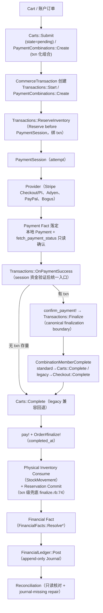
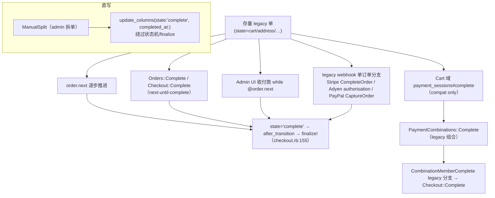

# RESEARCH-20260906-p5-0 — Commerce Core Convergence Audit（CORE-P5-0）

> 日期：2026-09-06 ｜ 来源：`豆包梳理业务需求/P5 — Commerce Core Consolidation & Legacy Convergence.md`（CORE-P5，用户定稿）
> Task：`TASK-20260906122835-863d556b`；Gate：`GATE-2026-09-06T12-28-46`（research）
> 分支：dev @ 7123c9e ｜ 性质：**只读架构收敛审计 — 无 Coding / 无 migration / 无删除**
> 状态：**DRAFT — 等待架构评审与用户确认**（按源文档 §36：三个冻结问题确认前，不批准大规模 legacy 删除或 Finalization 重构）

---

## 0. TL;DR

1. CORE-P5 源文档的**前置判断全部得到代码验证**：P0–P4 已落地（CommerceTransaction 编排、PaymentSession、Fact Resolver、FinancialLedger、Reconciliation 均真实存在）；**文档设想的大量"目标态"已在 P0–P4 过程中被事实实现**——`Transactions::Finalize` 即文档 §8 建议的 canonical finalization boundary，`OnPaymentSuccess` 即唯一支付成功收口，Journal 无绕过 Resolver 的 posting 路径，Recovery 完全基于 Fact。
2. 真正剩余价值集中在五处：**① 资金侧两套平行 fact 体系**（`Transactions::{Payment,Inventory}FactResolver` 小写 verdict vs `FinancialFacts::*` + `FinancialFact` 大写状态，无统一契约、无公共基类、存在重复规则）；**② legacy/standard 分裂**——`next`-until-complete 适配器（`Orders::Complete`/`Checkout::Complete`/Admin UI 收付款/legacy webhook 单订单分支）**无法完成标准流程(pending)订单**；③ **ManualSplit 直写完成**（`update_columns(state:'complete', completed_at:)`）绕过状态机/finalize；④ **legacy webhook surface 仍挂载**（Stripe `/stripe`、Adyen `/adyen/webhooks`，默认关闭但可达）+ **storefront 死调用** `POST /carts/:id/complete`（404）；⑤ **全库 0 个 DB CHECK constraint**，金额/数量正确性仅靠模型校验。
3. **结论（冻结项）**：当前生产能完成"标准新订单"的**只有一条 canonical 路径**（支付完成 → `OnPaymentSuccess` → `Transactions::Finalize` → `CombinationMemberComplete` → `Carts::Complete`）；legacy 完成适配器仅对存量 `cart/address` 订单有效；**在 runtime 观测（CORE-P5-8 legacy metrics）落地前，禁止按 grep=0 删除任何 legacy**（CORE-INV-09）。
4. 本审计输出 §5 要求的 16 项矩阵/计划（§4–§12），并冻结 3 项决策（§13），等待评审。

---

## 1. 范围与方法

- 依据：CORE-P5 源文档 §5（CORE-P5-0 输出清单）、§6（15 个审计问题）、§36（三个冻结问题）。
- 范围：backend/app + `pallastrade_gems/{core,api,admin,stripe,adyen,paypal_checkout}` + storefront + platform SDK。六层独立搜索完成（Gate prep 已录证据）。
- 只读：不创建/修改/删除任何代码与 schema；本文件为唯一产出。
- 术语权威：`ai/skills/pallastrade-payments/SKILL.md`、`ai/skills/pallastrade-checkout/SKILL.md` 已读并与代码交叉核验。

---

## 2. 术语与编号冲突（审计必读）

### 2.1 "完成"的双语义（全篇判断基础）

| 标记 | 定义 | 位置 |
|---|---|---|
| `completed?`（业务完成） | `completed_at.present?` | `pallastrade_core/app/models/pallastrade/order.rb:399` |
| `complete?`（legacy 状态机态） | `state == 'complete'` | `order/checkout.rb:42` 状态机（legacy 末态） |
| `standard_flow?` | `state ∈ [pending,paid,…]` | `order.rb:406-410` |

- **标准流程**：`Carts::Submit` 建 `state='pending'`；业务完成 = `pay!` + **`Order#finalize!`**（`order.rb:823` 置 `status='placed'`、`touch :completed_at`）。标准单**永不到 `state='complete'`**。
- **Legacy 流程**：存量 `state ∈ {cart,address,delivery,payment,confirm}` 经 `order.next` 推到 `state='complete'`，`after_transition to: :complete → finalize!`（`checkout.rb:155`）。
- ⚠️ `state='complete'`（状态机态）与 `completed_at`（业务完成）**可分离**：ManualSplit 子单被直写 `state='complete'+completed_at`；反之 legacy `next` 无法推进 pending 标准单。

### 2.2 两套 P 编号（防错乱，沿袭 TXN-P2-0 §2 约定）

| 编号 | 含义 | 出处 |
|---|---|---|
| P0–P5（本文 CORE-P5） | Payment Foundation / Checkout / Commerce Transaction / Inventory / Financial / **Commerce Core Consolidation** | 豆包系列文档 |
| 内部 P1..P8 | 订单生命周期（P2 拆单引擎、P4 组合支付服务层、**P5 自动拆单**、**P6 手动拆单**、P7 售后、P8 风控/锁存） | `ai/skills/pallastrade-checkout|payments/SKILL.md` |

→ CORE-P5 涉及 AutoSplit/ManualSplit 时内部编号称 **P5/P6（拆单域）**，与豆包 CORE-P5 是**不同编号体系**，本文一律写代码名避免混淆。

---

## 3. CORE-P5-0 三个冻结问题的代码答案

### 问题 1：生产到底有几条"订单完成"路径？

**能真正落 `completed_at` 的原语只有 2 个**：

| Primitive | 位置 | 适用 |
|---|---|---|
| `Order#finalize!`（经 `Carts::Complete#complete_standard_order!`） | `order.rb:823` / `carts/complete.rb:60-77` | 标准流程（唯一 canonical） |
| `ManualSplit#finalize_completed_child!`（**直写** `update_columns(state:'complete', completed_at:)`） | `orders/manual_split.rb:61-64` | admin 手动拆单子单（绕过状态机与 finalize!，无完成事件） |

而**入口（entry points）约 10+ 个**，分两族：

- **标准族（唯一能完成新订单）**：`POST /orders/:id/payment_sessions/:id/complete` → `OnPaymentSuccess`；webhook 统一端点 → `HandleWebhook` → `OnPaymentSuccess`；`OnPaymentSuccess` 有 txn → `confirm_payment!` + `Transactions::Finalize`，无 txn（存量）→ `Carts::Complete`。
- **Legacy 族（仅对存量 cart/address 单有效）**：`Orders::Complete`（admin API）、`Checkout::Complete`、Admin UI 收付款 `while @order.next`、Stripe legacy `CompleteOrder` 单订单分支、Adyen authorisation processor、PayPal legacy `CaptureOrder`——全部 `next`-until-complete，**对 `state='pending'` 标准单无效**（停在 pending，`completed_at` 不设）。

**数量结论**：能完成标准订单的 = **1 条 canonical**；legacy 族 6+ 条只能完成存量 legacy 单；外加 ManualSplit 1 条直写路径。→ 见 §4 流图与 §5.1 入口矩阵。

### 问题 2：哪些 legacy adapter 仍然真实 reachable？

| Legacy 面 | 可达性 | 证据 |
|---|---|---|
| `POST /carts/:id/complete` 直连路由 | 🚫 **已删（404）**；SDK `carts.complete`（`platform/packages/sdk/src/store-client.ts:444-445`）与 storefront `completeCheckoutOrder`/`express-checkout-flow`（`storefront/src/lib/data/payment.ts:61`）仍调用 → **死调用待清** | `api/config/routes.rb:46`（carts 仅 `submit`） |
| Cart 域 `payment_sessions#complete` | ✅ 路由在，**compatibility only**（组合分支走 legacy `PaymentCombinations::Complete`） | `routes.rb:55`；`store/carts/payment_sessions_controller.rb:4-10,74,90` |
| `Orders::Complete`（admin API `PATCH /admin/orders/:id/complete`） | ✅ 可达，仅 legacy/B2B（`payment_pending` 可跳支付） | `admin/orders_controller.rb:48-50` → `core/orders/complete.rb:17` |
| Admin UI 收付款 create/capture | ✅ engine 挂载 `/`，`while @order.next` | `pallastrade_admin/payments_controller.rb:39-40,36-39` |
| Stripe legacy StripeEvent `/stripe` + 8 handlers + `CompleteOrderFromSessionJob` | ⚠️ 仍挂载/无条件注册，**默认不投递**（`use_legacy_webhook_handlers=false`）；历史商户若仍指向旧 URL 则可达 | `stripe/config/routes.rb:10`、`initializers/stripe.rb:11-21`、`lib/configuration.rb:13` |
| Adyen `/adyen/webhooks` + `Process*EventJob` | ⚠️ 同上默认关但挂载；Adyen **无** Store v3 统一端点 adapter（legacy-only webhook） | `adyen/config/routes.rb:5`、`webhooks_controller.rb:7`、`engine.rb` |
| PayPal legacy `CaptureOrder` | ⚠️ 仅旧 `order#capture!` 触发；session 主流程已走统一端点 | `paypal_checkout/capture_order.rb:32`、`order.rb:45` |
| `PaymentCombinations::Complete`（无 txn legacy adapter） | ✅ 存量组合仍可达（新组合已 txn 化不走它）；Settlement 原语被 canonical 与 legacy 共用 | `payment_combinations/complete.rb:21`、`settlement.rb:18-58` |
| transaction-unaware 库存写入 | ✅ **仍在**（见 §5.4） | `cart_legacy/*`、`carts/complete.rb`、`orders/cancel.rb:70`、`ExpireJob` |
| 宿主 `backend/app` 直操作 PSP/Reservation/Payment | 🚫 零（仅 TS 类型） | 六层搜索 |

### 问题 3：哪些 invariant 已稳定适合 DB enforcement？

`schema.rb` **全库 0 个 CHECK constraint**；已固化仅 NOT NULL / partial unique / FK。候选与 Gap 见 §8 DB_INVARIANT_GAP_MATRIX。**推荐第一梯队（低风险高价值）**：`transaction_orders.amount_snapshot` NOT NULL+≥0、金额列 ≥0 CHECK（commerce_transactions / payment_splits）、reservation active unique 补 `expires_at` 语义。

---

## 4. CANONICAL_FLOW_MAP 与 LEGACY_FLOW_MAP

### 4.1 CANONICAL_FLOW_MAP（冻结的唯一标准路径 — 现状已实现）



**冻结声明（对齐 AC-5001/5002/5003）**：以上是**唯一**能完成标准新订单的路径；新能力必须挂这条链；禁止新增 special checkout / special completion / special order-complete flow。

### 4.2 LEGACY_FLOW_MAP（存量订单可达，非 canonical）



---

## 5. 入口矩阵

### 5.1 FINALIZATION_ENTRYPOINT_MATRIX（谁最终把订单置为业务完成）

| # | 入口 | 文件:行 | 类型 | 经 CommerceTransaction | 标准单可完成? | Reachable |
|---|---|---|---|---|---|---|
| 1 | `POST /orders/:id/payment_sessions/:id/complete` | `store/orders/payment_sessions_controller.rb:76,90,108` | controller | 有 txn→Finalize；无→Carts::Complete | ✅ | ✅（canonical，routes.rb:67-69） |
| 2 | webhook 统一端点 → `HandleWebhook` → `OnPaymentSuccess` | `webhooks/payments_controller.rb:27`；`handle_webhook.rb:47,67` | webhook/service | 有 txn→Finalize；无→Carts::Complete | ✅ | ✅（PayPal/Stripe 默认） |
| 3 | `OnPaymentSuccess`（统一收口） | `transactions/on_payment_success.rb:47,72` | service | ✅ | ✅ | 被 1/2/Stripe 组合分支调用 |
| 4 | `Transactions::Finalize`（canonical） | `transactions/finalize.rb:24,81,112` | service | ✅ `tx.complete!` | ✅ | 被 3/Recover 调用 |
| 5 | `Transactions::Recover`/RecoverJob/Sweeper | `transactions/recover.rb:108-109` | service/job | ✅ | ✅（fact-based 收尾） | cron 5min |
| 6 | Stripe `/stripe/confirm_payment/:id`（redirect） | `stripe/confirm_payments_controller.rb:24` | controller | ❌ 直接 Carts::Complete | ✅ | ✅ 路由在 |
| 7 | `Carts::Complete`（本体，标准+legacy 双分支） | `carts/complete.rb:9,60,76-77` | service | 不建 txn，可被 txn 链复用为 participant | ✅ | 被 1/3/4/6/8/9 间接调用 |
| 8 | 组合成员完成（standard 分流） | `combination_member_complete.rb:21,30`；`combination_settle_job.rb:31` | service/job | txn 组合经 Finalize；legacy 组合 direct | ✅（standard 分支） | ✅ |
| 9 | `PaymentCombinations::Complete`（legacy adapter） | `payment_combinations/complete.rb:21,52` | service | ❌（无 txn） | ✅（成员 standard 分流） | ✅ 存量组合 |
| 10 | `Orders::Complete`（admin API） | `admin/orders_controller.rb:48-50`→`core/orders/complete.rb:17` | admin | ❌ next-until | ❌（仅 legacy/B2B） | ✅ |
| 11 | Admin UI 收付款 create/capture | `pallastrade_admin/payments_controller.rb:39-40,36-39` | admin controller | ❌ next-until | ❌（仅 legacy） | ✅ |
| 12 | Stripe legacy `CompleteOrder` 单订单分支 | `stripe/webhook_handlers/*` → `complete_order.rb:40` | webhook/job | ❌（legacy checkout_complete_service） | ❌ | ⚠️ 默认关但可达 |
| 13 | Adyen authorisation processor | `adyen/.../authorisation_event_processor.rb:40` | webhook | ❌ | ❌ | ⚠️ 默认关但可达 |
| 14 | PayPal legacy `CaptureOrder` | `paypal_checkout/capture_order.rb:32`（`order.rb:45`） | service | ❌ | ❌ | ⚠️ 仅旧调用方 |
| 15 | `ManualSplit`（admin 拆单子单直写） | `orders/manual_split.rb:61-64`（入口 admin `orders_controller.rb:111`、admin UI `:63-69`） | admin/service | ❌ 直写 state+completed_at | ✅（但绕过全部编排） | ✅ split 端点（flag 灰度） |
| 16 | Seeds/sample 直写 | `core/db/sample_data/orders.rb:81` | seeds | ❌ | — | dev only |

**行 10–14 是核心 legacy/standard 分裂点**（对应 RISK-01 记录于 `combination_member_complete.rb:6-16`）：只能完成存量 legacy 单，标准单若只靠这些入口会卡 pending。

### 5.2 PAYMENT_COMPLETION_ENTRYPOINT_MATRIX

| # | 入口 | 位置 | 说明 |
|---|---|---|---|
| 1 | store `orders/payment_sessions#complete`（canonical） | `orders/payment_sessions_controller.rb:76` | → `OnPaymentSuccess` |
| 2 | store `carts/payment_sessions#complete`（compat） | `carts/payment_sessions_controller.rb:74` | 组合→legacy `PaymentCombinations::Complete`(:90)；单订单仅 complete session 不驱动完成 |
| 3 | webhook 统一端点（Stripe/PayPal 默认；Adyen 无） | `webhooks/payments_controller.rb:27` | → HandleWebhook（30s 延迟） |
| 4 | Stripe legacy StripeEvent（8 handlers） | `initializers/stripe.rb:11-21`；`webhook_handlers/*` | 默认关；→ CompleteOrderFromSessionJob |
| 5 | Adyen `/adyen/webhooks` | `adyen/webhooks_controller.rb:7` | 默认关；authorisation/capture/cancellation |
| 6 | admin 手动捕获/void | `admin/orders/payments_controller.rb:42,69` | capture!/void，不驱动完成 |
| 7 | `Payment#capture!`（manual-capture） | `payment/processing.rb:44-90` | 经 gateway，boundary 内 |

### 5.3 TRANSACTION_CREATION_ENTRYPOINT_MATRIX

| 入口 | 文件:行 | 场景 |
|---|---|---|
| `Transactions::Start` | `transactions/start.rb:155`（txn）+`:183`（TransactionOrder） | 单订单 durable txn；`POST /orders/:id/transactions`（`transactions_controller.rb:18`） |
| `PaymentCombinations::Create` | `payment_combinations/create.rb:139`（txn）+`:149`（TransactionOrder/成员） | 合并支付（txn 化组合） |
| `PaymentSessions::Start` | `payment_sessions/start.rb` | **不建 txn**（仅 session；txn 由上层绑定） |

无其他生产创建点。状态机：`created→payment_pending→payment_confirmed→finalizing→completed`（+recovery_required/manual_review；`commerce_transaction.rb:74-131`）。

### 5.4 INVENTORY_ENTRYPOINT_MATRIX

模型 `StockReservation`（`stock_reservation.rb:16`；STATES `RESERVED/COMMITTED/RELEASED/EXPIRED` :25；唯一创建点 `StockReservations::Reserve` :52）。

**transaction-aware（绑 txn）**：
| 路径 | 位置 |
|---|---|
| `Transactions::Start` 库存门 → `ReserveInventory`（逐 participant，绑 `commerce_transaction_id` :94，created-this-attempt 失败补偿 Release :88） | `start.rb:63` → `transactions/reserve_inventory.rb` |
| `Transactions::Finalize` 交易级 Commit 兜底 | `finalize.rb:74` |
| `Transactions::Recover` PAID 分支先查 `InventoryFactResolver`，released/expired/ambiguous → `manual_review!`（不猜） | `recover.rb:82-87` |
| `PaymentSessionReservationSubscriber`（`payment_session.processing` → Extend TTL） | `payment_session_reservation_subscriber.rb:30` |

**transaction-unaware（仍存在）**：
| 路径 | 位置 |
|---|---|
| `CartLegacy::{AddItem,RemoveLineItem,SetQuantity,Empty}` 直接 Reserve/Release | `cart_legacy/add_item.rb:55`、`remove_line_item.rb:16`、`set_quantity.rb:24`、`empty.rb:31` |
| `Carts::Complete` canonical 完成内 Reserve/Commit（无 txn 分支） | `carts/complete.rb:36,45,71,81` |
| `Orders::Cancel` 未付订单取消 → Release(reason:order_canceled) | `orders/cancel.rb:70` |
| `StockReservations::ExpireJob` TTL 兜底过期 | `jobs/.../expire_job.rb` |

→ 结论：transaction-unaware 写入**不是历史残留而是活跃路径**（legacy 购物车 + 无 txn 完成 + 取消 + 过期）；P5-5 退休时需逐条判据，不能整体删。

### 5.5 FINANCIAL_POSTING_ENTRYPOINT_MATRIX（Journal 唯一合法写入 = `FinancialLedger::Post`）

| 触发 | 编排 | 位置 | 绕过 Resolver? |
|---|---|---|---|
| `payment.paid` 事件 | `PostPayment` = `ResolvePayment`→门禁→Post | `subscribers/financial_ledger/payment_paid_subscriber.rb:23`→`post_payment.rb` | ❌ 无 |
| `refund.created` 事件 | `PostRefund` = `ResolveRefund`→门禁→Post | `refund_created_subscriber.rb:22`→`post_refund.rb` | ❌ 无 |
| `payment_combination.succeeded` 事件 | `PostCombinationAllocations`→逐 split `PostAllocation`= `ResolveAllocation`→Post（稳定 key 无时间戳） | `payment_combination_succeeded_subscriber.rb:25`→`post_combination_allocations.rb:24`/`post_allocation.rb:36` | ❌ 无 |
| repair 补记（journal-missing） | `RepairTransaction` 复用 PostPayment/PostRefund/PostAllocation | `financial_ledger/repair_transaction.rb:139,143,147` | ❌ 复用 |
| 冲销（append-only correction） | `FinancialLedger::Reverse`（写相反金额 + `reversal_of`） | `financial_ledger/reverse.rb:28` | ⚠️ **已实现未接线**（仅 spec 使用） |

→ **不存在绕过 resolver 的 posting path**（对齐 AC/INV）。Journal 为 append-only 不可变（`financial_ledger_entry.rb` IMMUTABLE_ATTRIBUTES + before_update guard），幂等 `idempotency_key`（DB unique :771）。

### 5.6 COMPATIBILITY_ADAPTER_MATRIX

| Adapter | 位置 | 被谁消费 | 分类（§18 生命周期） |
|---|---|---|---|
| `Checkout::Complete`（legacy next-until） | `core/checkout/complete.rb:3` | `CombinationMemberComplete` legacy 分支、Stripe `CompleteOrder` 单订单、Adyen/PayPal legacy、Admin `Orders::Complete` 不引用（另有 orders/complete.rb） | ACTIVE_COMPATIBILITY（仅 legacy 单） |
| `Orders::Complete`（admin） | `core/orders/complete.rb:17` | admin API `PATCH /admin/orders/:id/complete` | ACTIVE_COMPATIBILITY（B2B/发票） |
| Admin UI `while @order.next` | `pallastrade_admin/payments_controller.rb:39-40` | admin 收付款 | ACTIVE_COMPATIBILITY（legacy admin） |
| `PaymentCombinations::Complete` | `payment_combinations/complete.rb:21` | 存量组合 + `carts/payment_sessions#complete` 组合分支 + CombinationSettleJob | ACTIVE_COMPATIBILITY（存量组合；新组合 txn 化） |
| Cart 域 `carts/payment_sessions#complete` | `api/.../carts/payment_sessions_controller.rb:74` | storefront legacy/Express 路径 | ACTIVE_COMPATIBILITY（兼容 only） |
| Stripe legacy StripeEvent handlers | `stripe/initializers/stripe.rb` + `webhook_handlers/*`（8） | `/stripe` 路由（默认关） | OBSERVE_FOR_REMOVAL |
| Adyen legacy `/adyen/webhooks` | `adyen/webhooks_controller.rb` + engine handlers | 默认关；Adyen 无现代端点 | OBSERVE_FOR_REMOVAL（但 Adyen 依赖它 = **无法直接删**） |
| PayPal legacy `CaptureOrder` | `paypal_checkout/capture_order.rb:32` | 仅旧 `order#capture!` | DEPRECATED（观察） |
| SDK/`storefront` `carts.complete` | `store-client.ts:444-445`；`payment.ts:61`、`express-checkout-flow.ts:133` | 死路由 404 | DEAD（调用方未清 = 死调用） |
| `Orders::ManualSplit` 直写 | `manual_split.rb:61-64` | admin split（flag 灰度） | ACTIVE_CANONICAL?（是**待 P5-2 收敛**的直写点，非 adapter） |

### 5.7 PRODUCTION_REACHABILITY_MATRIX（生产可达性汇总）

| 完成/适配面 | 路由 | Job/Webhook | Runtime 使用可观测 | 生产可达? | 依据 |
|---|---|---|---|---|---|
| `orders/payment_sessions#complete`（canonical） | ✅ | — | 无独立计数 | ✅（正向单/组合/补付主路径） | `routes.rb:67-69` |
| webhook 统一端点 | ✅ | ✅ HandleWebhookJob(30s) | PaymentWebhookEvent 去重落库 | ✅（Stripe/PayPal 默认） | `webhooks/payments_controller.rb:27` |
| Stripe `/stripe` legacy handlers | ✅ | ✅ CompleteOrderFromSessionJob | ❌ 无计数 | ⚠️ 默认关（`use_legacy_webhook_handlers=false`）但挂载可达 | `stripe/config/routes.rb:10`、`initializers/stripe.rb` |
| Adyen `/adyen/webhooks` | ✅ | ✅ Process*EventJob | ❌ 无计数 | ⚠️ 默认关但挂载；**Adyen 唯一通道** | `adyen/config/routes.rb:5` |
| PayPal legacy `CaptureOrder` | — | ❌ | ❌ | ⚠️ 仅旧 `order#capture!` 调用 | `capture_order.rb:32` |
| Stripe `/stripe/confirm_payment/:id` | ✅ | — | ❌ | ✅（redirect 回跳幂等） | `stripe/config/routes.rb:4` |
| Cart 域 `carts/payment_sessions#complete` | ✅ | — | ❌ | ✅（storefront legacy/Express） | `routes.rb:55` |
| `POST /carts/:id/complete` | 🚫 已删 | — | ❌ | **DEAD**（SDK/storefront 仍调用→404） | `routes.rb:46` |
| Admin API `orders#complete` / Admin UI 收付款 | ✅ | — | ❌ | ✅（admin/B2B/legacy） | `admin/orders_controller.rb:48`、`pallastrade_admin/payments_controller.rb:39` |
| admin `orders#split`（ManualSplit） | ✅（flag 灰度） | — | ❌ | ✅（flag 开启时） | `admin/orders_controller.rb:111` |
| 库存预留 txn-unaware 原语（CartLegacy/Carts::Complete/Cancel/Expire） | — | ✅ ExpireJob(cron 5min) | ❌ | ✅（活跃路径，非残留） | §5.4 |
| FinancialLedger posting（PostPayment/PostRefund/PostAllocation/Repair） | — | ✅ RepairTransactionJob | ✅ ledger 落库 | ✅（唯一合法入口） | §5.5 |

> **可观测性缺口（对齐 CORE-P5-8）**：除 PaymentWebhookEvent 与 ledger 外，**legacy 完成面全部无 runtime 使用计数**——当前无法证明"真没人用"，只能证明"代码没引用"。这是 FROZEN-2 的核心依据。

---

## 6. PROVIDER_CAPABILITY_MATRIX

> 客观判据：`financial_facts/capture_evidence_policy.rb:36-48` `implements_financial_details?`（method owner ≠ 基类）；`LOCAL_CAPTURE_RESOLUTION_TYPES` 只含 Stripe+Bogus。

| provider | create_session | complete/purchase | capture | refund | webhook | fetch_payment_status | fetch_financial_details | reconciliation | manual_capture | 备注 |
|---|---|---|---|---|---|---|---|---|---|---|
| **Stripe** | ✅ CS+PI 双模式 | ✅ | ✅ | ✅ | ✅ | ✅ | ✅ | ✅ SUPPORTED（唯一真实 PSP 全能力） | ✅ | fetch_financial_details 含 fee/net；setup session ✅ |
| **Bogus** | ✅ | ✅ | ✅(sim) | ✅(sim) | ❌ | ✅(deterministic) | ✅(deterministic) | ✅（测试替身） | ✅(sim) | `test?` 恒 true，TEST only |
| **Adyen** | ✅ | ✅ | ⚠️ 异步两段式（request_capture/capture 查 metafield，落地靠 CAPTURE webhook） | ✅ | ✅ | ❌ raise | ❌ raise | ⚠️ UNSUPPORTED | ✅（异步） | void 同两段式；**缺 fetch_* → reconciliation 恒 UNSUPPORTED** |
| **PayPal Checkout** | ✅ | ✅ | ✅（无 auth-only） | ✅ | ✅ | ❌ raise | ❌ raise | ⚠️ UNSUPPORTED | ❌（`authorize` raise 'Not implemented'，gateway.rb:99-102） | `session_required? = !use_legacy_api` |
| **Check** | ❌ | ✅ simulated | ✅(sim) | ✅(sim) | ❌ | ❌ | ❌ | NOT_APPLICABLE（显式豁免） | ✅ | offline/线下；非 PSP；与 PSP 同表 = 混层证据 |
| **StoreCredit** | ❌ | ✅ ledger | ✅ ledger | ✅ | ❌ | ❌ | ❌ | NOT_APPLICABLE | ⚠️ 语义特殊（双步 ledger） | PaymentMethod 行 + StoreCredit 账本双重编码 |

**关键缺口（对齐 AC-5009/5010、CORE-INV-08）**：Adyen/PayPal 缺 `fetch_payment_status`/`fetch_financial_details`/`fetch_refund_details` → recovery 对二者 fallback 本地证据、reconciliation 恒 `UNSUPPORTED`。Stripe capability matrix **完整**（AC-5009 ✅）。instrument/provider 混层 = `PaymentMethod` STI 单表同时承载 PSP（Stripe/Adyen/PayPal/Bogus）+ offline（Check）+ 账本型（StoreCredit）；`FinancialFacts::InstrumentClassifier`（P4 已建，`financial_facts/instrument_classifier.rb`）是 P5 §16 建议的第一阶段 compatibility layer 的**已存在雏形**。

**执行边界结论（CORE-INV-04 ✅）**：宿主与 API 层零 PSP 直连；所有 SDK 调用约束在 gateway 内；唯一例外 = legacy Stripe handler `webhook_handlers/base.rb:34` 直接 `Stripe::Checkout::Session.list`（legacy 内部，默认关）。`Spree::`/`Solidus` 常量 backend 全库 0 命中（无旧别名层）。

---

## 7. FACT_RESOLVER_MATRIX 与 STATE_AND_FACT_OWNERSHIP_MATRIX

### 7.1 FACT_RESOLVER_MATRIX（三套体系，命名分裂）

| Resolver | 路径:行 | Result 结构 | 状态枚举 | evidence 来源 | ambiguous 行为 | 与 P5 §7 设想 |
|---|---|---|---|---|---|---|
| `Transactions::PaymentFactResolver` | `transactions/payment_fact_resolver.rb:22`（call :33） | `Result success({verdict, reasons:[Symbol], provider_results:[Hash]})` | `:paid/:unpaid/:ambiguous`（**小写**） | 本地 completed Payment（同币种足额）→ 否则 `payment_method.fetch_payment_status` 只读直查（Stripe `payment_sessions.rb:209`/Bogus `bogus.rb:164`） | **safe stop**：`:ambiguous` 交调用方（Recover→manual_review） | ✅ 对应 Payment fact authority |
| `Transactions::InventoryFactResolver` | `transactions/inventory_fact_resolver.rb:14`（call :19） | `{verdict, reasons, items:[{order_id,line_item_id,quantity,verdict}]}` | `:not_required/:unreserved/:reserved/:committed/:released/:expired/:ambiguous`（**七态**） | StockReservation 行（含 legacy 未绑 txn 行）+ `order.completed?` + snapshot demand；零 provider 调用 | 多 participant 不一致/PARTIAL→`:ambiguous`（Recover→manual_review） | ✅ 对应 Inventory fact authority |
| **`FinancialFactResolver`（不存在）** | — | — | — | — | — | **P5 §7 设想的 Financial authority 在现实中拆成两处**：`FinancialFacts::{ResolvePayment,ResolveRefund,ResolveAllocation}`（产出 transient `FinancialFact` 值对象 `models/.../financial_fact.rb:17`，状态**大写** `CONFIRMED/AUTHORIZED_ONLY/UNPAID/AMBIGUOUS/NOT_APPLICABLE/UNSUPPORTED` :21-26）+ `FinancialLedger::Post` 入账 | ⚠️ 命名与 P5 文档不符 |

**重复规则（AC-5007 反例，P5-3 核心工作量）**：
- `CaptureEvidencePolicy`（completed≠captured、要求 capture_event；`capture_evidence_policy.rb`）与 `PaymentFactResolver`（completed Payment 即 paid）**语义重叠**；
- `RetryPaymentSafetyPolicy`（`retry_payment_safety_policy.rb:10`）自述与 P2 resolver 的 provider_query **等价验证重叠**；
- `InventoryFactResolver` 注释自述"参照 PaymentFactResolver 职责边界"，**手写复刻、无共享基类**（两个 resolver 各自 `prepend ServiceModule::Base`，无公共 Result 抽象）；
- reconciliation 消费 `CaptureEvidencePolicy` + `fetch_financial_details`，**不调用** `PaymentFactResolver` → 同域两套判定并存。

### 7.2 STATE_AND_FACT_OWNERSHIP_MATRIX（对齐 P5 §7 / CORE-INV-01/02/05）

| 领域 | 事实/权威 | 代码 owner | 交叉写入? |
|---|---|---|---|
| Commercial facts | Order / CheckoutSnapshot | Order、CheckoutSnapshot/View（`order_checkout/*`，P1） | ✅ 无跨写 |
| Transaction execution | CommerceTransaction | `commerce_transaction.rb` 状态机（命令式事件驱动，无 subscriber 直接完成 txn） | ✅ |
| Payment attempt | PaymentSession | `payment_session.rb:37`；attempt 绑 `transaction_id` FK | ✅ |
| Payment fact | PaymentFactResolver（txn 侧）/ `FinancialFacts::ResolvePayment`（ledger 侧） | ⚠️ 双 owner（见 7.1） | ⚠️ 规则重叠 |
| Inventory reservation | StockReservation | `stock_reservation.rb` 状态机 + 5 原语 | ⚠️ 存在 txn-unaware 写入（§5.4） |
| Physical inventory | StockItem / StockMovement | `stock_movements`（originator=Order/Shipment） | ✅ |
| Inventory fact | InventoryFactResolver | 只读；无 Fact 表（reservation 行即 fact） | ✅ |
| Financial fact | FinancialFacts::Resolve* → FinancialFact VO | transient VO（不落表） | ✅ |
| Financial history | FinancialLedgerEntry（Journal） | append-only 不可变；唯一 `Post` 入口 | ✅ 无绕过 |
| Provider consistency | Reconciliation（ReconcileSweeperJob/ReconcileTransaction） | transient VO；auto 仅 journal-missing repair | ✅ 只读 |
| 状态机 authority | Provider callback **不得**直接成为业务 authority（CORE-INV-05） | webhook → evidence + `OnPaymentSuccess`（不直接 complete Order） | ✅ 成立 |

---

## 8. DB_INVARIANT_GAP_MATRIX（schema.rb 现状，全库 0 CHECK）

| 候选 invariant（P5 §22） | 当前 DB 状态 | schema.rb | Gap |
|---|---|---|---|
| commerce_transactions.currency NOT NULL | ✅ | 519 | — |
| commerce_transactions.amount NOT NULL | ✅ default 0.0 | 514 | `amount >= 0` 无 CHECK（仅模型 numericality） |
| transaction_orders unique(txn_id, order_id) | ✅ unique | 2597 | — |
| transaction_orders.amount_snapshot | ❌ **可空** decimal，无 ≥0 | 2589 | 候选：NOT NULL + CHECK ≥0 |
| payment_sessions.transaction_id FK | ✅（可空 = legacy 不回溯） | 2825/1359 | 一 txn 可多 session（正确，attempt 语义） |
| payment_sessions.amount/currency NOT NULL | ✅ | 1334/1336 | 无 ≥0 CHECK |
| Reservation：单 active RESERVED per inventory identity | ⚠️ **partial unique `(stock_item_id,line_item_id) WHERE state='reserved'`** | 2253（`idx_stock_reservations_active_reserved_unique`） | ① 按 pair 而非单 stock_item（超卖语义待确认）；② 条件**不含 `expires_at`**——TTL 过期未流转的行阻挡新建（依赖 ExpireJob） |
| Reservation quantity NOT NULL / >0 | quantity NOT NULL | 2241 | 无 >0 CHECK |
| ledger idempotency_key UNIQUE | ✅ | 771 | `posting_key` 非列（派生 `fact_posting_key` + idempotency_key） |
| ledger reversal 唯一（posted 且未冲销） | ✅ partial unique WHERE state='posted' | 777 | reversal 行 amount 为负，无符号 CHECK |
| ledger amount/currency/entry_type/state NOT NULL | ✅ | 749/752/754/767 | 无 sign/enum CHECK |
| payment_splits captured/refunded ≥ 0 | ❌ 无 CHECK（NOT NULL default 0.0） | 1402/1403/1409 | 候选固化点 |
| payment_splits unique(combination_id, order_id) | ✅ | 1412 | — |
| payment_webhook_events UNIQUE(provider, provider_event_id) | ✅ | 1437 | **无 FK**（表不在 FK 段） |
| payments：session 1:1 | ✅ `idx_pallastrade_payments_session_unique` | 1463 | — |
| 全库 CHECK constraint | **0 条** | — | 金额/数量/状态全靠模型校验 |

**建议第一梯队（§3 问题 3 冻结项）**：`transaction_orders.amount_snapshot` NOT NULL+CHECK≥0；`commerce_transactions.amount`/`payment_splits.{captured,refunded}_amount` CHECK≥0；reservation active unique 增补 `expires_at`（或确认保留现状并记录理由）。**不 DB 化**：状态机、complex business rules（对齐 §23 不过度 DB 化）。

---

## 9. CORE-P5 源文档 §6 十五个审计问题 → 速答

| # | 问题 | 答案（代码证据见上文矩阵） |
|---|---|---|
| 1 | 多少 Order completion 入口？ | 落 `completed_at` 原语 2 个（finalize! / ManualSplit 直写）；入口 10+ 分标准族（1 条 canonical）与 legacy 族（6+，仅存量单） |
| 2 | `Carts::Complete` 生产调用方？ | `OnPaymentSuccess:47`、`CombinationMemberComplete:30`、`CombinationSettleJob:31`、Stripe `ConfirmPaymentsController:24`、`Finalize`（经 CombinationMemberComplete :118-131）；**直连路由已删**（SDK/storefront 死调用待清） |
| 3 | `Checkout::Complete` reachable？ | ✅ 是（legacy adapter）：CombinationMemberComplete legacy 分支、Stripe legacy 单订单、Adyen/PayPal legacy；**对标准单无效** |
| 4 | legacy Stripe completion job reachable？ | ⚠️ 引擎/8 handlers/Job 仍注册挂载，默认 `use_legacy_webhook_handlers=false` 不投递；Adyen 同构且**无现代替代** |
| 5 | PaymentCombination 完全进 CommerceTransaction？ | ❌ 未完全：新组合 txn 化（Create:139）；存量组合仍走 legacy `PaymentCombinations::Complete`（Settlement 被两路共用） |
| 6 | manual payment 绕过 Transaction？ | ⚠️ 部分：admin 离线支付建 Payment/capture 不驱动完成；Admin UI 收付款 `next` 推进 legacy 单（绕过 txn）；标准单无 manual 完成入口 |
| 7 | Check/StoreCredit 绕过 canonical financial facts？ | ❌ 不绕过：P4 后所有 payment.paid/refund.created 事件 → FinancialLedger Post（含 Check/StoreCredit）；reconciliation 对二者 NOT_APPLICABLE |
| 8 | AutoSplit/ManualSplit 独立 completion path？ | AutoSplit 不完成子单（仅 Splitter）；**ManualSplit 对已完成源单的子单直写完成**（绕过状态机/finalize） |
| 9 | Adyen/PayPal 生产可达路径？ | 作为支付方式可达（session 走统一 webhook）；Adyen 依赖自身 legacy `/adyen/webhooks`；二者 reconciliation/recovery 只读契约缺失 |
| 10 | PaymentSession 之外直接调 PSP？ | ❌ 无（全部收敛 gateway）；唯一例外 legacy Stripe handler `base.rb:34`（默认关） |
| 11 | Reservation transaction-unaware 新写入？ | ✅ 仍在（§5.4）：CartLegacy 四操作 / Carts::Complete 无 txn 分支 / Orders::Cancel / ExpireJob |
| 12 | Journal 绕过 Resolver 的 posting？ | ❌ 无：唯一 `FinancialLedger::Post`，全部经 `FinancialFacts::Resolve*`；repair 复用；Reverse 未接线 |
| 13 | Resolver 重复 fact rules？ | ✅ 有（§7.1）：CaptureEvidencePolicy vs PaymentFactResolver 语义重叠；RetryPaymentSafetyPolicy 等价重叠；Inventory 手写复刻；三套枚举 |
| 14 | 稳定 invariant 可 DB enforcement？ | 见 §8：0 CHECK；首推 amount_snapshot/金额≥0/active reservation TTL 语义 |
| 15 | 哪些 compatibility adapter 可删？ | **暂无满足 Retirement Gate 者**；最接近 = SDK `carts.complete`（代码 refs 有，需先清 storefront 调用 + runtime 观测） |

---

## 10. DEPRECATION_PLAN（legacy 生命周期分类 → Retirement Gate）

### 10.1 分类总表

| Legacy 面 | 分类 | 判定依据 | 推荐动作 |
|---|---|---|---|
| SDK `carts.complete` + storefront 调用 | **DEAD（路由 404）** | route=0；refs≠0（死调用） | **P5-5 第一步**：storefront 迁移到 orders 域 complete/transactions → 清 SDK 方法 → 观测 |
| `Checkout::Complete`（legacy adapter） | ACTIVE_COMPATIBILITY | 仍被 CombinationMemberComplete legacy 分支 + 各 legacy webhook 引用 | 保留至 legacy 存量单清零；加 metric |
| `Orders::Complete`（admin/B2B） | ACTIVE_COMPATIBILITY | admin 发票/B2B 语义仍需要 | 保留；文档化为"仅 legacy/B2B" |
| Admin UI `while @order.next` | ACTIVE_COMPATIBILITY | legacy admin 收付款 | 观察 admin 使用量；若 0 → DEPRECATED |
| `PaymentCombinations::Complete` | ACTIVE_COMPATIBILITY | 存量组合 | 存量组合清零后删（新组合已 txn 化） |
| Stripe legacy `/stripe` + handlers | OBSERVE_FOR_REMOVAL | 默认关但挂载 | 加 `legacy_provider_callback_calls_total` metric → 观测期后拆 mount + handlers |
| Adyen legacy `/adyen/webhooks` | ACTIVE（Adyen 无现代替代） | Adyen 唯一 webhook 通道 | **不能按 legacy 删**；先补 Store v3 adapter 或维持现状 |
| PayPal legacy `CaptureOrder` | DEPRECATED | 仅旧调用方 | 观察 |
| Cart 域 `carts/payment_sessions#complete` | ACTIVE_COMPATIBILITY | storefront legacy/Express | 迁移到 orders 域后 DEPRECATED |

### 10.2 Retirement Gate（CORE-INV-09 / §20 强制，缺一不可）

每条删除前必须全 0 + runtime 观测 clear + baseline 绿：

```text
Code refs = 0 ｜ Route reachability = 0 ｜ Job schedule = 0 ｜ Webhook reachability = 0
Provider redirect dependency = 0 ｜ Production observation = clear ｜ Regression green
```

→ **当前无任何条目满足**；首条候选（SDK carts.complete）也只满足 route=0，refs 仍非 0。**结论：本阶段零删除。**

---

## 11. P5_RISK_LIST

| # | 风险 | 严重度 | 说明 |
|---|---|---|---|
| R1 | legacy 完成适配器无法完成标准单 → 卡 pending | **高** | `Orders::Complete`/`Checkout::Complete`/Admin UI/legacy webhook 单订单分支对 `state='pending'` 无效；若前端 complete 未先落地且只有 legacy webhook，订单停留 pending（`combination_member_complete.rb:6-16` 注释 + 各控制器注释自述） |
| R2 | 资金侧双 fact 体系规则漂移 | **高** | PaymentFactResolver vs CaptureEvidencePolicy/FinancialFact 两套判定并存；P6（Refund/Dispute）若基于错误 authority 将放大 |
| R3 | ManualSplit 直写绕过编排 | 中 | 子单 `update_columns(state:'complete')` 无 finalize!/完成事件/资金侧副作用路径依赖；若拆单 + txn 组合同时启用需审计资金入账 |
| R4 | Reservation active unique 语义缺口 | 中 | partial unique 按 `(stock_item,line_item)` 且不含 `expires_at` → TTL 过期未流转行阻挡新建（依赖 ExpireJob 时效）；P3 审计已标（schema:2253） |
| R5 | Adyen legacy-only webhook | 中 | Adyen 无 Store v3 端点；若按"legacy"误删即断支付完成 |
| R6 | storefront 死调用静默吞错 | 中 | `completeCheckoutOrder` 对 404 的容错注释（403/422 视为成功）会掩盖路由失效，制造"看起来完成"假象 |
| R7 | DB CHECK 缺失 | 低-中 | 金额/数量负值只能靠模型校验；批量/修复路径若绕过 AR 校验可写脏数据（当前无绕过证据） |
| R8 | 组合 legacy adapter 双路共存 | 中 | `Settlement` 被 canonical Finalize 与 legacy `PaymentCombinations::Complete` 共用；存量组合不迁移则双路长期并存 |
| R9 | 编号混淆 | 低 | CORE-P5 与内部 P5(自动拆单)/P6(手动拆单) 同名；文档/REQ 需统一用代码名（本文 §2.2 约定） |

---

## 12. P5_IMPLEMENTATION_PLAN（冻结项之外的后续包建议）

> 前置原则：CORE-P5-0 三个冻结问题确认前，不做 P5-1..P5-8 的任何代码/migration 变更。

| 包 | 目标 | 建议首步（只读/低成本） | 依赖 |
|---|---|---|---|
| **CORE-P5-1** Canonical Flow Contract | Commerce Core Contract 文档化（§7 ownership 表落地为代码注释/契约） | 产出 contract 文档 + `Transactions::Finalize`/`OnPaymentSuccess` 注释升级 | P5-0 冻结 |
| **CORE-P5-2** Finalization Boundary | 收口 ManualSplit 直写 + legacy webhook 单订单分支 | ManualSplit 子单补 completed 语义审计（是否需 finalize 等价事件）；legacy webhook 单订单分支对标准单无效 → 加 metric 观察 | P5-0 + P5-8 metric |
| **CORE-P5-3** Resolver 统一 | 统一 Result contract（§12 status/reason_code/evidence/observed_at/source） | **最高技术债**：抽公共 Result/verdict 契约；消除 CaptureEvidencePolicy 与 PaymentFactResolver 重叠；Inventory 复用抽象 | P5-0 |
| **CORE-P5-4** Payment Abstraction | instrument/provider contract 分离（§15-17） | 基于既有 `FinancialFacts::InstrumentClassifier` 文档化 capability matrix；**不**立即改 PaymentMethod 表（§16） | P5-0 |
| **CORE-P5-5** Legacy Retirement | 按 Retirement Gate 删 | **只清 SDK carts.complete 死调用**（改 storefront→orders 域）；其余等 metric | P5-8 metric |
| **CORE-P5-6** Invariant Hardening | §8 第一梯队 CHECK/unique | 增量 migration（无历史冲突） | P5-0 |
| **CORE-P5-7** Commerce Trace | 统一 trace 读模型 | 已有 snapshot/trace/ledger/audit_logs 聚合；设计跨域 projection（不新建 event store，§26） | 中后期 |
| **CORE-P5-8** Operational Hardening | legacy usage + stuck/recovery/mismatch metrics | **前置依赖**：加 `legacy_carts_complete_calls_total` 等计数器 + needs_attention 导出 | 可与 P5-2/5 并行 |

**建议顺序**：P5-0（本文，冻结）→ **P5-8 metric 先行**（为所有删除决策供数）→ P5-5 仅清死调用 → P5-6 DB 固化（独立可合并）→ P5-3/P5-2 需评审 → P5-1/P5-4 文档化 → P5-7。

---

## 13. 冻结决策（等待用户/架构评审确认）

1. **FROZEN-1**：标准新订单的 canonical 完成路径 = `OnPaymentSuccess → Transactions::Finalize → CombinationMemberComplete → Carts::Complete`；**唯一**。后续 P6（Refund/Cancel/Dispute）必须挂此链。
2. **FROZEN-2**：所有 legacy 完成面（§10.1）**保持现状、零删除**，直至 CORE-P5-8 legacy usage metric 提供 runtime 证据（CORE-INV-09）。唯一例外清理项 = SDK `carts.complete` 死调用（代码迁移，非删除业务路径）。
3. **FROZEN-3**：DB invariant 第一梯队（§8）= `transaction_orders.amount_snapshot` NOT NULL+≥0、金额列 ≥0 CHECK（commerce_transactions/payment_splits）、reservation active unique 增补 `expires_at` 语义——确认后作为 CORE-P5-6 独立增量 migration 实施；**不做**状态机/complex 规则 DB 化。
4. **FROZEN-4（命名）**：后续文档/REQ 使用代码名（`Transactions::Finalize`、`Carts::Complete`、`Checkout::Complete`、`ManualSplit`…），并标注编号体系（CORE-P5 vs 内部 P5/P6），沿用本文 §2.2 约定。

---

## 附：本审计证据索引

- 六层跨层搜索记录（Gate `GATE-2026-09-06T12-28-46` prep notes）
- 领域 Skill：`ai/skills/pallastrade-payments/SKILL.md`、`ai/skills/pallastrade-checkout/SKILL.md`
- 关键文件（读/抽查）：`core/.../transactions/{start,finalize,recover,on_payment_success,payment_fact_resolver,inventory_fact_resolver}.rb`；`core/.../carts/{submit,complete}.rb`；`core/.../checkout/complete.rb`；`core/.../orders/{complete,manual_split,cancel}.rb`；`core/.../payments/{handle_webhook,combination_member_complete,payment_combinations/*,financial_ledger/*,financial_facts/*,reconciliations/*}.rb`；`api/config/routes.rb`；`sdk/src/store-client.ts`；`storefront/src/lib/data/{payment,order-payment,express-checkout-flow,payment-combination}.ts`；`backend/db/schema.rb`
