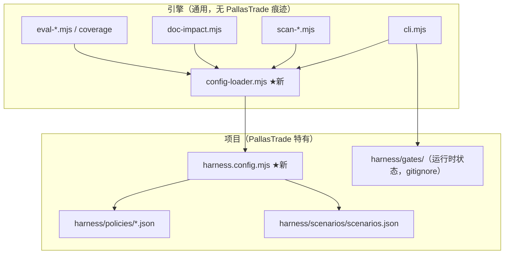

# Harness 机制独立化路线图（v2）

> 权威方案文档。目标：将 harness 机制从 PallasTrade 项目解耦为可独立维护、可开源、可被任意项目接入的通用工程机制；同时保证 PallasTrade 自身持续可用且效率更高。
> 状态：**已批准（approved）** — 2026-08-10
> 关联 Gate：GATE-2026-08-10T14-16-38（实施跟踪）

---

## 1. 背景与目标

当前 harness 机制（`scripts/harness/` 12 个 `.mjs` + `harness/` 配置）运行良好，但**引擎代码与 PallasTrade 项目结构深度耦合**：

- `cli.mjs` 硬编码 `ROOT = resolve(__dirname, '..', '..')`
- gate 的 6 层搜索 check 硬编码 PallasTrade 目录
- `doc-impact.mjs` 的知识同步规则（SYNC_RULES）整个硬编码在 JS 里
- doctor / coverage / eval 均含 PallasTrade 特定路径

**三条目标主线：**

| 主线 | 内容 |
|---|---|
| **A. 解耦** | 引擎（通用机制）与配置（项目声明）彻底分离，配置驱动 |
| **B. 冷启动/渐进/自学习** | 从 0 开始的使用者能被机制"带着建规范"，而非先写全规范才能用 |
| **C. 自有项目可用 + 提效** | PallasTrade 迁移后行为不变、流程不退化，且 check/commit 效率更高 |

---

## 2. 目标架构



**核心原则**：引擎默认值 = "单层普通项目也能跑的最小可用配置"；项目通过 `harness.config.mjs` 覆盖声明自身结构。规则数据（反模式/scenarios）仍留项目内，配置只存路径引用。

---

## 3. 产品能力模型（开源后提供的能力）

| 能力域 | 能力 | 映射现状 |
|---|---|---|
| **① 门禁与工作流** | 前置 Gate / 分支+时效绑定 / 强制跳过保护 / 可审计履历 / 任务类型化 | `harness gate` + lefthook |
| **② 扫描与门禁** | 反模式扫描 / 密钥泄漏拦截 / 死循环检测 / 规则源统一 | `scan-*.mjs` |
| **③ PRD 需求闭环** | 一句话需求→PRD / 自动查重 / AC→测试映射 / 需求确认门 / 文档同步门 | `prd` 子命令 + doc-impact |
| **④ AI 编排层** | 机器可读输出（JSON）/ 状态文件协议 / 指令文件生成 / Skill 联动 / AI 行为评估 | gate JSON + eval |
| **⑤ 扩展与插件** | Preset 预设 / 自定义 check / 自定义 scanner / 规则热更新 / 引擎版本锁定 | 待建（Phase 2 定协议） |
| **⑥ 可观测与报告** | 结构化报告 / 证据留存 / CI 一键接入 / 演进指标 / 降级通道 | evidence + JSON 输出 |

**差异化王牌**：③ PRD 需求闭环 + ④ AI 编排层 + ⑤ 插件协议。

---

## 4. 冷启动/渐进/自学习模型

### 4.1 哲学转变
从"执行者（enforce）"升级为"引导者（onboard）+ 执行者"。复用现有 **user-confirmed 哲学**：harness 生成草案 → 用户确认 → 生效。

### 4.2 从 0 用户冷启动旅程（4 步）
1. **`harness init`** — 向导问答（技术栈 / 是否用 AI / 团队规模 / 严格档位）→ 生成 4 类资产草案
2. **`harness analyze`** — 扫描代码库 → 推断栈/层结构 → 生成初始 layers + anti-patterns（从代码里发现，非凭空编）→ 输出"规范差距报告"
3. **生成草案**（用户确认后写入）：规范 / 文档 / 工程配置 / 场景库
4. **渐进生效** — 档位递进

### 4.3 渐进档位（progressive enforcement）
| 档 | 开启 | 建议时机 |
|---|---|---|
| **Lite** | gate + 反模式 + 密钥扫描（pre-commit 硬卡） | 第 1 天（5 分钟接入） |
| **Standard** | + PRD 工作流 + doc-impact + check profiles | 1~2 周后 |
| **Strict** | + AI eval + 场景库 + coverage + 完整报告 | 团队成熟后 |

`harness doctor` 主动 hint 下一步（"你已有 N 个 PRD，建议升 Standard"）。

### 4.4 自学习（`harness suggest`）
| 触发 | 行为 |
|---|---|
| 同类违规 ≥2 次 | suggest：沉淀为反模式规则，一键确认 |
| 用户手动修复同类问题 | suggest：转自动 check |
| review 重复评论 | suggest：转 check |
| 用户跳过 check（有正当理由） | 记例外清单，定期 review |
| 新 PRD 的 AC 风格 | 学习并更新本地 PRD 模板 |

数据源 = gate 履历 + 扫描历史 + 例外清单（`.harness-cache/` + `gates/`），**无需联网**。

---

## 5. 分阶段实施计划

### Phase 0：现状基线（不改代码）
- [ ] 固化关键命令输出为 **golden files**（`gate` / `doc-impact` / `check --profile quick` / `scan-anti-patterns`）
- [ ] 建立 12 个 `.mjs` 的**耦合清单**（哪些行引用 PallasTrade 路径/结构）
- [ ] `harness.test.mjs` 补 golden 对比测试

**产出**：回归对照基线（无此基线，无法证明行为未变）。

### Phase 1：解耦 + 提效基础（不搬仓库）

#### 1.1 引擎/配置分离
- 新增 `scripts/harness/config-loader.mjs`：`findConfigPath / loadConfig / validateConfig / getLayerChecks`
- 新增 `harness.config.mjs`（schema 见 §6）
- 兼容过渡：`harness.config.mjs` → `harness/config.json` → 默认值；Phase 1 末删 `config.json`
- 12 个 `.mjs` 逐模块去硬编码

#### 1.2 提效基础（主线 C）
| 优化 | 做法 | 收益 |
|---|---|---|
| Lazy-load 命令 | cli.mjs 按命令动态 import | 高频命令启动快 |
| 配置缓存 | mtime memo + `.harness-cache/` | 多次命令不重复解析 |
| Smart-skip | 基于 `git diff --name-only` 只跑受影响 check | dev 循环提速 |
| 结果缓存 | 文件集哈希 + 规则版本 → 缓存复用 | 重复扫描近零成本 |
| 并行 check | Promise.all 并发 | profile 耗时下降 |

#### 1.3 新命令（基础版）
- `harness init`（v1 空骨架，向导版 Phase 2）
- `harness config:check`（校验 + 报告默认值使用情况）
- `harness cache:clean`

**Phase 1 验收**：golden diff 全绿；quick profile 改单文件场景耗时显著下降；PallasTrade 现有流程行为不变。

### Phase 2：独立化 + 冷启动（开源核心）

#### 2.1 独立仓库 + npm 包
- `scripts/harness/` 迁独立仓库（保留 git 历史），发 npm 包（命名待定）
- PallasTrade 迁移：lefthook / CI / package.json 全改 npx 形式
- 版本策略：PallasTrade **pin 版本**；规则 JSON 留项目内可覆盖
- **Dogfooding 门**：发布前在 PallasTrade 完整跑 doctor / check quick+full / gate 全流程

#### 2.2 冷启动三件套
- `harness init` 向导 + 档位（§4.2/4.3）
- `harness analyze`（§4.2）
- 生成 4 类资产：规范 / 文档（AGENTS.md、CLAUDE.md、copilot-instructions、PRD 模板）/ 工程配置（lefthook、CI、.gitignore、npm scripts）/ 场景库

#### 2.3 插件协议（防 Phase 3 返工）
- **Check 插件**：`{ id, label, run(ctx) => {pass, evidence}, dependsOn[] }`
- **Scanner 插件**：`{ id, glob, exclude, run(files, rules) => violations[] }`
- **Preset**：`{ id, layers, checkDefs, antiPatterns[], docImpactRules[], templates[] }`
- Phase 2 开放配置级注册；Phase 3 开放文件级插件（`harness/plugins/*.mjs` 自动加载）

**Phase 2 验收**：`npx init` 空目录 5 分钟内跑通 Lite 档全链路；PallasTrade 迁移后全流程等价；analyze 结果与手写一致。

### Phase 3：自学习 + 生态 + 报告
- `harness suggest`（§4.4）
- 官方 preset：`preset-pallastrade`（现有 policies/scenarios 沉淀）/ `preset-nextjs` / `preset-rails` / `preset-single`
- 规则库贡献机制 + 文档站
- `harness report`（违规趋势 / 门禁通过率 / 证据汇总，JSON 输出）
- 可选 SaaS/API（规则云端下发、多项目报告）——Phase 3 末评估，本地优先

---

## 6. 配置 Schema（`harness.config.mjs`）

```js
export default {
  name: 'pallastrade',
  // ① 层定义：gate 6 层搜索来源；单层项目配 [{id:'app', path:'src'}]
  layers: [
    { id: 'backend-app', path: 'backend/app' },
    { id: 'core',        path: 'backend/pallastrade_gems/pallastrade_core/app' },
    { id: 'api',         path: 'backend/pallastrade_gems/pallastrade_api/app' },
    { id: 'admin',       path: 'backend/pallastrade_gems/pallastrade_admin/app' },
    { id: 'storefront',  path: 'storefront/src' },
    { id: 'platform',    path: 'platform/packages' },
  ],
  // ② gate：覆盖默认 checkDefs / 过期时长
  gates: {
    expiryHours: { feature: 48, bugfix: 24, style: 8 },
    checkDefs: {
      feature: ['read-skill-customization', 'read-skill-domain', 'read-skill-prd',
                'create-prd-doc', 'create-req-doc', 'req-doc-has-skill-table', 'user-confirmed'],
      security: ['read-skill-security'],
    },
  },
  // ③ 知识同步规则：替代 doc-impact SYNC_RULES（默认空数组不炸）
  docImpact: { base: 'origin/main', rules: [ /* 现 14 条全量搬入 */ ] },
  // ④ 覆盖率
  coverage: {
    thresholds: { backend: { line: 80, branch: 60 }, storefront: { lines: 10 }, platform: { lines: 8 } },
    targets: [ { id: 'backend', path: 'backend', testCmd: 'rspec' }, /* ... */ ],
  },
  // ⑤ 扫描器规则文件
  scanners: { antiPatterns: 'harness/policies/anti-patterns.json' },
  // ⑥ eval / scenarios
  scenarios: 'harness/scenarios/scenarios.json',
  // ⑦ check profiles（原 config.json 搬入）
  profiles: { quick: {...}, full: {...}, nightly: {...}, release: {...} },
  // ⑧ doctor 检查项
  doctor: { requiredDirs: ['backend','platform','storefront','ai'], requiredFiles: ['AGENTS.md'], composeCandidates: [...] },
  // ⑨ 状态/产物路径（默认通用）
  paths: { gates: 'harness/gates', requirements: 'harness/requirements', evidence: 'artifacts/harness-evidence', prd: 'docs/prd' },
};
```

**关键**：规则数据留在 `harness/policies/`，配置只存路径引用；schema 校验防滥用。

---

## 7. 自有项目持续可用 + 提效（主线 C 专项）

### 7.1 可用性保障（每个 Phase 必过）
| 机制 | 说明 |
|---|---|
| 双轨回归 | 改造期新旧路径并存，`HARNESS_LEGACY=1` 可回退 |
| Golden 测试 | Phase 0 基线 + 每次变更 diff |
| Dogfooding 门 | 每 Phase 结束先在 PallasTrade 真实跑完整流程 |
| 版本 pin + 规则覆盖 | 引擎升级不破坏 PallasTrade；PallasTrade 规则演进不阻塞引擎 |
| 降级通道 | `HARNESS_GATE_SKIP=1` 留痕 |

### 7.2 提效目标（量化）
| 场景 | 现状 | 目标 |
|---|---|---|
| pre-commit（gate:required + 3 扫描） | 全量加载 + 全量扫描 | 启动 <200ms；只扫 staged 变更 + 缓存 |
| `check --profile quick`（改 1 文件） | 全量 | Smart-skip 后只跑受影响项，耗时 -50%+ |
| `doc-impact` | 全量匹配 | diff 已实现 + 规则 regex 预编译缓存 |
| 重复命令 | 每次重解析 | `.harness-cache/` 命中近零成本 |

### 7.3 效率设计原则
1. 高频命令轻量化（lazy-load，不加载 eval/coverage 重模块）
2. 变更感知（默认只跑受影响，`--full` 显式全量）
3. 缓存三层：进程内 memo → `.harness-cache/` → git 状态
4. 缓存命中含「规则版本 + 文件哈希 + 配置 mtime」，任一变即失效

---

## 8. 里程碑汇总

| 里程碑 | 内容 | 收益 |
|---|---|---|
| **M1（Phase 0-1）** | 基线 + 解耦 + 提效基础 | PallasTrade 内部先受益：check/commit 更快，行为不变 |
| **M2（Phase 2）** | 独立 npm 包 + 冷启动三件套 + 插件协议 | 别人能 `npx init` 用；可独立维护 |
| **M3（Phase 3）** | 自学习 + 生态 + 报告 | 社区贡献规则；机制越长越强 |

---

## 9. 实施记录

| 日期 | 版本 | 内容 | 执行人 |
|---|---|---|---|
| 2026-08-10 | v2.0 | 方案定稿：整合冷启动/渐进/自学习模型 + 自有项目可用提效约束；批准实施 | AI + 用户确认 |
| 2026-08-10 | v2.1 | **Phase 1 实施中**（GATE-2026-08-10T14-16-38）：T1.1 config-loader.mjs（findConfigPath/loadConfig/getGateChecks/默认配置）+ 12 测试；T1.2~1.5 cli/doctor/affected/check/gate/prd/sync-check/coverage/eval-*/generated-check/doc-impact/扫描器全部去硬编码；T1.6 init/config:check/cache:clean；T1.8 harness.config.mjs 落地 + AGENTS.md §0.1 登记。**已知边界**：eval-scenarios 的 READINESS_CHECKS（GS-xxx）与 nav:check 为 PallasTrade 内容级资产，Phase 2 迁入 preset-pallastrade。 | AI |
| 2026-08-10 | v2.2 | **Phase 1 提效（§1.2 落地）**：① config-loader 进程内 memo（同一进程复用配置）② `check` 变更感知——本地默认只扫 changed-files，`--full`/CI 全量（实测增量 0.53s vs 全量 1.46s ≈ 2.7x）。**暂缓**：跨进程 `.harness-cache`（RegExp 不可 JSON 序列化，收益低）、并行 check（doc-impact/coverage 内部 process.exit 会中断并行）。24 测试全过。 | AI |
| 2026-08-10 | v2.3 | **Phase 2a 独立包迁移（§2.1 落地）**：独立仓库 `github.com/stevenbian9266-cyber/pallastradeharness`（main 分支）——`pallastrade-harness` npm 包（bin: harness + harness-scan-*，config-loader 导出，MIT，17 files `npm pack` 通过）。引擎适配：resolveProjectRoot 兜底改 cwd、扫描器 CLI entry 用 resolveProjectRoot、harness.mjs 加 scan-* 子命令。PallasTrade 迁移：lefthook.yml + package.json 改用 `npx harness`（git 依赖），保留 `scripts/harness/` 回退（**待清理**）。验证：npx harness doctor 11/11 / gate:required / scan 全过，pre-commit 已走新包。**待办**：① `scripts/harness/` 清理 + AGENTS.md/copilot-instructions 引用统一改 npx ② npm publish（需用户 npm 账号）③ init 向导/analyze（Phase 2b）④ 插件协议（§2.3）。 | AI |
| 2026-08-10 | v2.4 | **Phase 2a 收尾 + Phase 2b（§2.2 落地）**：① 删除 `scripts/harness/` 完全切换到独立包——copilot-instructions/AGENTS.md/skill/workflows/tasks.json/README 全部统一 `npx harness`；CI 加 `npm ci` 安装依赖；pnpm-lock 更新；readiness GS-009/013/014 + doctor harness-dirs 适配 node_modules 路径（独立包 de59806）。② **init 向导**（独立包 d871e01）：交互问答 + `--preset single|nextjs|rails|monorepo --tier lite|standard|strict --ai --team`，生成 harness.config.mjs + lefthook.yml + AGENTS.md + copilot-instructions.md + .gitignore 追加。③ **analyze**（同提交）：栈/层/差距报告 + `--write` 生成配置草案。验证：玩具项目 init 全套生成 + config:check 正常；PallasTrade analyze 检出 backend/storefront 层 + doctor 11/11。**待办**：npm publish（需用户登录）、插件协议（§2.3）。 | AI |
| 2026-08-11 | v2.5 | **npm publish 完成 ✅**：`pallastrade-harness@0.1.0` 已发布至 registry.npmjs.org（MIT，4 bin，19 files）。踩坑记录：npm 新政策（gat-bypass2fa-deprecation）——① 新账号发第一个包需 2FA（OTP 或 bypass token）死循环；② npm 已移除 Authenticator app (TOTP) 选项，2FA 仅支持 **Security key (WebAuthn)**；③ 解法：网页启用 Security key 2FA → 终端 `npm publish` 时浏览器认证（security key）→ 发布成功。PallasTrade 依赖已从 git 切换至 `^0.1.0`（提交 bd247a9）。**待办**：插件协议（§2.3）；后续版本迭代可研究 npm **staged publishing**（2027 起 bypass token 禁直接发布）。 | AI |
| 2026-08-11 | v2.6 | **插件协议（§2.3）完成 + 0.1.1 发布**：独立包新增 `bin/plugins.mjs`（loadPlugins/normalizePlugins/validatePlugin，两级加载：`harness/plugins/*.mjs` + `config.plugins`）+ 示例插件 + `plugins:list` 命令 + gate 追加 `plugin-<id>` check + `check` 执行插件 check/scanner（失败→exit 1）。README 补发布说明 + 插件开发章节。`0.1.1` 已发布（security key 认证，用户操作），PallasTrade 升级 `^0.1.1`（提交 fc20944），验证 plugins:list/doctor/check 全过。**Phase 2 全部完成**。**待办**：Phase 3（自学习 suggest / 生态 preset / 报告）。 | AI |
| 2026-08-11 | v3.0 | **Phase 3 完成 + 0.2.0 发布**：① `bin/stats.mjs` 扫描统计——3 扫描器每次写入 `.harness-cache/scans.json`（违规趋势数据源）；② `harness suggest` 自学习——重复违规→建议强化规则、gate 分布→建议档位、例外→review 建议（纯本地无网络）；③ `harness report`——gate 通过率/类型分布/平均时长 + 扫描趋势 + 文档资产，`--format json`；④ 官方 preset 文件化 `presets/`（single/nextjs/rails/monorepo/pallastrade），`init` 从 presets/ 动态加载。修复 init docImpact 正则双重转义 bug。实测（PallasTrade）：suggest 建议升 Standard（46 gate/23 feature）、report 96% 通过率。`0.2.0` 已发布（用户 security key 认证），PallasTrade 升级 `^0.2.0`（提交待记）。**Phase 3 完成**。**待办**：Phase 4 生态（规则库贡献/文档站/staged publishing）。 | AI |
| 2026-08-11 | v3.1 | **Phase 4 生态（§4 落地）+ suggest 误报修复 + 0.2.1 发布**：① **修复 suggest 档位误报**——analyze/run 加 config 参数，档位建议前检查 `config.gates.checkDefs.feature` 是否已含 PRD check（create-prd-doc/create-req-doc/user-confirmed/read-skill-prd），已含则不推升级建议（PallasTrade 配置其实已在用 PRD 工作流，不再误报）；新增 3 条 suggest 合约测试（含回归用例）。② **基础规则集** `rules/base-anti-patterns.json`（STARTER-001~005 跨语言通用规则：内联样式/硬编码色值/console 残留/TODO·FIXME/密钥泄漏，schema 注释 + rules/README.md 清单），可复制到项目 `harness/policies/anti-patterns.json` 作起点。③ **贡献指南** README 章节（规则/插件/preset/引擎代码/发布流程）。④ **npm 政策预警文档化**：2027-01 起 bypass-token 禁直发 → 迁移 staged publishing / trusted publishing（OIDC）。`0.2.1` 发布中（security key 认证，用户操作），PallasTrade 升级 `^0.2.1`（提交待记）。实测：PallasTrade `suggest` 仅报 data 建议不再误报档位；16 合约测试全绿。**待办**：Phase 4 余项（文档站、规则库提交入口、trusted publishing 落地）。 | AI |
| 2026-08-11 | v3.2 | **Phase 4 生态收尾（独立仓库 e420291，无需发版——仅文档/workflow/模板，不进 npm 包）**：① **文档站** `docs/`（GitHub Pages + Jekyll，`pages.yml` 自动部署，8 页：index/getting-started/configuration/commands/plugins/rules/contributing/roadmap）；② **贡献入口** `CONTRIBUTING.md` + `.github/PULL_REQUEST_TEMPLATE.md` + `.github/ISSUE_TEMPLATE/rule-request.md`；③ **trusted publishing** `.github/workflows/publish.yml`（`v*` tag → `npm publish --provenance`，OIDC + NPM_TOKEN 兼容），配置步骤文档化（npm Granular Access Token → Publish packages → GitHub secret；Pages Source 需手动切 GitHub Actions）。清理残留 `pallastrade-harness-0.1.0.tgz`。PallasTrade 侧顺带清理 `scripts/harness` 死代码残留 + `.gitignore` 加 `.harness-cache/`（提交 6ce30e7）。**Phase 4 完成**（trusted publishing 待 npm 侧授权后启用）。 | AI |
| | | （Phase 0~3 实施进度在此追加） | |

---

## 10. 验收总标准

- [ ] 引擎代码无 PallasTrade 硬编码（grep 仅注释/测试命中）
- [ ] 玩具项目（单层）能跑 `init → gate → clear → required → doc-impact → anti-patterns` 全链路
- [ ] PallasTrade 现有流程行为不变（golden diff）
- [ ] `npm run test:harness` 全绿（含新增 contract 测试）
- [ ] `harness/gates/` 已 gitignore
- [ ] 冷启动：空目录 5 分钟跑通 Lite 档
- [ ] 提效：pre-commit <200ms 启动；quick profile 单文件场景耗时 -50%+
