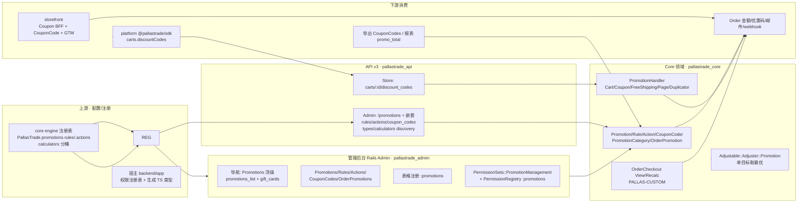

# REVIEW-20260908 — 管理后台 Promotions 模块及关联上下游架构审计

> 类型：审计（audit，只读分析 + 报告，无代码改动）
> Task：TASK-20260908125814-c23dabc6（Gate GATE-2026-09-08T12-58-30）
> 日期：2026-09-08 ｜ 基线：dev @ fcdb883b
> 范围：管理后台 promotions 模块（Rails Admin）+ 其上游（配置/注册/权限/导航）与下游（购物车/结账/订单/商城前端/SDK/报表/导出）架构。
> 方法：6 层跨层搜索（backend/app → core → api → admin → storefront → platform）+ 领域 Skill（pallastrade-promotions）+ 关键文件精读。

---

## 一、架构总览

- **当前实际管理后台**：Rails 引擎 `pallastrade_admin`（服务端渲染 ERB + Turbo + dialog/TomSelect），挂在 PallasTrade::Core::Engine（`backend/config/routes.rb` mount at `/`，admin 域独立认证）。`platform/packages/` 现仅含 `cli / create-pallastrade-app / docs / sdk / sdk-core`，**无 dashboard/admin-sdk 源码**（历史有 `REQ-20260808-remove-react-dashboard.md`）。
- **促销引擎**：Solidus 风格 —— Promotion（STI、kind coupon_code/automatic、multi_codes）→ Rules(N)/Actions(N) → Calculator 决定金额；调整通过 `Adjustable::Adjuster::Promotion` 单目标择优（不叠加）。

---

## 二、分层盘点

### 1. 管理后台 Admin（pallastrade_admin）
| 面 | 位置 | 要点 |
|---|---|---|
| 导航 | `config/initializers/pallastrade_admin_navigation.rb:208-225` | Promotions 顶级（position 50，icon discount，landing=`promotions_list`，`can?(:manage, Promotion)` 门控）；子菜单 `promotions_list` + `gift_cards` |
| 路由 | `config/routes.rb:165-181` | `/admin/promotions` CRUD + `select_options` + member `clone`；嵌套 `promotion_actions(as: :actions)`、`promotion_rules(as: :rules)`、`coupon_codes(index)`；gift_cards 同导航组 |
| 表格 | `config/initializers/pallastrade_admin_tables.rb:606-679` | `:promotions`：name/code/kind/usage_limit/status/starts/expires/created/updated；usage_limit 列 partial 显示 multi-code 已用数 |
| 控制器 | `promotions_controller.rb`（select_options→applied 促销 JSON；clone→`PromotionDuplicator`）、`promotion_rules/actions_controller.rb`（**STI 子类仅从注册表 allowlist 解析，杜绝 constantize**）、`coupon_codes_controller.rb`（只读）、`orders/order_promotions_controller.rb`（后台给订单加/删优惠码 → `PromotionHandler::Coupon`） | — |
| 视图 | promotions index/show/edit + `_header/_sidebar/_status/_usage_limit/_form(/_kind /_settings)` + `_rules/_actions` + 各 rule/action 类型 `forms/_*.html.erb` + `shared/_calculator_fields`；订单页 `_promotions` partial 单列 order_promotions，adjustments 面板排除 `PromotionAction/TaxRate` 源 | 对话框/Turbo 刷新 |
| 辅助 | `promotions_helper`（status）、`promotion_rules_helper`、`promotion_actions_helper`；面包屑由导航推导 | — |

### 2. API v3（pallastrade_api）
- **Admin 编辑器 API**：`admin/promotions_controller.rb` 单次 POST/PATCH 可携带 `rules[]/actions[]`（`Promotion#rules=/actions=` typed reconcile + `additional_permitted_attributes` 白名单）；嵌套 `promotion_rules/actions/coupon_codes` CRUD（`SubclassedResource` 按注册表解析 type）；顶层 discovery：`promotion_actions/types`、`promotion_rules/types`、`promotion_actions/calculators`（带偏好 schema，供 SPA 渲染选择器）。序列化：admin promotion（含 rule_ids/action_ids/multi-codes 操作字段）/rule（嵌关联预览）/action/coupon_code。
- **Store 消费 API**：`store/carts/discount_codes_controller.rb`（create/remove → `PallasTrade.coupon_handler`，`with_order_lock` + CartResolvable）；Cart/Order serializer `many :discounts` = `order.discounts`（alias `order_promotions`）→ `DiscountSerializer`（统一化，替代 CartPromotion/OrderPromotion 两套）。
- **权限**：均经 `current_store.promotions.accessible_by(current_ability)` + prefixed id 查找；`scoped_resource :promotions`。

### 3. 核心领域（pallastrade_core）
- **注册**：`lib/pallastrade/core/engine.rb` after_initialize —— `promotions.rules`（13 内置）、`promotions.actions`（4 内置：CreateAdjustment/CreateItemAdjustments/CreateLineItems/FreeShipping）、`calculators.promotion_actions_create_adjustments / _create_item_adjustments` 分桶；宿主 initializer 仅注释示例，**无自定义**。
- **模型**：`promotion.rb`（prefix `promo_`、SingleStoreResource、Metafields/Metadata、kind、multi_codes、usage_limit、match_policy、`code/path/name` normalize、coupon 后置生成/软删、`before_destroy :not_used?`、`eligible?/activate/deactivate/eligible_rules/line_item_actionable?/used_by?/code_for_order` 等）；`promotion_rule.rb` / `promotion_action.rb`（base + `additional_permitted_attributes` 扩展点）；STI 子类：Rules 13 个 / Actions 4 个；`coupon_code.rb`（prefix `coupon_`，state unused/used，paranoid，全局唯一 code）；`order_promotion.rb`（prefix `discount_`，`amount = order.all_adjustments.promotion.where(source: promotion.actions).sum(:amount)`）；`promotion_category.rb`（见发现 C）。
- **处理器**：`PromotionHandler::Cart`（自动促销按 recalc 激活/停用，SQL UNION）、`Coupon`（码 apply/remove，含 gift card 分支、错误 i18n 码）、`FreeShipping`、`Page`（path 型，见发现 G）、`PromotionDuplicator`（admin clone）。
- **择优**：`Adjustable::Adjuster::Promotion` 每个 adjustable 只保留最大折扣一条、其余 `eligible:false`（同额取新）。注册于 `config.pallastrade.adjusters`。
- **多码生成**：`Promotion#generate_coupon_codes` —— ≤`coupon_codes_web_limit` 同步 `CouponCodes::BulkGenerate`，超过走 `CouponCodes::BulkGenerateJob`（queue `:pallastrade_coupon_codes`）。

### 4. Storefront（下游主消费）
- `app/api/checkout/coupon/route.ts` BFF：apply/remove → SDK `carts.discountCodes`；错误归一化（coupon_not_found / apply_failed…）。
- `components/checkout/CouponCode.tsx` + `UnifiedCheckout.tsx`：已应用折扣 chip、移除按钮、TOTAL SAVINGS（discount+gift card+store credit 合并）。
- `OrderTotals.tsx`、`order-confirmation` 邮件 `displayDiscountTotal`、`webhooks/handlers.ts`（邮件数据）、`analytics/gtm.ts`（coupon 事件上报）。
- vitest：`UnifiedCheckout.test.tsx`（PRD 3.9.2 折扣码应用/移除走 BFF）。

### 5. Platform SDK
- `@pallastrade/sdk`：`carts.discountCodes.{apply,remove}`；生成类型 `Promotion`/`Discount`（zod+TS）。**admin 侧无源码消费者**（见发现 A）。

### 6. 宿主层（backend/app）
- 无 promotion 装饰器/订阅者/控制器覆盖 —— 促销能力全部位于框架 gems。
- 仅：`app/javascript/types/serializers/` 生成的 Admin/Store Promotion 系列 TS 类型；`config/initializers/pallastrade_permission_registry.rb` 注册 `:promotions`（功能权限矩阵：actions read/create/update/destroy；data_fields store_id）。
- 权限双轨（见发现 B）。

### 7. 数据模型（backend/db/schema.rb）
`pallastrade_promotions`(STI type、kind、multi_codes、code_prefix、number_of_codes、usage_limit、match_policy、advertise、path、promotion_category_id、store_id、paranoid 列无但 rules/actions 有 paranoia、`pallastrade_promotions_stores` 兼容 join) · `pallastrade_promotion_rules`(preferences text、UNIQUE(promotion_id,type)、product_group_id/user_id 遗留列) · `pallastrade_promotion_rule_taxons/_users` · `pallastrade_promotion_actions`(position、deleted_at paranoia) · `pallastrade_promotion_action_line_items`(variant+quantity) · `pallastrade_coupon_codes`(code 全局唯一、state、order_id、deleted_at) · `pallastrade_order_promotions` · `pallastrade_promotion_categories`。调整落 `pallastrade_adjustments`（source_type=PromotionAction）。

---

## 三、上下游链路（应用/消费点）

| 场景 | 链路 |
|---|---|
| 后台创建促销 | Admin 表单（kind/code/规则/动作/计算器）→ Promotion/Rule/Action 持久化 → 前台 recalc 生效 |
| 顾客输入优惠码 | Storefront BFF `/api/checkout/coupon` → SDK → Store `carts/:id/discount_codes` → `Coupon` handler（OrderLock）→ order_promotions + adjustments |
| 自动促销 | `Order#recalculate`（CartLegacy::Recalculate/Update）→ `PromotionHandler::Cart` → 择优 `Adjuster::Promotion` → 总额 `discount_total` |
| 下单提交 | `Orders::Create`（coupon apply）→ 完成订单冻结调整；`promo_code`（multi-code 取订单已用码） |
| 展示折扣 | Cart/Order API `discounts[]`（order_promotions 口径，聚合行/单/运费三档）；新 `OrderCheckout` 视图（见发现 D） |
| 免费配送 | 配送步 `apply_free_shipping_promotions` → shipment 级调整；`has_free_shipping?` |
| 报表/导出/事件 | 报表 `promo_total`；`Exports::CouponCodes`（导出器注册表）；order events（order.updated 等发布） |
| 权限/门控 | nav `can?(:manage, Promotion)`；API ability+store 作用域；`hide_prices` 门控金额（折扣不泄露给 guest） |

---

## 四、发现与风险（含证据）

### 发现 A：两套"促销编辑"实现并存，v3 Admin 编辑器 API 无仓库内消费者
- 证据：Rails Admin（`pallastrade_admin/.../promotions*.rb`、ERB+Turbo）；v3 Admin API 完整（`pallastrade_api/.../admin/promotions_controller.rb` 批量 reconcile + `promotion_actions/types|calculators`、`promotion_rules/types`，注释明言 "so the SPA can …"）。`platform/packages` 仅 5 包、无 dashboard/admin-sdk；全仓未检索到调用 `/promotion_actions/types` 的前端。
- 影响：两套实现需长期同步（Rails 端逐个表单 vs API 端批量 typed 写入，语义均以 `PallasTrade.promotions` 注册表为准 —— 一致点是注册表）；API 面当前靠 OpenAPI/文档维护，无契约回归。
- 级别：中（架构漂移/死面风险，非缺陷）。

### 发现 B：促销权限"双轨"定义
- 证据：gem `PermissionSets::PromotionManagement`（manage Promotion/Rule/Action/Category/CouponCode + Metafield read/admin）；宿主 `permission_registry.rb` 另注册 `:promotions`（功能权限矩阵/导航校验用）。两者分配与桥接位置未在本仓代码中直接可见（角色→权限集应落在 DB/seed/配置）。
- 影响：新增"促销管理员"角色或改粒度高权限时可能只改一边 → Ability 与矩阵 UI 不一致。
- 级别：中（需一次映射盘点）。

### 发现 C：`promotion_category` 属"半成品"字段
- 证据：schema 有 `pallastrade_promotion_categories` 表；`Promotion belongs_to :promotion_category`；Admin API serializer 暴露 `promotion_category_id`；但 **Admin UI 无分类管理页、无表单选择器**（`pallastrade_admin/app/views` 检索 0 命中）；store serializer 不含；注册/种子亦无内置。
- 级别：低（死字段/规划中能力，建议明确下线或补 UI）。

### 发现 D：新 Checkout 只读视图的折扣明细口径 ≠ Cart/Order discounts 口径
- 证据：`Order#discounts` = `order_promotions`（alias，`order.rb:226`），每促销一条、金额由 `OrderPromotion#amount` 对 **all_adjustments** 聚合（含行级/运费级）→ Cart/Order API `many :discounts`。而 `OrderCheckout::CheckoutView#discounts`（`services/.../order_checkout/view.rb:90-94`）只取 `order.adjustments`（**order 级 adjustable 仅**）→ `CreateItemAdjustments`（行级）与 `FreeShipping`（shipment 级）促销**不会出现在**新 CheckoutSerializer `discounts[]`（`checkout_serializer.rb:74-79`），但权威 `discount_total` 已含 → 前端若直接用该列表展示"已享优惠"会漏行级/免邮促销；且与 Cart 口径不一致。
- 级别：中（需 P0/P1 checkout 确认是否存在其他补偿展示；若无应统一为 order_promotions 口径或补齐三档 adjustable）。

### 发现 E：单码促销 `code` 无唯一性约束（同码可并存）
- 证据：`pallastrade_promotions.code` 索引非唯一；模型未 validate（store, code）唯一；`Promotion.with_coupon_code` 对同码命中取 `.last`（`promotion.rb:110-121`），顺序不确定 → 配置错误时命中不确定。multi_codes 的 `coupon_codes.code` 则全局唯一（索引+模型验证），不受影响。
- 级别：低-中（配置健壮性；建议 store+code 唯一索引 + 友好报错）。

### 发现 F：促销域自动化测试覆盖薄弱（本仓库可见范围）
- 证据：`backend/spec` 相关仅 `navigation_consistency_spec`（导航结构）、`order_checkout/view_spec`（空折扣投影）、`orders/splitter_spec`（含 promo adjustment 的分摊）；**无 admin promotions controllers/views request/feature spec、无 core rule/action/coupon handler 专项 spec**（core `testing_support/factories/promotion*_factory.rb` 齐全 → 基建在、覆盖缺）；storefront 侧 1 例 vitest（coupon BFF）。
- 级别：中（促销=资金影响面，建议补：单码/多码/自动/过期/usage_limit/规则 any|all/择优/免邮/移除回滚/权限矩阵的 request 级回归）。

### 发现 G：遗留/无消费者面
- `advertise=true` + `path` + `PromotionHandler::Page`：store API 无 promoted 列表路由、storefront 无 banner 消费 → v2-era 残留（表单仍展示 advertise/kind）。
- `pallastrade_promotions_stores` + `LegacyMultiStoreSupport`：单店化兼容（5.6 移 multi_store 扩展）。
- 新 Cart 实体（`pallastrade_carts`）与 legacy `carts/:id/discount_codes`（解析 Order-as-cart，路由注释明示"供旧流程过渡"）双路径并存 → 迁移期需保证新结算路径折扣不丢（与发现 D 同源关注）。
- 级别：低（需产品决策保留/下线；迁移期跟踪）。

### 发现 H（正面实践，建议保持）
- STI type 一律经注册表 allowlist 解析（Admin/API 均防 constantize）；折扣为负金额 + Money + `hide_prices` 门控；优惠码 apply/remove 在 order lock 内；`remove` 幂等且清理行级（CreateLineItems）再重算；扩展点（rules/actions/calculators/`additional_permitted_attributes`/admin partial/locale）单一注册表驱动，与 customization 决策树兼容；多码大批量异步生成不阻塞保存。

---

## 五、建议（按优先级）
| 优先级 | 建议 | 关联发现 |
|---|---|---|
| P0 | 确认新 Checkout `discounts[]` 是否需要覆盖行级/免邮促销，统一口径或显式降级（防漏展示/口径漂移） | D |
| P1 | 促销权限双轨映射盘点（PermissionSets ↔ PermissionRegistry ↔ 角色 DB 分配）并固化单一来源 | B |
| P1 | 补促销域请求/特性级回归（尤其资金面：单码/多码/自动/择优/免邮/移除） | F |
| P2 | 明确 v3 Admin 促销编辑器 API 定位（外部集成 / 未来 SPA），未定前在文档标注"无第一方 UI 消费者"并保持注册表一致性 | A |
| P2 | 单码促销加 store+code 唯一约束；`with_coupon_code` 同码命中策略显式化 | E |
| P3 | promotion_category 决策（下线 or 补 UI）；advertise/path 决策；清理多码异步生成阈值配置说明 | C/G |

---

## 六、验证与约束
- 只读审计，无业务代码/知识文档变更（本次不改动任何规范文件/权威文档 → 知识同步矩阵不触发）。
- 产出物：本报告（harness/reviews/）。证据：6 层跨层检索结果 + 关键文件摘录（见各发现"证据"列）。
- 后续如需实施任一建议，另开 feature/refactor gate 并走 PRD/REQ 流程。
