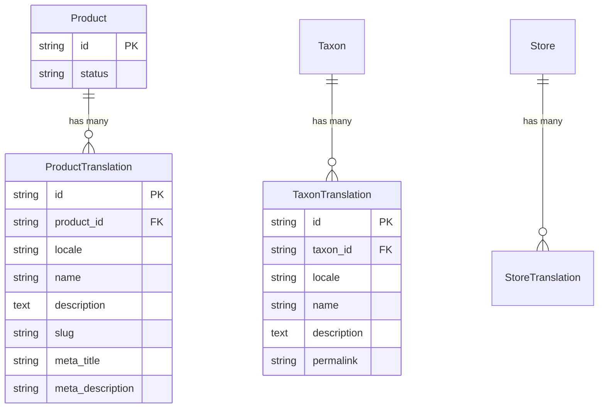

## Overview

PallasTrade supports two types of translations:

1. **Resource Translations** — translatable content fields on models like Products, Taxons, and Stores (e.g., product name, description, slug)
2. **UI Translations** — interface strings used in the admin panel (e.g., button labels, flash messages)

For configuring which locales and currencies are available in your store, see [Markets](/developer/core-concepts/markets). Markets control locale and currency assignment per geographic region.

## Resource Translations

Resources with user-facing content fields have built-in support for translations. Each translatable resource has a corresponding translations table in the database — for example, product translations are stored in `pallastrade_product_translations`.



### Translatable Fields

| Resource         | Translatable Fields                                                                                                                                                                 |
| ---------------- | ----------------------------------------------------------------------------------------------------------------------------------------------------------------------------------- |
| Product          | `name`, `description`, `slug`, `meta_description`, `meta_title`                                                                                                             |
| Taxon            | `name`, `description`, `permalink`                                                                                                                                                        |
| Taxonomy         | `name`                                                                                                                                                                                |
| Option Type      | `presentation`                                                                                                                                                                  |
| Option Value     | `presentation`                                                                                                                                                                  |
| Property         | `presentation`                                                                                                                                                   |
| Product Property | `value`                                                                                                                                                                 |
| Store            | `name`, `meta_description`, `meta_keywords`, `seo_title`, `customer_support_email`, `address`, `contact_phone` |

### Store API

To retrieve translated content, pass the locale via the [`X-PallasTrade-Locale` header](/api-reference/store-api/localization) or the SDK `locale` option:

<CodeGroup>

```typescript Store SDK
// Fetch product in French
const product = await client.products.get('pallastrade-tote', {}, {
  locale: 'fr',
})

product.name        // "Sac PallasTrade"
product.description // "Un sac fourre-tout élégant..."
product.slug        // "sac-pallastrade"

// List categories in German
const { data: categories } = await client.categories.list({}, {
  locale: 'de',
})
```

```typescript Admin SDK
// Pass the locale as a request option to get translated content.
// The Admin API resolves by prefixed ID only — slugs are not accepted.
const product = await adminClient.products.get('prod_86Rf07xd4z', {}, { locale: 'fr' })

const { data: categories } = await adminClient.categories.list({}, { locale: 'de' })
```

```bash cURL
# Fetch product in French
curl 'https://api.mystore.com/api/v3/store/products/pallastrade-tote' \
  -H 'X-PallasTrade-API-Key: pk_xxx' \
  -H 'X-PallasTrade-Locale: fr'
```

</CodeGroup>

Slugs are also localized — a product can have different slugs per locale. See [Slugs](/developer/core-concepts/slugs#internationalization) for details.

### Managing Translations

Translations are managed in the Admin Panel. When editing a product, taxon, or other translatable resource, switch the locale selector to enter content in each language.

Translations can also be [managed via the Admin API](/developer/sdk/admin/quickstart).

## UI Translations

PallasTrade stores UI translation strings in a separate project: [PallasTrade I18n](https://github.com/stevenbian9266-cyber/pallastrade). This is a community-maintained project with locale files for 43+ languages.

To install UI translations:

<CodeGroup>

```bash PallasTrade CLI (Docker)
pallastrade bundle add pallastrade_i18n
```

```bash Without PallasTrade CLI
bundle add pallastrade_i18n
```

</CodeGroup>

Once installed, all translation files are available automatically — no need to copy any files.

<Info>
The full list of supported locales is available in the [PallasTrade I18n GitHub repository](https://github.com/stevenbian9266-cyber/pallastrade/tree/main/config/locales).
</Info>

## Related Documentation

- [Markets](/developer/core-concepts/markets) — Locale and currency configuration per geographic region
- [Localization](/api-reference/store-api/localization) — Locale, currency, and country headers in API requests
- [Slugs](/developer/core-concepts/slugs) — Localized slugs and URL identifiers
- [Products](/developer/core-concepts/products) — Product translations
